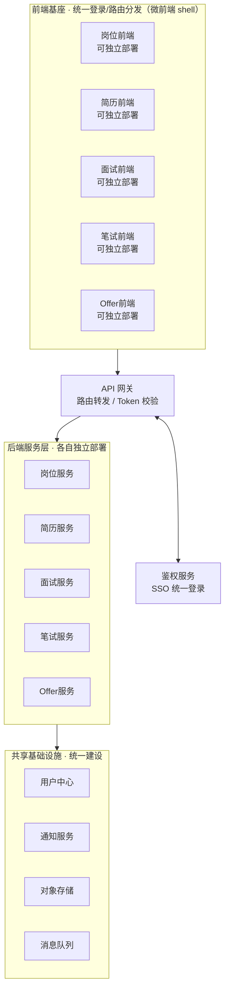

# 招聘平台子系统集成架构设计

> 背景：整个招聘平台包含岗位创建、简历筛选、面试、笔试、发 offer 等多个子系统，目前按子系统独立开发。本文档给出一套让各子系统「现在独立开发、后面逐个接入、互不影响」的架构方案。

## 核心思路

前端用微前端方式接入，后端用独立服务 + 统一网关/鉴权，子系统之间不直接依赖，而是通过契约（API）或消息队列联动。这样任何一个子系统改动、上线、甚至重写，都不会影响其他子系统。

## 整体架构图

**图例**
- 🔵 前端子应用 — 各子系统前端，独立开发、独立部署
- 🟢 后端子服务 — 各子系统后端，独立开发、独立部署
- ⚪ 平台公共能力 — 网关、鉴权、用户中心、通知、存储、消息队列，统一建设，供所有子系统复用

## 落地路径（分阶段推进，不需要一步到位）

### 阶段一：现在 —— 独立开发，先定契约
各子系统按现在的方式独立开发（如 Vite + React 前端 + NestJS 后端），但先约定两件事：
- 统一的鉴权 token 格式（哪怕现在只是简单 JWT，也按未来 SSO 的字段结构来发）
- 公共数据模型（候选人 ID、岗位 ID 等跨子系统字段的命名要统一）

这一步不需要真的搭网关或基座，先把「契约」定下来，后面接入时才不用大改。

### 阶段二：接入网关 + 鉴权
单独起一个轻量的鉴权服务，负责登录、发 token、刷新。每个子系统后端只需加一个校验 token 的中间件/Guard，不需要自己管用户密码。可以先不做完整 API 网关，只做鉴权这一层，代价最小、收益最大。

### 阶段三：前端接入基座
当有 2 个以上子系统前端需要在同一入口下切换时，再引入乾坤（qiankun）或 [Module Federation](https://webpack.js.org/concepts/module-federation/) 把各自的应用注册进主壳。子系统前端该怎么开发还怎么开发，唯一的适配是暴露微前端框架要求的生命周期函数（bootstrap/mount/unmount），工作量通常是几十行代码，不影响业务代码。

### 阶段四：跨子系统业务联动
等真正出现「简历筛选通过 → 自动创建面试任务」这类跨系统流程时，再引入消息队列做异步解耦，避免子系统之间同步调用互相卡死。

## 关于是否需要微前端框架

如果团队规模不大（小团队甚至单人主导多个子系统），建议**先不要上乾坤这类运行时微前端框架**——配置复杂、坑也不少（样式隔离、路由冲突、部分库不兼容），维护成本对小团队不划算。

更简单的替代方案：
- 每个子系统独立部署在自己的路径/子域名下（如 `interview.xxx.com`、`resume.xxx.com`）
- 做一个很薄的「门户壳」，只负责顶部导航和登录态跳转

用户体验上感觉是一个系统，但技术上完全不用运行时集成，类似 Google Workspace 各产品之间跳转的方式。等真的需要把某个子系统的组件深度嵌入另一个页面，再上乾坤/Module Federation 也不迟。

## 为什么不用 Next.js 全栈

- 后端计划独立部署、被多个子系统共用，Next.js 的 API routes 早晚要被拆出来单独跑，等于今天图的「一体化」方便，明天要亲手拆掉。
- 面试子系统大概率需要 WebSocket 等实时能力，NestJS 的 Gateway 支持比 Next.js API routes（尤其部署在 serverless/edge 上）更成熟。
- 乾坤等微前端框架假设子应用是标准 SPA，Next.js 自带的 SSR/路由模型接入乾坤时容易冲突，社区里普遍不推荐；现有的 Vite + React SPA 反而是最省心的接入方式。
