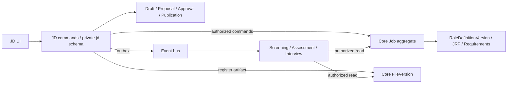

# HireOS Command — JD Management Interface Spec

> **v1.3 文档优先 Copilot 编辑版**：Settings、Appearance、首页、文件与连接、操作历史、任务/提醒、模型配置均必须在独立JD中提供完整页面、行为与验收；不得因标记为公共而省略。PRD已完整内嵌Resume Screening公共章节，并给出JD适用规则。

| 属性 | 内容 |
|---|---|
| 文档编号 / 版本 | CMD-JD-002 / v1.3 |
| 日期 / 状态 | 2026-09-11 / 逻辑接口与字段契约；待生成机器 Schema/OpenAPI |
| 新增交换契约 | hireos.jd.* / schema_version 1.0.0 |
| 消费兼容目标 | Resume Screening Schema 2.0.0；Interview 现有版本化岗位输入 |
| 配套 | [PRD](HireOS_Command_JD_Management_PRD_v1.3.md) · [Design Brief](HireOS_Command_JD_Management_Design_Brief_v1.3.md) |

## 1. 规范与架构基线

采用 [Foundation v2.2](../../HireOS_Command_Shared_Foundation_Data_Integration_and_Build_Plan_v2.2.md)、[Common Data v1.2](../../HireOS_Command_Common_Data_Foundation_and_Database_Plan_v1.2.md) 和 [架构决策](../../HireOS_Command_Architecture_Review_and_Decisions_2026-09-11.md)。对照 [Screening Interface v1.1](../../Resume_Screening_Interface_Spec_v1.1.md)、[Interview Interface v1.0](../../HireOS_Command_Interview_Interface_Spec_v1.0.md)；旧接口的本地主档和同平台邮件交接描述被新架构替代，不修改其评分业务语义。

R=必填，O=可选，C=满足条件时必填。datetime 为 UTC ISO 8601；UI 使用 Workspace 时区。金额采用十进制定点表示，JSON 用 decimal string，不用二进制浮点作金额运算。ID 为不透明稳定字符串；样例 ID 仅用于说明。空数组与 unknown 不混用；未知值用 null+data_status。默认拒绝未注册枚举值，新增字段兼容策略见 §13。

接口路径为建议逻辑映射：JD 前端/SDK 调用 JD API；JD 调用 Core 主档 API 和公共服务。其他 L2 不调用 JD 的查询/写入端点，详细资料经 Core FileVersion 或共享主档获取，业务请求通过事件总线。不能将下面的 REST 路径解释为允许 L2 横向同步调用。

### 1.1 通用类型

| 类型 | 字段与约束 |
|---|---|
| Ref | type:string R；id:string R；version:int≥1 C（版本对象）；workspace_id:string R。跨租户拒绝 |
| ActorRef | actor_type:human/service/ai R；id:string R；human_user_id:string C（人工确认）；delegation_ref:Ref O。由服务端认证构造 |
| FileVersionRef | file_id/file_version_id:string R；checksum:string R；content_type:string R。链接临时生成，不存为永久权限 |
| ValueWithStatus | value:JSON或null R；data_status:known/unknown/disputed/not_applicable R；source_refs:Ref[] R。known 要有值 |
| MoneyRange | min/max:decimal-string或null R，至少一个值；currency:ISO4217 R；period:hour/month/year R；basis:gross/net/unknown R。全未知时整体 null |
| Reason | code:string R；text:string R；evidence_refs:Ref[] R。普通审计仅存去敏 code/ref |
| VisibilityPolicy | classification:public_eligible/internal/restricted R；allowed_purposes:string[] R；allowed_role_refs:Ref[] R；policy_ref:Ref R |
| ErrorEnvelope | code/message:string R；retryable:bool R；correlation_id:string R；field_errors:object[] O；current_version:int O；recovery_action:string O。不回显无权字段 |

public_eligible 仅表示可以进入公开审批，不代表已公开。internal 默认不允许所有下游用途；每个字段及产物需同时满足用途政策。

### 1.2 持久对象通用头

object_id、object_type、schema_version、object_version（int≥1）、workspace_id、organization_id、owner_service、created_at、created_by、correlation_id、data_classification、purpose 均 R；updated_at R；source_refs:Ref[] R（根对象可空）；supersedes_ref C（替代旧对象/版本）。job_id 对所有 Job 从属对象 R，对未分配 Intake、模板及跨岗位 SavedView 可空。

owner_service 表示事实持有者，origin_module/source_system 表示内容来源，不混淆。所有请求的 workspace 和 actor 根据认证验证，不信任请求体覆盖。请求另带 request_id、Idempotency-Key（写命令 R）、expected_version 或 If-Match（更新 R）；不机械要求查询对象有 created_at。

## 2. 聚合与权威持久化



Job 是 Core 内招聘需求聚合根，RoleDefinitionVersion 和 requirements 是其从属数据。Application、ScreeningEvaluation、InterviewProject 为其他聚合，引用 job_id，不属于 Job 的数据库事务。JD 的编辑工作记录不是可供下游当作正式要求读取的第二权威副本。

| 对象 | owner_service | 关键关系 |
|---|---|---|
| Job | core | 0..1 position_ref；0..1 active_role_version_ref；多个历史 role version |
| RoleDefinitionVersion / JRP | core | 恰好一个 job_id；要求、dimension、rubric/source refs |
| JobDraft / Proposal / Comment / Conversation | jd | job_id + base_role_version_ref / draft_revision |
| ApprovalRequest / ApprovalDecision / HumanTask | jd | 冻结候选 manifest 与政策 |
| JDVersion / Publication / ImpactDecision | jd | 精确角色/候选版本、产物与决定 |
| Snapshot payload / FileVersion | core 文件登记；内容生产责任按 producer | 精确 RoleDefinitionVersion，不含草稿指针 |
| ModelRun / DeliveryAttempt / Audit projection | 对应公共服务 | JD 存 operation_ref，消费状态回执；不复制另一套权威结果 |

## 3. Job、JRP 与限制字段

### 3.1 Job

| 字段 | 类型 / 必填 | 规则 |
|---|---|---|
| job_id / title | string R / string R | title 不能为空；内部/外部表达可不同 |
| position_ref | Ref O | 可选 JD 模板引用，不强依赖 Position 服务 |
| department/team/business_unit/location | ValueWithStatus R | 未知显式标记 |
| hiring_manager_ref / recruiter_ref / owner_ref | ActorRef O/O/R | 提审角色门槛适用时前两者按政策必填 |
| headcount | int≥1 R | 不从候选人数推导；变更可触发审批 |
| hiring_reason / employment_type / workplace_type / level | ValueWithStatus R | 词表配置版本可追溯 |
| priority | low/normal/high/urgent R | 默认 normal |
| target_start_date | date O | 按岗位地点日历解释 |
| hiring_status | draft/open/paused/closed/archived R | 与审批/发布分离 |
| active_role_version_ref | Ref O | open 要求引用有效已确认版本 |
| external_refs | ExternalRef[] R | 外部交换才需要映射；同平台不映射新 ID |
| lifecycle_reason | Reason C | pause/close/archive/reopen 必填 |

ExternalRef={system,entity_type,external_id,external_version?}。唯一约束 scope=(workspace,system,entity_type,external_id)；相似 title 不能自动合并岗位。

### 3.2 RoleDefinitionVersion / JobRequirementProfile

| 字段 | 类型 / 必填 | 规则 |
|---|---|---|
| role_version_id / requirement_profile_id / version_no | string R / string R / int R | JRP 与角色版本一一绑定；不建立两条独立生效时间线 |
| job_id / origin | string R / jd_module/foundation_confirmed/external_import R | 基础模块输入不伪造 JD 审批 |
| status | draft/confirmed/published/superseded/withdrawn R | confirmed 可用；published 为 Core 已分发标准，非招聘站发布 |
| role_summary / responsibilities | string R / string[] R≥1 | 暂存草稿可未完整；confirmed 执行门槛 |
| requirements / dimensions | Requirement[] R≥1 / Dimension[] R | 缺 dimension 时 evaluation_readiness=needs_configuration |
| evaluation_readiness | ready/needs_configuration R | 不能将“岗位确认”冒充“评分配置完整” |
| hiring_context / success_criteria | object R / SuccessCriterion[] R | 每叶子字段有 VisibilityPolicy |
| internal_compensation / public_compensation | MoneyRange或null R / MoneyRange或null R | 互相独立；公开值不能由内部预算自动推断 |
| restricted_requirement_refs | Ref[] R | 只在有权读取的内部表示中返回，不进通用下游包 |
| confirmation_ref / approval_manifest_ref | Ref R / Ref C | JD 审批入口后者 R；foundation_confirmed 用真实确认依据 |
| confirmed_by / confirmed_at | ActorRef C / datetime C | confirmed/published 必填，human |
| content_hash / policy_refs / source_refs | string R / Ref[] R / Ref[] R | 规范化内容摘要；来源精确版本 |

SuccessCriterion={criterion_id,period,statement,evidence_expectation,visibility_policy} 均 R。Role 中 public/private 标题、工作安排等与 Job 主档重叠值在激活命令中校验一致；需改主档的 material 字段一起成为冻结审批 manifest 的一部分。

### 3.3 Requirement 与评分契约

Requirement 字段：requirement_id:string R；statement:string R；category:responsibility/skill/experience/education/certification/language/authorization/work_arrangement/other R；priority:must_have/preferred R；evaluation_type:eligibility/scored/context R；dimension_id:string C（scored）；evidence_standard:string R；predicate:object O；visibility_policy:VisibilityPolicy R；source_refs:Ref[] R；data_status:known/disputed R；supersedes_requirement_id:string O。

机器硬条件 predicate={operator:eq/gte/lte/in/range,expected:JSON,unit?:string}，不得从自由文本临时猜出硬门槛。priority=must_have 不自动转成资格淘汰。scored 要有 criterion_weight:number≥0，每 dimension 内和=1；Dimension={dimension_id,name,description,weight,applicability,rubric_ref,rubric_anchors}，适用维度 weight 和=1、至少一个正值。rubric_anchors 含 0 和 100 锚点、行为描述与证据预期，量尺不是概率。

JD 定义岗位证据与评价标准；ScreeningPolicy 的算法、推荐阈值、模型 cohort、未知证据规则由 Screening 管理，不能由 JD 生成器发明。消费者缺评分政策时建立配置任务，不伪装具备运行条件。

### 3.4 RestrictedHiringRequirement

字段 requirement_type、value、business_reason、jurisdiction、policy_basis_ref、created_by、visibility_policy 均 R；review_status=pending/approved/rejected/expired R；approved_by/approved_at C；expires_at O；allowed_downstream_usage:string[] R 默认 []；external_publish:bool R 固定 false；AI_screening_usage/AI_assessment_usage/AI_interview_scoring_usage:bool R 固定 false（v1）。

Core 保管正式受限内容，使用独立受控读取投影；JD 草稿亦需相同字段保护。审核不是默认合法性认证。拒绝/过期字段不可生效；ordinary requirement、自由文本和附件仍需策略检测以防绕过。敏感具体值不出现在总线 payload 或普通模型上下文。

## 4. 草稿、协作与 AI 工具

| 对象 | 除通用头外字段 |
|---|---|
| JobDraft | draft_id:string R；base_role_version_ref:Ref O；revision:int R；blueprint:object R；collaboration_status:solo/in_collaboration/ready R；field_provenance:object R；unresolved_conflict_refs:Ref[] R；readiness_result_ref:Ref O |
| ChangeProposal | proposal_id:string R；draft_ref:Ref R；base_revision:int R；patch:PatchItem[] R；author:ActorRef R；reason:Reason R；status:proposed/applied/rejected/stale R；applied_revision:int C |
| PatchItem | path:string R；operation:add/replace/remove R；old_value_hash:string C（replace/remove）；new_value:JSON C（add/replace）；source_refs:Ref[] R；visibility_policy:VisibilityPolicy R |
| Comment | comment_id:string R；anchor:{draft_revision,requirement_id?,field_path?,jd_version_ref?} R；body:string R；author:ActorRef R；visibility_policy:VisibilityPolicy R；thread_id:string R；status:open/resolved R；proposal_ref:Ref O |
| CollaborationGrant | job_ref:Ref R；member_ref:ActorRef R；capabilities:string[] R；field_scopes:string[] R；expires_at:datetime O；granted_by:ActorRef R。仅授权委托者可授出的权限 |
| Conversation | conversation_id:string R；job_ref:Ref R；visibility:job_shared/private/restricted R；participant_refs:ActorRef[] R；context_manifest_ref:Ref R |
| Message | message_id:string R；conversation_ref:Ref R；author:ActorRef R；body_artifact_ref:FileVersionRef或body:string 二选一；source_refs:Ref[] R；reply_to_ref:Ref O；supersedes_ref:Ref O；tool_run_refs:Ref[] R |
| AIAction | action_id:string R；tool_name:string R；level:L1/L2/L3 R；input_manifest_ref:Ref R；arguments_hash:string R；expected_versions:object R；status:proposed/confirmed/running/succeeded/failed/cancelled/outcome_unknown R；confirmation_ref:Ref C（L2/L3 执行）；result_ref:Ref C |
| ConfirmationRecord | action_ref:Ref R；human_actor:ActorRef R；target_refs:Ref[] R；arguments_hash:string R；confirmed_at:datetime R；expires_at:datetime R；policy_ref:Ref R |

确认绑定精确 action 参数和版本；重试相同幂等命令可复用确认，内容/目标/收件人变化必须新确认。界面一次 Apply changes 可确认一组明确 patch，不逐字段重复弹窗。服务端禁止 patch 任意私有路径或 approval 字段。

采用 revision CAS；不同字段自动合并仅限服务可证明 base 未冲突，返回合并后的 revision 与操作历史。同字段冲突 409，提案标 stale 并给授权差异；用户解决后新提案。Presence 为临时信号，不是权威锁。网络重发 message_id 去重；编辑消息创建新 revision，不撤销或重放历史写命令。

ModelTaskRequest 沿用 SHARED-11：task_type、subject_refs、input_manifest、policy_ref、data_classification、purpose、output_schema_version、budget_ref、deadline、idempotency_key 均 R。task_type 注册 jd_parse/requirement_discovery/quality_review/jd_generate/jd_translate/change_summary。ModelRun/Attempt 记录实际模型、prompt/策略/输入版本、状态、用量、成本及回退。返回 no_eligible_model 不生成虚构文本。

## 5. JDVersion、审批、激活与状态迁移

### 5.1 JDVersion

jd_version_id、job_id、audience:internal/external、language、version_no、source_content_hash、template_ref、visibility_policy_ref、content_artifact_ref、content_hash、review_status:draft/reviewed/approved/superseded 均 R。

source_candidate_ref 与 source_role_version_ref 至少一个：审批前引用冻结 candidate manifest；激活后用不可变绑定记录关联 Core role version（不修改已冻结正文）。每个公开渠道引用精确 jd_version_id，不能引用“latest”。内部 JD 的通用文件只含内部普通字段；包含 restricted 的文档按授权受众另生成受控版本，不让同一无保护文件依赖 UI 遮挡。

### 5.2 审批对象

| 对象 | 字段 |
|---|---|
| ApprovalCandidate | candidate_id:string R；job_ref:Ref R；draft_ref:Ref R；frozen_revision:int R；proposed_profile_artifact_ref:FileVersionRef R；job_patch:PatchItem[] R；internal_jd_ref/external_jd_ref:Ref O；manifest_hash:string R；base_core_job_version:int R；base_role_version_ref:Ref O |
| ApprovalRequest | request_id:string R；candidate_ref:Ref R；policy_ref:Ref R；status:not_submitted/pending/changes_requested/rejected/approved/cancelled/superseded R；step_refs:Ref[] R；submitted_by/at C；superseding_request_ref:Ref O |
| ApprovalStep | step_id:string R；order:int R；mode:all/any R；required_capability:string R；assignee_refs:ActorRef[] R；scope_paths:string[] R；status:waiting/active/approved/changes_requested/rejected/cancelled R；task_refs:Ref[] R |
| ApprovalDecision | decision_id:string R；request_ref/step_ref/candidate_ref:Ref R；candidate_hash:string R；actor:ActorRef R（human）；action:approve/request_changes/reject R；reason:Reason C（非 approve）；decided_at:datetime R；policy_ref:Ref R |
| ActivationOperation | operation_id:string R；candidate_ref/approval_ref:Ref R；status:not_requested/pending/succeeded/failed/outcome_unknown R；core_idempotency_key:string R；core_result_ref:Ref C；attempt_refs:Ref[] R；error:ErrorEnvelope C |

默认 HM→HR 不同人；政策可配置顺序/并行、预算步骤与代理，流程版本在提交时冻结。权限及政策撤销在动作执行时检查。若政策变更声明旧审批不可继续，旧请求 superseded 并重新提交，不能用冻结政策规避撤销。

### 5.3 状态迁移

| 对象 / from → to | 命令 | 必须校验 |
|---|---|---|
| Approval not_submitted → pending | submit | readiness、人员、冻结 manifest、明确确认 |
| pending → approved | final valid decision | 全部要求步骤、职责分离、hash 未变、当前权限 |
| pending → changes_requested/rejected | decision | 当前有效 approver、理由 |
| pending → cancelled/superseded | withdraw/revise | 提交者或管理权限；撤销未完成任务 |
| approved → Activation pending | activate | 审批仍有效、candidate hash、Core CAS |
| Activation pending/unknown → succeeded | reconcile | Core 返回同幂等键的权威角色版本 |
| Job draft → open | open | active 已 confirmed/published、无阻断政策 |
| open → paused；paused → open | pause/resume | 状态权限、原因；resume 校验 active 有效 |
| draft/open/paused → closed | close | 明确确认、原因、下游/外部影响说明 |
| closed → archived | archive | 保留策略；不硬删版本 |
| closed → open | reopen | 权限、原因、有效标准；新增申请周期由相关命令处理 |
| archived → closed | restore | 管理权限；恢复不自动 open |

关闭/暂停发出可恢复渠道撤下请求，不能把外部 publication 同事务假设为 withdrawn。发布/邮件发送在执行前校验 Job 当前状态；已送达离线文件不能声称远程抹除。

### 5.4 跨服务生效协议

1. JD 本地事务冻结 candidate、完成审批记录、写 ActivationOperation 与 outbox。
2. Worker 以稳定 core_idempotency_key 调 Core 的 confirm-role-version 命令，附 candidate hash、授权决定证明、预期 Job/active 版本及必要主档 patch。
3. Core 验证服务与人工授权依据、租户、引用、政策和 CAS，在 Core 单事务保存 RoleDefinitionVersion/requirements、需要的 Job 字段、active 指针及 Core outbox。不能仅信任传入 approved=true。
4. JD 收到结果后在本地事务标 succeeded、写对外事件。超时先按同键查询；重试同键同体，Core 返回原结果。不同内容同键报 IDEMPOTENCY_CONFLICT。
5. Core 成功、JD 回写失败时靠 operation 对账恢复。以 Core active 为生效事实；JD UI 状态落后标 syncing。禁止为“回滚”删除已生效版本；纠正用新版本。

这是可恢复多步操作，不是跨 schema 分布式事务。尚未成功时不发 requirement.activated 成功事件。

## 6. 快照与下游映射

### 6.1 JobRequirementSnapshot

| 字段 | 类型 / 规则 |
|---|---|
| snapshot_id / job_ref / role_version_ref | string R / Ref R / Ref R；固定精确版本 |
| status | confirmed/superseded/withdrawn R；新运行默认只用当前有效 confirmed |
| audience / purpose / consumer_module | internal_evaluation/external R；purpose:string R；consumer_module:string C（内部交换） |
| profile_projection | object R；只含用途授权的职责、要求、维度、证据、成功标准 |
| jd_version_ref / jd_text | Ref O / string R；jd_text 为对应用途可读表达，不能包含被过滤字段 |
| requirement_graph_ref | Ref O；无独立 graph 不伪造 |
| policy_refs / confirmation_ref | Ref[] R / Ref R |
| generated_at / source_hash / projection_hash | datetime R / string R / string R；不同用途 hash 可不同 |
| artifact_ref / projection_schema | FileVersionRef R / string R |
| supersedes_snapshot_ref / withdrawal_reason | Ref O / Reason C |

内容不可变；status/withdrawal 为单独受控元数据版本，历史 payload 不重写。获取快照需当前权限与用途核验；snapshot 不携带永久授权。预算、受保护属性、限制背景和无关批注默认排除。

### 6.2 消费者适配表

| JD/Core 字段 | Screening RoleCriteriaSnapshot 2.0.0 | Interview 岗位输入 |
|---|---|---|
| job_ref | job_ref；同 Core job_id | Job 引用 |
| role_version_ref + snapshot_id | source_refs / snapshot 引用与内容 hash | input manifest 的角色标准版本 |
| jd_version_ref | jd_version_ref，可空 | JDVersion 引用，可缺但保留结构化定义 |
| requirement_graph_ref | 原样，可空 | RequirementGraphVersion，可缺不得编造 |
| requirements / dimensions / evidence_standard | JobRequirement / MatchDimension / RubricAnchor | 能力/要求/证据及 rubric 精确映射 |
| confirmation_ref / actor/time | confirmed_by/at；origin 对应来源 | 岗位标准确认依据，不是面试最终确认 |
| policy_refs | 岗位来源政策；scoring_policy_ref/workflow_policy_ref 由 Screening 补齐 | Interview 自己的计划/评价政策另行绑定 |
| public/use-authorized compensation | compensation_range 或 null | 必需且有权的范围；不是 Offer 授权 |

适配器生产完整目标 schema，不只重命名 snapshot。Screening 要求 responsibilities≥1、requirements≥1、dimensions≥1、rubric 0/100 锚点、权重归一以及有效 scoring/workflow policy；不足返回 needs_configuration 和人工任务，不伪造分数或政策。目标 schema 缺失/版本不兼容返回 needs_review/unsupported_schema。

JD-only Interview 可创建岗位项目，无 candidate_id/application_id。JD 激活不得自动创建 Application；Screening 仍先推荐、再人工 LinkDecision，经 Core 创建关系，下一步决定另行执行。

### 6.3 变更影响

ChangeSet={old_role_ref,new_role_ref,changed_requirement_ids,materiality:material/non_material,classification_policy_ref,reason} 均 R。ImpactReview={review_id,change_set_ref,requested_consumer_modules,response_refs,as_of,completeness:complete/partial/unknown,status:collecting/ready/decided}。

ImpactResponse={review_ref,consumer_module,as_of,affected_count:int或null,affected_refs_artifact:FileVersionRef?,availability:available/stale/unavailable,limitations:string[]}；count 为 null 时说明 reason；不同阶段计数不可直接求和为独立人数。

ImpactDecision={review_ref,choice:new_only/request_reevaluation/keep_existing,scope_artifact_ref:FileVersionRef,old_snapshot_ref,new_snapshot_ref,actor:human,reason,policy_ref,decided_at}。new_only 约定为生效后新启动的评估采用新版本，已启动保留旧输入；如企业按新 Application 划分，必须在 scope 中显式写 cohort 规则。不得用含糊“所有人”造成范围漂移。

通过总线发 reevaluation.requested；消费者返回 accepted/needs_review/rejected/completed/failed 及新结果引用，自己决定可否重评、重测及是否需额外人工批准。旧快照被政策 withdrawn 时不得以 keep_existing 开启新运行。

## 7. 交付、文件、发布与邮件

### 7.1 统一输入与产物

IntakeEnvelope 复用公共字段：intake_id、channel:manual/file/email/folder/api、source_system、received_at、submitted_by、authorization_ref、material_refs、inline_fields、suggested_job_refs、status:received/validating/needs_review/accepted/rejected/failed。至少一个 material 或 inline_fields。按 workspace+来源+内容摘要幂等；相同文件复用内容，保留全部来源。accepted 仅指 JD 消费接收，不代表需求确认。

ExportRequest={job_ref,jd_version_ref或snapshot_ref,audience,format:pdf/docx/markdown/json,recipient_scope_ref?,policy_ref,requested_by,idempotency_key}。ExportArtifact={artifact_ref?,generation_status:requested/generating/ready/failed/cancelled,source_manifest_hash,operation_ref,access_policy_ref}。ready 必须有完整 FileVersion 和校验和。预览未批准版本加 Draft 标识；不能借导出绕过发布审批。

### 7.2 Publication 与 Delivery

| 对象 | 字段 / 状态 |
|---|---|
| Publication | publication_id、job_ref、external_jd_ref、channel_ref、approval_ref、requested_by、status 均 R；provider_publication_id/url C（真实返回）；last_verified_at O；withdrawal_operation_ref O |
| Publication status | not_published/queued/publishing/published/failed/outcome_unknown/withdrawal_pending/withdrawn |
| EmailDraft | draft_id、job_ref、sender_identity_ref、to/cc/bcc、subject、body_ref、attachment_refs、audience、source_version_refs、recipient_policy_result、status:draft/ready 均 R |
| SendRequest | email_draft_ref、confirmed_content_hash、confirmation_ref、idempotency_key R。地址来自授权联系人或明确输入，不从姓名猜测 |
| DeliveryAttempt | attempt_id、exchange_id、transport:email/file/api、recipient_ref、requested_at、status、operation_ref R；provider_message_id O；error C；retry_of O |
| Delivery status | queued/submitted/delivered/bounced/failed/unknown；下载另记 requested/transfer_served；人工转交另存 HumanDeliveryConfirmation |

发件服务执行前重新核验权限、版本、岗位状态、邮件正文、全部附件与所有收件人；邮件发送操作有独立确认，生成 PDF 不隐式发送。对外仅发送批准的 ExternalJD。unknown 先通过 provider ID/幂等键查询；供应商无法判断是否已发送时需人工核验，不能盲目自动重发。

发布成功需要渠道确认；人工发布可记录 evidence_ref 与 confirmed_by，显示 human_confirmed 交付方式，不伪造 provider 回执。撤下超时保持 withdrawal_pending/outcome_unknown，可查与重试。新外部版本发布不覆盖旧 Publication 历史。

### 7.3 交换包

Package 由 manifest.json + payload.json + 可选 report.md/PDF 构成。manifest 至少：exchange_id、package_type:job_requirements、schema_version、producer、workspace_id、job_ref、role_version_ref、snapshot_ref、purpose、target_schema、created_at、content_hash、files（name/size/checksum/type）、access_policy_ref、source_refs。payload 自包含用途允许要求及来源版本；不能仅含会过期 URL。通过原子完成标识/ready FileVersion 发布，半包不可消费。

同平台通过事件+Core FileVersion；外部跨部署可邮件/文件/API。ReceiverReceipt={receipt_id,exchange_id,consumer,status:accepted/imported/needs_review/rejected/failed,received_at,local_refs,error?}，接收者拥有 receipt。邮件 delivered 不等于 imported；受理 202 不等于业务完成。重复不同通道到达按 package hash/版本去重，外部 ID 映射人工确认后保留。

## 8. API 操作目录

以下 /jd/v1 与 /core/v1 为本稿建议命名，需契约仓库评审后固定。共享平台现有路径通过 SDK 适配，不强行重命名 Screening /v2。

| 操作 | 建议映射 | 输入关键项 | 响应 |
|---|---|---|---|
| 岗位库 | GET /jd/v1/jobs | filter/sort/view/cursor/limit | 200 授权读模型、as_of、next_cursor |
| 建岗 | POST /jd/v1/jobs | title/owner/HC + intent/source | 202 operation；Core 成功后 job_ref |
| 开工作草稿 | POST /jd/v1/jobs/{id}/drafts | base_role_ref + expected_job_version | 201 draft_ref/revision |
| 提案 / 应用 | POST /jd/v1/drafts/{id}/proposals；POST /proposals/{id}/apply | patch/base_revision；confirmation | 201 proposal；200 new_revision 或409 |
| 评论/协作授权 | POST /jd/v1/jobs/{id}/comments；/collaborators | anchor/body；member/scope | 201；授权操作单独确认 |
| AI 运行 | POST /jd/v1/ai-actions | tool/input manifest/expected_versions | 202 action/run_ref；流式文本为临时输出 |
| 文档生成 | POST /jd/v1/jobs/{id}/jd-versions | audience/source/language/template | 202 operation |
| 提审 | POST /jd/v1/jobs/{id}/approval-requests | frozen candidate/policy/confirmation | 201 pending request + tasks |
| 决定 | POST /jd/v1/approval-requests/{id}/decisions | step/action/hash/expected_version | 201 decision；返回 request status |
| 生效 | POST /jd/v1/approval-requests/{id}/activate | candidate/approval/CAS | 202 ActivationOperation |
| 权威写入（JD→Core） | POST /core/v1/jobs/{id}/role-versions:confirm | approved manifest/authorization/CAS/key | 200/201 role_ref + job version |
| 状态命令 | POST /jd/v1/jobs/{id}/lifecycle-actions | action/reason/expected_version | 202 operation；Core 确认后完成 |
| 快照 | POST /jd/v1/jobs/{id}/snapshots | role_ref/purpose/consumer | 202 generation；ready ref |
| 影响决定 | POST /jd/v1/impact-reviews/{id}/decisions | scope/choice/refs/confirmation | 201 decision + async requests |
| 导出/发布/邮件 | POST /jd/v1/exports；/publications；/email-sends | 相应精确源版本和确认 | 202 operation，不表示已交付 |
| 操作查询 | GET /jd/v1/operations/{id} | id | 200 status/result/error/recovery |
| 保存视图 | POST /jd/v1/saved-views | name/filter/sort/group/columns/scope | 201；共享不共享权限 |
| 任务查询/动作 | GET /jd/v1/tasks；POST /tasks/{id}/actions | scope/cursor；action/version | 来源 JD 完成规则及状态 |

列表过滤字段 allowlist；limit 有服务上限，返回稳定 cursor 与排序 tie-breaker(job_id)。统计与列表同授权范围；搜索在索引检索及返回前都校验，不返回 restricted 命中摘要。未知参数拒绝或明确忽略警告，不静默改变筛选含义。

### 8.1 成功与错误

200 已完成查询/幂等已完成命令；201 已创建本地事实；202 异步已受理，必须有 operation_ref；409 版本/幂等冲突；422 业务前置条件不满足；401 未认证；403 无权限（不应暴露存在时用404）；429 限流；503 依赖不可用。统一 ErrorEnvelope。

错误码至少 VERSION_CONFLICT、IDEMPOTENCY_CONFLICT、POLICY_BLOCKED、APPROVAL_STALE、NO_VALID_APPROVER、ROLE_NOT_ACTIVE、SNAPSHOT_WITHDRAWN、RESTRICTED_FIELD、NO_ELIGIBLE_MODEL、BUDGET_EXCEEDED、ARTIFACT_NOT_READY、DEPENDENCY_UNAVAILABLE、DELIVERY_UNKNOWN、UNSUPPORTED_SCHEMA。异步结果未知不能映射普通可安全重试 failed。

## 9. 事件契约与可靠性

### 9.1 Envelope

必填：event_id、type、schema_version、workspace_id、producer、aggregate_type、aggregate_id、aggregate_version、occurred_at、correlation_id、causation_id、subject_refs、authorization_ref（业务动作适用时）、payload。aggregate_version 归真实生产聚合；JD Approval 与 Core Job 版本不能共用一条序列。

payload 仅含 ID、精确版本、必要去敏 change category 和 artifact refs。跨租户/伪造 producer/授权上下文拒收。人类可读事件文本不能成为执行授权。

| 事件名（本稿拟注册） | 生产者 / 触发 | 最小 payload | 典型消费者 |
|---|---|---|---|
| core.job.created | Core 建岗成功 | job_ref,origin | JD 投影、Audit |
| core.job.role_version.confirmed | Core 生效提交成功 | job_ref,role_ref,previous_role_ref,confirmation_ref | JD 对账、授权岗位投影 |
| core.job.status_changed | Core 状态改变 | job_ref,from,to,reason_code | JD、各已安装 L2 |
| jd.approval.requested / decided | JD 本地提交/决定成功 | request_ref,candidate_ref,status | Tasks 投影、Audit、通知 |
| jd.requirement.snapshot_ready | 文件 ready 且绑定版本 | job_ref,role_ref,snapshot_ref,artifact_ref,purpose | 获授权下游 |
| jd.requirement.change_announced | 新角色及快照就绪 | old/new refs,change_set_ref,impact_review_ref | Screening/Assessment/Interview |
| jd.requirement.impact_requested | JD 请求只读影响统计 | review_ref,old/new refs,reply_contract | 相关下游 |
| hiring.requirement.impact_reported | 来源 L2 | review_ref,response_artifact_ref,availability,as_of | JD 影响投影 |
| jd.requirement.reevaluation_requested | 人工 ImpactDecision | decision_ref,scope_artifact_ref,new_snapshot_ref | 目标 L2 |
| hiring.requirement.reevaluation_status_changed | 目标 L2 | request_ref,status,result_refs/error_ref | JD 状态投影 |
| jd.publication.status_changed | JD 接收渠道确认 | publication_ref,status,artifact_ref | Audit、通知 |
| task.requested/updated/completed/cancelled | 来源 JD | task_ref,source_version,subject_refs,completion_ref? | L3 Tasks |
| core.role_snapshot.withdrawn | 权威状态撤回 | snapshot/role_ref,reason_code,replacement_ref? | 已授权消费者 |

若平台已有同义事件，通过 Registry 映射复用，不同时发布两个独立成功事实让消费者重复执行。注册前这些名字是拟定契约，不冒称现有服务已支持。

### 9.2 示例

```json
{
  "event_id": "evt-jd-104",
  "type": "jd.requirement.snapshot_ready",
  "schema_version": "1.0.0",
  "workspace_id": "ws-demo",
  "producer": "jd",
  "aggregate_type": "snapshot_generation",
  "aggregate_id": "sg-104",
  "aggregate_version": 2,
  "occurred_at": "2026-09-11T08:00:00Z",
  "correlation_id": "corr-104",
  "causation_id": "cmd-104",
  "authorization_ref": {"type":"confirmation","id":"conf-104","version":1,"workspace_id":"ws-demo"},
  "subject_refs": [{"type":"job","id":"job-104","version":6,"workspace_id":"ws-demo"}],
  "payload": {
    "job_ref": {"type":"job","id":"job-104","version":6,"workspace_id":"ws-demo"},
    "role_ref": {"type":"role_version","id":"role-104-v3","version":3,"workspace_id":"ws-demo"},
    "snapshot_ref": {"type":"job_requirement_snapshot","id":"snap-104-v3","version":1,"workspace_id":"ws-demo"},
    "artifact_ref": {"file_id":"file-104","file_version_id":"fv-104-1","checksum":"sha256:demo-placeholder","content_type":"application/json"},
    "purpose": "screening_input"
  }
}
```

checksum 为示例占位值；生产必须实际计算，不能将此样例当有效交换包。

### 9.3 可靠处理规则

每个服务业务事务同写自己的 outbox；消费者 inbox 唯一键=(consumer,event_id)，消费事务成功后 ack。至少一次投递，不宣称 exactly once。Redis Streams 不同模块独立 consumer group，同模块多副本共享组；pending 恢复、有限重试、退避、死信和人工异常任务是必需能力。

按生产 aggregate_id/version 处理，旧事件不回滚投影；版本缺口暂存并通过权威 Core 或生产者重新发包事件恢复，不能越界直接查询另一个 L2。跨 aggregate 无全局顺序，消费者校验被引用文件 ready 与版本，必要时等待。

同事件重放不重复通知；重新执行真实业务用明确新 request_id，不能换 event_id 绕过业务幂等。事件保留不是永久档案；通过 Core 版本和来源产物重建投影，对账指标包括积压、失败、缺口和 unknown 年龄。

## 10. Tasks、统计、偏好与审计

HumanTask 沿用 Screening 公共契约：task_id/source_module/task_type、subject_refs/source_version、required_action/completion_rule、assignee_ref或queue_ref、priority、status、due_at、needs_refresh、dedupe_key、reminder_policy_ref 均按条件填充。status=open/in_progress/waiting/completed/cancelled；waiting 必须 reason 且有 resume_at 或 resume_event_type；completed 必须业务 completion_ref。

动作 claim/reassign/start/defer/resume/submit/cancel 通过来源校验。审批 Task submit 调用 §5 决定命令；草稿变更让任务 needs_refresh 或取消替换，不存在绕过版本的勾选完成。逾期派生；转派与提醒发送前检查最新状态/负责人/权限。

JobStatsSnapshot={scope:personal/team/workspace,as_of,timezone,filter_snapshot,availability:available/stale/unavailable,counts}，counts 含 my_open_tasks、pending_approvals、draft_jobs、open_jobs、paused_jobs、closed_jobs；不同实体维度不相加。候选人 stage counts 为独立来源投影，缺失=null，不与 HC 混算。

SavedView={name,owner_ref,sharing_scope,filters,sort,columns,group_by,view_type:table/card/board/organization}；保存定义不保存一份绕过权限的数据。Appearance={theme:light/dark/deep/system,accent:blue/teal/violet,text_size:small/medium/large} 账户级；统计折叠 user+workspace+module 作用域。

AuditFact 记录 actor、action、subject/version、before/after refs、reason_code、time、policy_ref、correlation_id、result。敏感差异存在受控内容记录，普通 audit 不保存明文 restricted 值。集中 Audit 是投影，来源本地事实可恢复，不能凭日志改变批准结果。

## 11. 安全、撤回与保留

- 读写、检索、模型上下文、文件获取、生成和发送每层执行租户+资源+字段+用途校验；服务账号不是全域 bypass。
- 公开转换先白名单再模型生成；输出检测覆盖手工追加、附件元数据、注释和隐含薪资。失败返回字段/类别提示，不向无权人显示被拦截值。
- 共享会话按参与者可见范围取上下文；个人 restricted 会话不自动同步共享摘要。服务端推送、索引和缓存分权限作用域，撤权后清除/失效派生副本。
- 权限变更使未执行确认失效并触发当前校验；历史版本不赋予永久访问权。已下载外部文件不能声称可召回。
- 保留/删除策略对文件、会话、模型运行、派生索引和备份分别落实；必要历史事实保留最小元数据，撤回内容使用 tombstone。不得直接硬删 Job 破坏 Application 历史引用。

## 12. 契约验收

对应 PRD AC 编号：AC-01/11 验证单 Core Job 与无 JD 导入接入；AC-02 测 patch CAS/评论非标准；AC-03/04 覆盖所有外发与模型读路径；AC-05 冻结 hash/撤权并发；AC-06 模拟 Core 成功但响应丢失；AC-07 新稿不改 active；AC-08 快照重现及影响 null；AC-09 inbox/outbox/乱序/跨渠道重复；AC-10 供应商 unknown 对账；AC-12 任务业务完成与提醒竞态；AC-13 依赖失败；AC-15 生命周期与渠道撤下分离。

机器契约测试另需：跨租户 Ref 拒绝、同幂等键不同体409、缺 rubric 不下游运行、没有 Application 的 JD-only 输入被接受、无真实 confirmation 不伪造已确认岗位、被撤回快照禁止新运行、consumer schema 不兼容明确回执。所有状态枚举应与 UI 标签映射逐项校验。

## 13. 兼容与工程交付清单

文档 v1.1 不等于所有平台 schema v1；新 JD schema 1.0.0 与 Screening 2.0.0 独立协商。可选字段增量兼容；改字段含义、必填项或枚举行为采用新主版本，Registry 文件+CI 验证；已发布包不原地改内容。消费者未知必需能力返回 unsupported_schema，不将新状态强塞为 success。

工程交付：JSON Schema/OpenAPI、事件注册与消费者能力表、Core 授权决定证明与 idempotency 查询协议、快照投影映射测试、渠道 adapter 回执协议、公共运行记录 owner、保留策略和运维目标。旧同平台独立主档原型迁移需显式 ID 对照和唯一写入切换，不允许永久双写。基础导入确认与 JD 审批都是获授权来源，但必须保留各自真实依据。

## 14. 公共设置与独立运行完整契约补充（v1.1）

对应PRD §14–15完整公共要求；本节补充上一版摘要，不能仅实现JD领域API而省略公共设置/连接/文件/任务/模型能力。文档版本升级不改变现有JD schema 1.0.0或消费者Schema2.0.0；字段增量按Registry协商。公共操作通过公共SDK及所属服务，JD不得另建配置主档或直接写公共schema。以下为逻辑契约，不声称已有生产路径。

### 14.1 设置对象与操作

| 对象 | 字段与规则（除标O外均R） |
|---|---|
| SettingScope | type:account/workspace/module/task；user_id C(account)；workspace_id C(非account)；module_id C(module/task)；task_type C(task) |
| SettingRecord | setting_id、scope、key、value、object_version、updated_by/at；owner_service；sensitivity；validation_schema_ref。凭据只能credential_ref |
| EffectiveSetting | key、effective_value、source_scope、source_version、inheritance_chain、can_override、writable_paths、policy_ref；无权字段不返回value |
| SettingChangeRequest | scope、expected_version、patch、idempotency_key；reason C(权限/政策变更)；confirmation_ref C(政策要求)。不能通过patch改owner/scope |
| SettingChangeResult | status:saved/validation_failed/conflict/forbidden；new_version C(saved)；field_errors C(validation_failed)；current_version C(conflict) |
| DisplayPreference | user_ref；theme_mode:light/dark/deep/system；accent_palette:blue/teal/violet；text_size:small/medium/large；version/updated_at。账户级，默认light/blue/medium |
| HomepagePreference | user_ref/workspace_id/module_id；expanded_sections:string[]；T1显示模式:expanded/summary；version。禁止T1完全隐藏 |
| NotificationPreference | user_ref/scope；channels；timezone；quiet_hours；digest_frequency；mandatory_policy_ref。个人不得关闭政策强制通知 |
| ConfigurationVersion | config_ref、scope、content_hash、status:draft/validating/approved/active/superseded/disabled、validation_result_ref、review_policy_ref；activation/approval refs C |

操作：get-effective-settings(scope)、patch-settings(expected_version)、reset-display-preferences(scope=display_and_homepage)、validate-config、publish-config、rollback-config。reset仅恢复显示及折叠，不删除SavedView或业务草稿。普通个人偏好直接保存，不要求业务双签；生产模型/权限/流程配置按发布政策执行。跨设备冲突返回409；UI可保留本次显示但标未同步，刷新以已保存值为准。Account与Workspace作用域分别缓存，切换用户清理旧用户数据。

SettingsNavigationItem={key,label,scope,required_capabilities,owner_service,route,availability:available/read_only/not_configured/unavailable}；未配置的连接页仍有设置入口和原因，不能将整个公共能力隐藏。无权敏感管理员分组可隐藏或显示访问受限，不展示配置值。

### 14.2 Files / Connections / Activity对象

| 对象 | 关键字段 / 状态 |
|---|---|
| SourceConnection | connection_id、workspace、kind:email/folder、name、authorization_ref、owner_ref、rule_version_ref、status:not_connected/connected/paused/disconnected/authorization_required/error；last/next_read_at O；checkpoint_ref O |
| SourceRuleVersion | connection_ref、version、scope、start_mode:new_only/history_range/existing_and_changes、filters、body/attachment选择、subfolders、read_mode:manual/automatic、schedule或watch_config、target_module O、hash |
| ReadRun | run_id、connection_ref、rule_version_ref、trigger:manual/scheduled/watch/retry、status:queued/running/succeeded/partially_succeeded/failed/cancelled、checkpoint_before/after、counts:discovered/matched/succeeded/skipped/failed、attempt_refs |
| IntakeItem | source_ref、source_version、checksum、status:discovered/queued/reading/uploading/validating/extracting/available/failed/cancelled/skipped、file_version_ref C(available)、error C(failed) |
| MaterialConsumptionReceipt | material_ref、consumer_module、status:unassigned/pending/accepted/needs_review/rejected/failed、business_object_refs、reason C(异常)。仅接收不代表JRP确认 |
| Operation | operation_id、workspace、type、actor、trigger、subject_refs、connection_ref O、requested/started/finished_at、stage、status、attempt_refs、correlation_id、retention_policy_ref |
| Attempt | attempt_id、operation_ref、attempt_no、retry_of O、started/finished_at、status、error O、idempotency_key、rule_version/checkpoint refs O。追加不覆盖 |
| DownloadAttempt | artifact_ref、actor、status:requested/preparing/ready/transfer_started/transfer_served/failed/cancelled/expired/outcome_unknown、expiry O、operation_ref；不保存明文临时token |

MaterialEnvelope按Core File/FileVersion映射旧material_id/version，不建平行文件主档。无job可available/unassigned。后台监控需真实已授权connector/辅助服务，浏览器临时目录选择不等于长期后台访问权。

操作必须覆盖：create/update/test/disconnect-connection；preview-rule；read-now；pause/resume-monitoring；reauthorize；list-files；preview-file；request-download；list-activity及批次子项/attempt时间线；retry-failed-items与retry-consumption分开。规则修改产生新版本，运行锁定旧版本；恢复从可靠checkpoint补扫，不跳过失败项。

同来源版本重复发现记录skipped并复用file ref；不同来源同内容保留provenance。无匹配的read成功但matched=0；成功与失败并存为partially_succeeded。授权撤回停止新读取；取消保留已成功项。源删除仅标来源不可用，保留受控历史。上传/下载/读取/预览/跳过/取消/空扫描均有Operation，不能只记成功业务导入。

### 14.3 模型管理扩展对象

| 对象 | 关键字段 |
|---|---|
| ModelDeployment | provider/model/version/deployment/region、credential_ref、capabilities、limits、enabled、health、data_policy_ref、review_expiry |
| PriceSchedule | deployment_ref、currency、billing_units/rates、source_ref、effective_at、status:known/unknown/pending_reconciliation、sync_policy_ref O |
| PriceSyncPolicy | provider_ref、supported、schedule、owner_ref、source_ref、last_run_ref；不支持需reason与manual_update入口 |
| ModelEvaluation | task_type、dataset/prompt/model refs、language/input_scope、sample_size、metrics、cost、p50/p95、failure_rate、measured_at、reviewer、status |
| QualityRegressionPolicy | task_policy_ref、schedule、dataset_ref、thresholds、owner_ref、on_failure:alert/disable/approved_rollback、authorization_policy_ref |
| RolloutPolicy | candidate/stable_policy_refs、scope、sample_fraction、budget、duration、stop_thresholds、rollback_ref、approval_ref。对照运行产物不直接成为正式JRP |
| AlertPolicy | source、thresholds、recipient_queue、channels、dedupe_window、quiet_hours、escalation、policy_version |
| BudgetLedgerEntry | budget_ref、logical_run_ref、attempt_ref O、kind:reserve/release/settle/adjust、amount/currency、estimated_or_actual、occurred_at、idempotency_key |

调用统一AI服务：register/test-deployment、record/sync-price、create-evaluation、schedule-regression、validate/publish/rollback-task-policy、configure-rollout、get-usage、list-runs/attempts、configure/list-alerts。每个异步动作返回operation_ref，不把202当完成。价格同步不自动增预算；灰度与回归同样校验材料授权、区域及预算。回滚只选已批准且当前有效配置，历史JRP/审批不改变。

AI费用预算与招聘HC预算分离。未知实际费用保持待对账；重试/回退累加同一逻辑run。配置继承只收紧硬条件；紧急撤权优先于运行锁定。新增这些管理契约不要求自动学习路由。

### 14.4 任务、提醒、统计与事件

沿用§10 HumanTask并完整提供claim/reassign/start/defer/resume/submit/cancel、评论、过滤、历史。ReminderPolicy={rule_ref,triggers,channels,timezone,quiet_hours,lead_time,repeat_interval,max_reminders,escalation_queue_ref}；ReminderAttempt={task_ref,rule_version,recipient_ref,scheduled_at,status:queued/sent/skipped/failed/cancelled,dedupe_key,delivery_ref?}。去重键=任务+规则版本+提醒时段+接收者，发送时重新检查任务/权限/负责人；完成/转派取消旧待发记录。

首页指标采用PRD§14.4；HomepageStatsSnapshot={metric_id,value:number或null,unit,scope,filter_ref,time_window,timezone,as_of,availability:available/stale/unavailable,source_version}，未加载为请求状态，不用null等同0。T1/2/3为展示元数据，不限制接口是否实现。

公共事实事件拟复用settings.updated、connection.status_changed、read_run.completed、material.available、material.consumption_updated、model.policy_activated、model.regression_completed、alert.raised及task.*；最终名称由公共Registry统一。各生产服务outbox/inbox和授权不变；JD消费投影，不横向调用其他L2。个人设置事件不携带敏感值，按用户作用域投递。

### 14.5 补充契约验收

PRD SH-JD-01～14为完整交付门槛。至少自动验证偏好跨用户隔离/版本冲突/幂等重置，读取检查点与重复跳过，available但消费失败的独立重试，下载unknown，模型预算并发/取价不支持/回归与灰度越权，提醒转派取消及发前授权。UI联调必须覆盖Settings所有分组，不能只测试后端接口而交付空设置页。

## 15. 最新Screening契约与公共UI适配（v1.2）

本节对照本轮附件Screening Interface v1.1（Schema2.0.0）§1/16/18/20。附件指纹见同版PRD§16。**字段名称或枚举不同必须显式转换，不能让公共组件直接猜测来源对象。** 本稿仍是逻辑契约；文档v1.2不将JD或Screening现有wire schema原地升级。

### 15.1 来源类型到公共适配器

| Screening字段 | JD现有字段 | 适配与拒绝条件 |
|---|---|---|
| Ref.entity_type/entity_id/version/source_system | Ref.type/id/version/workspace_id | entity_type↔type、entity_id↔id；version必须精确；source_system从权威来源登记取，不能用workspace_id代替；workspace由已认证envelope提供并核验 |
| ActorRef.actor_id/actor_type=human/agent/service | ActorRef.id/actor_type=human/ai/service | agent↔ai为表示映射；human必须认证主体；AI不是人工决定者；额外human_user_id不是伪造批准人 |
| Reason.code/explanation | Reason.code/text/evidence_refs | explanation↔text；evidence扩展另放授权来源ref；错误提示不回显无权明文 |
| ArtifactRef.artifact_id/version/content_hash/media_type/access_scope | FileVersionRef.file_id/file_version_id/checksum/content_type | 通过Core注册映射解析artifact版本，校验hash/media_type；access_scope由当前政策计算，不从旧快照继承永久权限 |
| ValueWithStatus.evidence_refs | ValueWithStatus.source_refs | 一般来源不自动升级为“验证证据”；适配时保留来源性质，缺验证状态按unverified处理 |
| MoneyRange.min/max:number、data_status | decimal-string min/max；全未知null | 显式按币种/周期和允许精度转换；不能无声丢精度，不能表示则needs_review/unsupported而非四舍五入；known带有效数，unknown整体null并标缺失 |
| HumanTask.source_module | JD任务source_module / 通用owner_service | source_module=jd表示业务来源；owner_service是运行时归属，不互相覆盖 |
| ReminderPolicy.lead_time_minutes/repeat_interval_minutes | §14缩写lead_time/repeat_interval | 公共交换一律用带_minutes字段且非负整数；缩写仅文档说明，不得传含糊单位 |
| TaskStatsSnapshot.availability | JD统计availability | available/stale/unavailable一致；loading是查询态，真实0与null不同 |

所有跨服务Ref在适配边界有租户、存在性与精确版本验证。内部同一平台Core Job使用原job_id，禁止为满足旧Ref格式新建另一Job；不同部署才有ExternalRef映射。未知角色/枚举/缺版本返回可操作错误，不默认为Viewer/succeeded/latest。

### 15.2 HumanTask完整共用字段

公共Task接口必须完整包含Screening§18字段：task_id、source_module、task_type、subject_refs、source_version、required_action、completion_rule、assignee_ref/queue_ref、collaborator_refs、priority、status、due_at、waiting_reason、resume_at/resume_event_type、needs_refresh、created_at/started_at/completed_at、completion_ref/cancellation_reason、dedupe_key、reminder_policy_ref、parent_task_ref/supersedes_task_ref。R/C约束沿用来源，不能因JD暂无某演示而删字段。

TaskActionRequest统一action=claim/reassign/start/defer/resume/submit/cancel；expected_version、actor、reason/payload按动作要求验证。JD-specific任务类型和completion_rule由JD提供，公共TaskList/TaskDetail不判断审批通过与否；调用来源业务成功后才完成。普通Task status只能open/in_progress/waiting/completed/cancelled；overdue与needs_refresh为独立flags。

公共MyTasks标签固定Assigned to me / Available to claim / Created or followed / Completed。tab是查询视图，不是状态枚举；Assigned to me可含前三个未结束状态，Completed为已完成窗口，队列待领取独立scope。

### 15.3 ModelTaskResult与失败一致性

ModelTaskRequest共用字段task_type、subject_refs、input_manifest、policy_ref、data_classification、purpose、output_schema_version、budget_ref、deadline、idempotency_key。JD注册自己的task_type，不复制Screening的任务名称或评分流程。

ModelTaskResult完整字段：run_ref；status=succeeded/failed/no_eligible_model/outcome_unknown；output_ref C(成功)；attempt_refs；actual_model_version C(已调用)；validation_status=passed/failed/not_run；error C(失败/无合格模型/未知结果需说明)。ModelAttempt完整保留provider/model/deployment/region、policy_ref/prompt_ref、started/completed_at、usage或null、estimated_cost/actual_cost或null、currency、fallback_reason、status。

HTTP成功、模型返回内容、结构化校验通过和提案人工应用是四个事实；succeeded输出如validation_status非passed不能用于正式写入。公共组件显示真实模型运行状态，JD业务操作结果另由AIAction/Proposal显示。未知费用不0，回退不放宽硬限制，历史结果不原地改写。

### 15.4 公共组件ViewModel与设计版本

ViewModel仅用于渲染，不是另一权威记录。UI必须通过SDK映射消费，不能让JD为便利修改Screening schema。逻辑公共契约版本暂标draft，正式发布前在Registry固定；未有实际bundle不得填写虚构生产版本号。

| ViewModel | 字段 / 行为 |
|---|---|
| SharedUIManifest | contract_version、token_set_ref、component_bundle_ref、locale、supported_theme_modes、supported_text_sizes、supported_capabilities；构建必须锁定同一正式token和组件版本 |
| DisplayPreferenceView | theme_mode、resolved_theme、accent_palette、text_size、saved_version、persistence_status:saved/saving/unsynced/error；resolved_theme由系统状态派生，不能反写覆盖用户System选择 |
| ListContext | scope_ref、filters、sort、cursor、selected_ids、scroll_anchor；按user/workspace/module隔离，返回恢复需复核权限和存在性 |
| AsyncView | load_state:idle/loading/refreshing/ready/error；availability:available/stale/unavailable；data或null、as_of、error_ref；允许stale数据+refresh error，不能单enum挤掉事实 |
| MetricCardView | metric_id、value或null、unit、scope、time_window、timezone、as_of、availability、drilldown_query；共用呈现，领域定义口径 |
| ActionView | action_id、label_key、enabled、disabled_reason、required_confirmation、target_ref、expected_version、operation_ref；UI禁用不替代服务端校验 |
| StatusBadgeView | entity_type、raw_status、label_key、semantic_tone、icon_key、flags；必须使用按实体分表映射，禁止只按status词猜语义 |
| DocumentPreviewView | artifact_ref、audience、version、title、preview_state、download_action、return_context；source/ref展示权限独立核验 |
| OperationTimelineView | operation_ref、attempt_items、stage、raw_status、counts、recoverable_actions；保留失败/跳过/重试，不仅最终成功 |

主题/字体/间距不允许业务记录携带自定义CSS覆盖共享组件。模块布局可组合组件；appearance持久化字段归公共账户，列表上下文归模块局部命名空间。偏好更新后所有挂载共享组件响应，不把主题只应用到首页。

### 15.5 公共状态文案与动作映射

| 对象原始状态 | 统一英文标签 | 操作/限制 |
|---|---|---|
| Task.open / in_progress / waiting | Open / In progress / Waiting | 领域下一步；Waiting需原因与恢复计划 |
| Task.completed / cancelled | Completed / Cancelled | 看历史，不直接重放动作 |
| Task.needs_refresh=true | Needs refresh | Review latest version，禁旧提交 |
| Connection.authorization_required | Authorization required | Reauthorize，仅授权用户 |
| ReadRun.partially_succeeded | Partially succeeded | Retry failed items |
| Material.available + consumption.unassigned | Available / Unassigned | 两个badge；人工归属 |
| Export.ready | Ready | Preview / Download，非已送达 |
| Download.outcome_unknown | Transfer status unknown | 检查/重新请求可观测状态，不宣称已保存 |
| Delivery.unknown | Delivery status unknown | Check delivery status，先对账不盲重发 |
| Model.no_eligible_model | No eligible model | 原因与人工路径 |
| Metric.unavailable / stale | Unavailable / Last updated … | Retry / Refresh；不显示0 |

JD专属Approval、Activation、Publication状态另表映射，不能为追求一致把approved替换为Task completed或把active替换为published。

### 15.6 跨模块契约与视觉验证

ALIGN-06验证adapter往返及字段损失，覆盖Ref无版本/跨租户、Artifact hash不匹配、金额精度无法表达、AI伪造人工、Task waiting缺恢复条件、Model succeeded但校验失败、unknown费用和陈旧统计。公共组件使用同一fixture渲染不同module_id，除领域内容外标签/动作/样式一致。

UIManifest在构建阶段检查公共bundle/token一致；兼容更新需回归两个模块共享页面，不能单模块发布破坏公共行为。当前只新增文档规范，无实际组件源码/运行界面可验证，因此不宣称像素级实现已对齐。

## 16. 文档编辑、锚点与Copilot修订契约（v1.3）

对应PRD§17，扩展§4–5，不修改已冻结JDVersion正文。下述是待注册的JD草稿契约增量；未部署前由Registry确定版本，不能将新必需字段直接强塞给旧消费者。正式Core JRP、审批及下游快照契约不变。

### 16.1 对象

| 对象 | 字段（除O外R；C为条件必填） |
|---|---|
| DocumentDraft | document_id、job_ref、audience:internal/external、language、revision、base_jd_version_ref O、base_role_version_ref O、blocks:DocumentBlock[]、content_hash、profile_draft_ref、mapping_status:consistent/needs_review、save_state由持久化响应派生 |
| DocumentBlock | block_id稳定ID、kind:heading/paragraph/list_item、content:受限富文本树、order_key、requirement_refs/field_paths数组、semantic_role:requirement/presentation_only/unmapped、visibility_policy_ref；不得允许任意HTML/脚本 |
| TextAnchor | anchor_id、document_ref、base_revision、start/end:{block_id,relative_position}、quote_hash、context_hash、status:resolved/stale/orphaned；relative_position使用协作引擎稳定定位，不只存绝对字符偏移 |
| CopilotEditRequest | request_id、document_ref、base_revision、anchor_refs、scope:selected_text/section/whole_document、instruction、input_manifest_ref、actor、idempotency_key；section需要section block ref；whole_document仍按权限过滤 |
| DocumentSuggestion | suggestion_id、document_ref、base_revision、anchor_refs、author:ActorRef、initiated_by、model_run_ref C(AI)、reason、text_operations、profile_patch、mapping_status:ready/needs_review、status:generating/proposed/accepted/rejected/stale/cancelled、content_hash、supersedes_ref O |
| TextOperation | operation_id、type:insert/delete/replace/format、target_anchor_ref、expected_content_hash、new_content C(insert/replace)、format_patch C(format) |
| SuggestionDecision | suggestion_ref、action:accept/reject、expected_suggestion_version、expected_document_revision、expected_profile_revision、actor:human、confirmation_hash、idempotency_key、result_revision C(accept成功) |
| AnnotationThread | thread_id、anchor_ref、visibility_policy_ref、comment_refs、status:open/resolved、resolved_by/at C、linked_suggestion_refs；Comment通过anchor_ref扩展原§4简单anchor，不删除旧历史 |
| DocumentRevision | document_ref、revision、parent_revision、actor、operation_refs、accepted_suggestion_refs、profile_revision、mapping_status、content_hash、saved_at |
| Presence | document_ref、actor、cursor/selection、observed_revision、expires_at；临时状态，非批准/锁/权限依据 |

引用材料、selected text和prompt按audience/用途构造InputManifest。私人/restricted会话的建议不能直接移到公共文档；需重新按受众生成并审核。协作推送须按当前字段权限裁剪，旧版本删除文字与注释同样受控。

### 16.2 接受、映射与并发

1. 生成提案只写DocumentSuggestion，不修改DocumentDraft或JRP草稿。generating只能预览进度，不可accept。
2. accept核验用户权限、提案hash、锚点、文档revision、profile revision及全部预期文本。映射needs_review则先返回待确认字段，不猜值。
3. 在jd本地事务内应用text_operations、profile_patch，记录SuggestionDecision/DocumentRevision/审计outbox，提案转accepted。任一校验失败返回409/422且均不应用。正式Core写入仍经原审批激活流程。
4. 直接人工输入先保存文档工作稿，语义映射异步时明确needs_review；提审校验mapping_status=consistent及精确内容hash。自动保存不表示同步完成。
5. 结构化表单改动引用关联块，形成反向同步建议；旧表达未同步时保持needs_review。用户显式选择调整措辞或修正标准，不能同时保留矛盾正式值。
6. 相同suggestion重复accept返回原结果；accept/reject并发CAS仅一方成功。批量操作绑定精确提案集，默认全组原子接受；存在重叠/stale/无权项返回待处理清单，界面允许移除后重新确认，不部分静默成功。
7. 非重叠协作编辑可以安全rebase；锚点重定位必须唯一且验证目标内容。删段导致orphaned；改意使stale。不能仅根据相同句子文本找到另一段后自动apply。
8. 撤销为新Revision/补偿操作；若目标已被他人修改则走新提案，不回退整篇到旧revision。历史decision不删；不得撤销审批/外部发送事实。

### 16.3 逻辑操作与错误

新增create-document-draft、apply-human-document-edit、create-copilot-edit、list-suggestions、decide-suggestion、decide-suggestion-set、create/resolve/reopen-annotation、resolve-document-mapping、get-document-revisions。所有写命令有idempotency_key/CAS；生成返回202与run_ref；人工编辑成功返回revision/saved_at/mapping_status。

查询支持render_mode=editing/review/reading。reading使用已采纳正文；review额外返回获授权待审修订。正式导出只从冻结并批准JDVersion生成，不由客户端隐藏标记后截图代替。草稿导出标Draft、默认不含建议/评论；内部审阅导出如包含批注需显式scope及权限，外部禁止包含。

错误增加ANCHOR_STALE、ANCHOR_ORPHANED、OVERLAPPING_SUGGESTIONS、DOCUMENT_PROFILE_MISMATCH、SUGGESTION_NOT_READY、READ_ONLY_VERSION。冲突响应仅含有权阅读的差异和可恢复动作。

协作持久化/恢复实现需验证实际编辑引擎的相对锚点、IME、离线队列及富文本操作合并；本稿不指定未经验证库。权限撤回使在途生成输出停止向撤权会话推送，已有输出仍按当前访问校验。

### 16.4 验收

COP-01～10覆盖选区到提案/文本+profile事务、双向定位、revision冲突、删除锚点、批量重叠、重复accept/reject竞态、角色切换、历史删除文字泄露、映射失败、撤销冲突和导出净化。模型成功但提案未采纳不写JRP；Saved但mapping_status=needs_review不允许提交审批。
