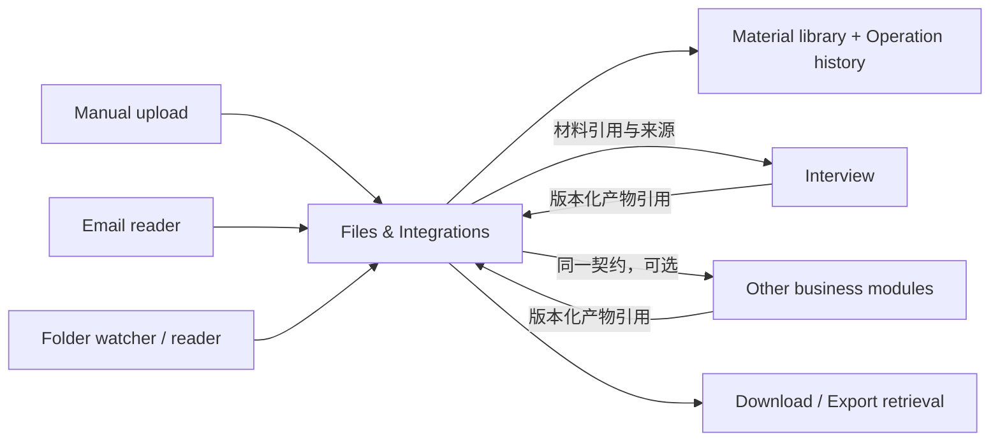

# HireOS Command — JD Management PRD

> **v1.3 文档优先 Copilot 编辑版**：Settings、Appearance、首页、文件与连接、操作历史、任务/提醒、模型配置均必须在独立JD中提供完整页面、行为与验收；不得因标记为公共而省略。PRD已完整内嵌Resume Screening公共章节，并给出JD适用规则。

| 属性 | 内容 |
|---|---|
| 文档编号 / 版本 | CMD-JD-001 / v1.3 |
| 日期 / 状态 | 2026-09-11 / 产品与设计交接稿；后端基础实现已开始，完整能力仍未完成 |
| 产品定位 | AI-Native Job Definition & Hiring Requirement System of Record |
| 读者 | 产品、设计、架构、研发、测试与业务负责人 |
| 配套文件 | [Interface Spec](HireOS_Command_JD_Management_Interface_Spec_v1.3.md) · [Design Brief](HireOS_Command_JD_Management_Design_Brief_v1.3.md) |

## 1. 依据、适用范围与冲突裁定

本文件依据原对话 [JD管理模块PRD](chatgpt-conversation://6aa3bb93-6450-83ea-a803-74c26fc6afb6) 的完整可读取文字、[Interview PRD v1.6](../../HireOS_Command_Interview_PRD_v1.6.md)、[Resume Screening PRD v1.3](../../Resume_Screening_PRD_v1.3.md) 及其配套接口和设计文件整理。

架构以 [Shared Foundation v2.2](../../HireOS_Command_Shared_Foundation_Data_Integration_and_Build_Plan_v2.2.md)、[Common Data v1.2](../../HireOS_Command_Common_Data_Foundation_and_Database_Plan_v1.2.md)、[2026-09-11 架构决策](../../HireOS_Command_Architecture_Review_and_Decisions_2026-09-11.md) 为准。旧文档的模块本地 canonical Job、独立账号适配器、同平台邮件串联及“后续再拆服务”描述不沿用。

三份文档是同一交付版本：PRD 定义行为与范围，Interface Spec 定义实体、状态和契约，Design Brief 定义界面与原型验收。本文新增的审批默认值、指标定义和具体交互是可实施设计默认，不冒称用户逐项批准。首批商业上线顺序仍按架构决策中的待定事项处理；“招聘数据源头”不意味着其他模块必须等待 JD 安装。

## 2. 产品目标与原则

帮助企业明确“为什么招、招什么人、如何判断、哪一版要求已被批准使用”，通过对话和多人协作生成结构化岗位标准，并管理内部、公开两种 JD。

1. **Chat is the interaction layer, not the database.** 正式标准来自结构化 Job Requirement Profile（JRP），不是聊天记录或 PDF。
2. **Job 是招聘需求的聚合根。** 所有标准、JD 表达、审批和发布均有明确 job_id；下游独立聚合引用此 ID，不被纳入一个跨服务大事务。
3. **一份公共主档。** JD 负责需求业务规则；Core Record 是 Job、RoleDefinitionVersion 与 requirements 的唯一持久化写入方。
4. **内部不等于无限可见。** restricted 数据另行授权；AI、搜索、导出和通知使用同一授权边界。
5. **讨论、提案、确认、审批、生效、发送是不同事实。** 不用一个“完成”掩盖多个状态。
6. **历史可重现。** 下游锁定精确快照；新标准不静默改写旧筛选、笔试和面试结论。

### 2.1 用户与任务

| 用户 | 主要任务 | 成功体验 |
|---|---|---|
| Hiring Manager | 描述业务目标、职责、成功标准，解决冲突 | 能看到自己的输入如何变成具体要求 |
| HR / Recruiter | 建岗、补全、协调、生成内外 JD、交付 | 统一岗位库与明确下一步，不反复维护多份文本 |
| Finance / Department Head | 按配置审查预算、编制或需求 | 只看职责内内容，批准精确版本 |
| Collaborator | 评论、建议修改、补充资料 | 意见不被自动当成正式要求 |
| Approver | 批准或退回 | 看差异、风险、审批范围和版本 |
| Viewer / Interviewer | 阅读获授权标准 | 不因内部 JD 入口获得预算或限制字段权限 |
| Workspace Admin | 配置权限、流程、连接及模型政策 | 共用平台能力，配置不等于业务批准权 |

## 3. 架构、所有权与运行方式

### 3.1 四层与依赖

沿用 L0 基础设施、L1 公共基础服务、L2 独立业务模块、L3 Shell/组合编排。JD 从第一天有独立后端进程、私有 jd schema、独立前端产物；共用版本化 UI/SDK，不引用其他 L2 的业务源码或私有表。

- 公共主档读写通过 Core API；不能直连 core schema。
- 同平台 L2 之间通过 Redis Streams 事件总线交换消息，不同步请求 Screening/Interview 业务接口。
- 详细交换产物注册为 Core FileVersion；事件携带引用和必要摘要，消费者经 Core 验权读取。
- Shell 可选；脱离 Shell 仍可从模块入口完成业务和处理任务。
- 独立运行 = Identity + Core + 必需公共运行能力 + JD；不是脱离公共基础或另建账号、岗位库。

### 3.2 所有权矩阵

| 对象 / 能力 | 业务责任 | 权威存储 / 写入 |
|---|---|---|
| Job 主档、招聘状态、负责人 | 授权岗位命令；JD 提供完整管理 UX | Core |
| 已确认 JRP / RoleDefinitionVersion / Requirement | JD 定义、审核；基础导入入口也可按政策确认 | Core，Job 的从属版本 |
| Position | 可选长期角色模板；不是一次招聘 | v1 作为 JD 模板记录，不创建第五类 Core 主档 |
| 工作草稿、提案、评论、会话、冲突 | JD | jd；非第二套正式 JRP |
| JDVersion、审批决定、发布记录、变更影响决定 | JD | jd；内容文件引用 Core FileVersion |
| RequirementSnapshot | Core 中锁定的要求/角色版本及用途投影 | Core 版本与 FileVersion；业务生成记录归 JD |
| HumanTask | JD 来源任务与完成规则 | jd；L3 仅聚合投影 |
| 身份 / 权限、模型、通知、审计 | 公共平台 | 各公共能力自己的运行记录；不默认加入 Core |
| 候选人、Application、筛选/面试/Offer 结果 | Core / 各来源业务域 | JD 只读取授权公共记录和事件投影 |

### 3.3 独立与集成行为

| 场景 | 预期行为 |
|---|---|
| 仅 JD 安装 | 完成建岗、协作、审批、版本、导出和已配置邮件发送；下游进度显示 Not connected |
| 未安装 JD，仅 Screening / Interview | 使用基础岗位输入经 Core 创建/确认标准；不要求 JD 项目或假审批记录 |
| 后续安装 JD | 按已有 job_id 接管编辑入口；来源与确认记录保留，不重建岗位 |
| 下游暂离线 | JD 业务继续；影响数据标更新时间/不可用，交接排队可恢复 |
| Core / Identity 不可用 | 禁止需要权威校验的保存、审批生效、发布和发送；保留可恢复输入，不显示成功 |

## 4. 数据定义与标准源头

### 4.1 Position 与 Job

Position 是可复用岗位定义，如“Senior Backend Engineer”；Job / Requisition 是一次具体招聘，如“Vietnam — Q4 — 2 headcounts”。Position 可关联多个 Job，MVP 允许 position_ref 为空。克隆只复制获授权内容，重置招聘状态、审批、发布、负责人确认及日期；不复制 Application、历史批准或 restricted 内容的授权。

### 4.2 JRP 内容

| 分组 | 内容 | 默认信息级别 |
|---|---|---|
| Role | 内外标题、部门、团队、级别、职责 | internal，公开字段另显式选择 |
| Hiring context | 新增/替补、业务目标、紧急度、目标日期、HC | internal |
| Requirements | must-have / preferred、技能、经验、教育、证书、语言、工作安排 | internal；可标记 public_eligible |
| Evaluation | 稳定 requirement_id、dimension、证据标准、rubric 引用、硬条件 | internal；仅允许用途进入下游 |
| Compensation | 内部预算上限、谈判范围、公开薪资范围、币种/周期/税前税后 | 内部预算 restricted 或 internal；公开薪资独立字段 |
| Success | 30/90 天、6 个月成果、KPI | internal；公开表达须独立审查 |
| Restricted | 特殊背景、限制性要求及理由、政策依据 | restricted，默认不入模型和下游 |

空缺必须表示 unknown / disputed / not_applicable，不让 AI 猜测币种、薪资周期、负责人、法律依据或 HC。AI 提取保留材料、段落与原文来源；人工确认才提交结构化字段。requirement_id 在含义连续时保持稳定，含义替换创建新 ID 并记录 supersedes。

### 4.3 内部与外部 JD

InternalJD 与 ExternalJD 都引用精确 JRP 版本、模板和语言，独立版本化。内部阅读仍经字段授权；外部生成从 public_eligible 字段白名单出发，不能把完整内部 JD 送给模型后期待脱敏。

生成链：授权字段读取 → 可公开投影 → 确定性过滤 → AI 改写 → 输出检查 → 人工审阅 → 外部 JDVersion。自由文本、附件、文件名、批注和生成内容也需检查。用户直接编辑公开文本若改变职责或硬要求，先形成 JRP 提案；不允许外部表达成为第二套正式标准。

未获公开批准的薪资、替补原因、内部评估策略和 restricted 值不得进入公开预览、搜索摘要、PDF/DOCX、邮件、分享链接、索引、日志或模型缓存。历史产物保留版本不代表永久访问权。

### 4.4 RestrictedHiringRequirement

独立记录 type、value、business_reason、policy_basis_ref、jurisdiction、reviewer、approval、visibility、allowed_downstream_usage、expiry。只记录真实来源，依据不明标 Pending review。

默认 external_publish=false；AI_screening_usage、AI_assessment_usage、AI_interview_scoring_usage=false。受保护属性及其代理不进入自动评分、排名或硬过滤。涉及实际岗位工作授权等要求须转成与工作相关、经政策审核的普通条件，不从国籍猜测。政策可 Allow / Warn / Require approval / Block，但本版不提供普通管理员一键开启受保护属性评分的能力。此为产品数据控制，不构成某司法辖区合法性的判断。

## 5. 创建、AI 与多人协作

### 5.1 创建入口与主流程

支持 Chat、PDF/DOCX/TXT 上传、粘贴笔记、模板、克隆及授权邮件/文件夹/API 导入。文件安全检查、读取、提取、人工确认、草稿保存分别展示。来源材料不因提取完成直接生效。

典型流程：输入招聘意图 → AI 澄清关键缺口并生成文档草稿 → 在文档内编辑、选中文本向 Copilot 提问 → 审阅原位修订与结构化影响 → 接受建议并协作解决争议 → 审批 → 激活已批准标准 → 打开招聘 → 按需发布或发送。

### 5.2 AI 能力与边界

| 级别 | 能力 | 交互规则 |
|---|---|---|
| L1 阅读 / 生成 | 解释、对比、翻译、起草、质量检查、补全建议、PDF/DOCX 预览 | 权限内直接生成；不改变正式标准 |
| L2 修改 | 修改要求、预算草稿、添加协作者、应用批注 | 先展示 Proposed changes，确认精确差异后执行 |
| L3 高影响 | 提审、审批动作辅助、激活、发布、发送、关闭、限制字段变更 | 授权人明确确认目标/版本/影响；审批决定必须是人工 |

Chat 支持流式回复、停止生成、重试、编辑消息、引用材料、回复某条消息、@mention、复制、历史检索、版本比较、可下载产物和 Job 相关邮件草稿。编辑消息或 regenerate 产生新尝试，不重放已经执行的命令。停止生成不保证已发邮件撤回，界面显示实际状态。

AI 权限 = 当前用户有效权限 ∩ Workspace AI Policy ∩ JD 工具白名单 ∩ 当前用途/字段授权。所有写入及外发在执行时重新核验。附件和聊天中的指令不能扩展工具能力。

与岗位有关的薪资基准、人才市场、title benchmark、技能词表与地区措辞可在已授权数据源下使用；输出引用来源及日期，无来源不编造结论。天气等无关请求提示本工作区范围，不调用无关工具。无合格模型或预算不足时保留手工路径。

### 5.3 需求质量与完整度

分别检查 Role、Requirements、Evaluation、Compensation、Hiring context、Success definition。区分确定性必填缺口和 AI 提示的歧义、冲突、过多 must-have、难以验证表述。完整度不是录用质量预测或审批凭证；unknown 不是 0 分。

默认提审门槛：title、有效负责人、HC、地点/工作安排、职责≥1、明确 must-have/preferred、内部/外部可见性、有效审批政策、未解决阻断项=0。薪资可为未确定，但若预算政策要求则阻断。评分维度缺失不一定阻断建岗；阻断需要评分契约的下游激活。

### 5.4 协作规则

共享 Job 会话与按字段评论，显示作者、时间、来源、在线状态和编辑定位。支持评论线程、建议修改、接受/拒绝、解决/重新打开、@mention、草稿差异及审计。

Comment ≠ Requirement。AI 总结各方观点并提供折中提案，由获授权人确认。私有/restricted 讨论不能在普通协作会话重述；共享 AI 回复只能使用全体可见上下文，个人敏感分析置于独立私有会话。

并发采用字段级提案与版本检查；相同字段冲突显示双方值、base/current，不使用静默最后写入覆盖。实时 presence 不等于字段锁。保存冲突、网络断开和权限撤销时保留可恢复输入，但撤权后不继续展示缓存敏感内容。

## 6. 生命周期、审批与版本

### 6.1 分离状态轴

| 状态轴 | 值 | 含义 |
|---|---|---|
| Job hiring_status | draft / open / paused / closed / archived | Core 招聘主档状态 |
| Draft collaboration_status | solo / in_collaboration / ready | 编辑过程，不决定正式标准 |
| Approval status | not_submitted / pending / changes_requested / rejected / approved / cancelled / superseded | 精确候选版本的业务决定 |
| Activation status | not_requested / pending / succeeded / failed / outcome_unknown | 将已批准候选版本写入 Core 并设为生效标准 |
| Publication status | not_published / queued / publishing / published / failed / outcome_unknown / withdrawal_pending / withdrawn | 每渠道、每外部版本的状态 |

批准不自动 open、发布或发送；open 不等于已在外部渠道发布。正在 open 的 Job 可同时存在新草稿 pending approval，原 active_role_version 保持。closed/archived 禁止新招聘动作；历史仍按权限可读。

### 6.2 审批默认

默认 Hiring Manager → HR，两类角色的不同授权人签署；Finance/Department Head 根据预算、HC 或组织策略加入，规则可配置。这不是复制 Interview 的最终评估双签，也不替代 Offer 的具体候选人预算审批。

提交锁定草稿、JRP 内容哈希、内外 JDVersion、审批政策版本及授权范围。审批人看到实际职责范围内的内容；若其步骤必须审预算却无预算权限，路由报错/转派，不能让其盲签。不可让 AI 成为 approver。

pending 时修改内容应创建修订草稿并取消/取代旧审批后重提；不可原地更新已签内容。支持退回修改、拒绝、撤回、代理/转派与超时提醒，代理需真实有效授权和审计。审批完成但 Core 写入失败显示 Approved · Activation pending/failed，不声称新版本生效。

### 6.3 版本与重大变更

JRP 用单调递增版本；内部/外部 JD 各自用版本号并引用来源；快照不可变。approved 候选冻结；confirmed/published 是 Core 标准可用性，不等于外部发布。

薪资、HC、地点、级别、雇佣方式、must-have、关键职责、rubric/权重变化默认 material，重走适用审批。语法/格式调整可按已版本化政策走简化内容审批，但外部新产物仍需确认发布。AI 只能建议分类，规则冲突取更严格路径。回滚通过基于旧版创建新版本实现，不移动历史版本内容。

### 6.4 Snapshot 与变更影响

下游使用 JobRequirementSnapshot 的用途允许投影和精确 role_version_ref，不重新解析 PDF 来覆盖已结构化要求。快照包含 requirements、evidence expectations、dimensions/rubric 引用、政策与来源哈希；Screening/Assessment/Interview 分别锁定自身 input manifest。

重大变化产生 ImpactReview：旧/新版本差异、下游报告的受影响对象、as_of、缺失模块和处理选项。可选 new_only、request_reevaluation、keep_existing。下游独立校验后执行；JD 不直接重写结果或强制候选人重测。下游无回复显示 unknown，不显示 0。

已开始的评估保留旧快照并标有新标准；新评估采用新 active 版本。需要重评时创建新评估/计划，旧记录不可覆盖。被撤回或禁止使用的快照不能按 keep_existing 继续新运行；历史保留与访问按当前政策执行。

## 7. 岗位库与工作区

岗位库是一级入口。支持 Table / Cards / Board / Organization 四视图，默认 All Jobs、My Jobs、Hiring Now、Needs My Attention、Drafts、Pending Approval、Recently Updated、Paused、Closed、Archived。自定义保存视图含过滤、排序、列、分组；共享视图定义不扩大数据权限。

搜索支持关键词与语义搜索；过滤 status、department、team、owner/HM/recruiter、location、employment、priority、HC、approval、publication、创建/更新/目标日期。搜索、计数、导出统一授权，restricted 不因搜索命中而泄露。Board 拖动进入确认/状态校验，不绕过审批。

Job Workspace：Overview、Requirements、Internal JD、External JD、Workflow & Approval、Publication、Attachments、Activity；版本与协作者从 header 进入。默认以可编辑 JD 文档为主体，右侧为 Copilot / Comments / Changes 共用侧栏，左侧可选文档大纲；Requirements Blueprint 是按需打开的结构化检查视图，不再占据主编辑画布。

Overview 展示三条独立事实：当前招聘状态、有效要求版本、新草稿/审批状态。另含下一步、完整度、HC、owner、协作者和带更新时间的下游概览。人数来自授权投影，同一个 Application 按定义去重；未连接/过期/无权限与 0 分开。

## 8. 公共能力复用登记

沿用 Interview SHARED-01～11 编号；实现共享能力一次，JD 只注册领域规则。

| 编号 | 公共能力 | JD 必须提供的入口与规则 |
|---|---|---|
| SHARED-01 | Identity、Workspace、RBAC/ACL | Job scope、字段授权、模块 entitlement、受控协作者 |
| SHARED-02 | Appearance | Light/Dark/Deep/System，Blue/Teal/Violet；默认 Light+Blue |
| SHARED-03 | 字号、可访问性 | Small/Medium/Large 默认 Medium；键盘与 200% 缩放 |
| SHARED-04 | Files / FileVersion | 上传、预览、下载、内外文档生成、版本与权限 |
| SHARED-05 | Email connections / reading | 授权邮箱、范围、Read now、监控、检查点；正文附件各保留来源 |
| SHARED-06 | Folder connections / reading | 授权目录、扫描、变化检测、暂停恢复，不修改源材料 |
| SHARED-07 | Operation / attempts | 读取、生成、激活、交付分开；单项重试与未知结果对账 |
| SHARED-08 | 统计框架 / 偏好 | T1 我的待办，T2 授权团队，T3 可折叠趋势；业务口径归 JD |
| SHARED-09 | HumanTask / workflow / notification | 补全、冲突、审批、发布、影响复核；完成需业务成功依据 |
| SHARED-10 | Audit / retention / provenance | 谁对哪个版本做了什么、原因、前后引用；敏感值不进普通日志 |
| SHARED-11 | Model configuration / routing | jd_parse、requirement_discovery、quality_review、jd_generate、translate、change_summary |

Files & Integrations 提供 Files / Connections / Activity。读取成功、材料被 JD 接收、需求已确认分别呈现；未知邮件意图入待确认队列，自动回执不创建岗位。未配置连接显示未连接，不模拟真实发送成功。

My Tasks 状态沿用 open/in_progress/waiting/completed/cancelled，逾期为派生属性。活动任务有 assignee 或 queue；领取、转派、暂缓、提醒复用公共框架，完成调用 JD 业务校验。通知前复核当前任务状态与权限，转派撤销旧提醒。任务深链独立和 Shell 内均可打开。

模型路由先过滤权限、用途、地域、数据和质量门槛，再考虑价格、时延、准确性与合规约束内的预算。模型版本、prompt、input manifest、尝试、费用、回退均可追溯；未知价格不记 0，回退不放宽硬限制。AI 故障保留手工编辑。

## 9. 权限与外发

| 动作 | 默认授权 |
|---|---|
| Create / edit Job | HR/HM/Recruiter 按 workspace 与 job scope；Collaborator 仅获分配字段或提案 |
| Read internal | Job ACL；不自动包含 restricted |
| Read/write restricted | 独立字段/用途授权；Admin 身份本身不绕过 |
| Submit approval | 获配置的 owner/HM/HR |
| Approve | 当前步骤分配的有效 approver，满足职责分离 |
| Activate / change status | 获岗位管理权限，且批准/政策满足 |
| Publish / email / share | 独立外发权限；确认对象、版本、渠道、收件范围 |
| Audit / policy settings | 专门审计/配置权限；不等于审批权限 |

服务端实施 RBAC + resource ACL + 字段与用途 policy。导出与邮件生成绑定可见投影，发送前再次检查权限、批准、版本及接收者；禁止通过过期签名链接取回撤权内容。外部收件只用已批准 ExternalJD；内部含限制字段的交付须全部接收者被授权，不能仅按公司域名推断。

支持 PDF、DOCX、Markdown 和机器 JSON 包。邮件使用共享连接与组织授权发件身份；面向候选人的通信沿用统一 hr@ 配置，不创建模块私有候选人邮箱。生成 ready ≠ downloaded ≠ submitted ≠ delivered ≠ target accepted。发布支持已配置渠道；无真实适配器时可导出人工交付，标 human_confirmed，不伪造第三方 publication_id。

## 10. 功能优先级与发布门槛

P0/P1 表示建设顺序，不将本次要求排除。完整交付包含全部表中内容。

| ID | 能力 | 优先级 |
|---|---|---|
| JD-01 | 五类创建入口、结构化提取与人工确认 | P0 |
| JD-02 | Job/JRP、内部/外部 JD、restricted 隔离 | P0 |
| JD-03 | AI 发现/提案/文档/邮件工具与权限边界 | P0 |
| JD-04 | 多人会话、批注、presence、并发冲突 | P0 |
| JD-05 | 审批、重大变更、版本、可恢复激活 | P0 |
| JD-06 | 岗位库、四视图、过滤与保存视图、语义搜索 | P0，组织视图/语义搜索可后于表格实现 |
| JD-07 | 快照、事件、下游影响与重评请求 | P0 |
| JD-08 | Files、Tasks、Appearance、模型、审计公共入口 | P0 |
| JD-09 | 外部渠道发布适配与交付恢复 | P1；P0 已有导出与配置邮件通路 |
| JD-10 | 高级 Position Catalog、企业级模板治理 | P1 扩展；基本模板/克隆为 P0 |

非范围：候选人 sourcing、自动关联 Application、评分排名、面试执行、Offer 决定、通用聊天助理。Job 数据源头不会自动启动这些业务。

## 11. 度量与质量门槛

记录 draft_created、proposal_applied、approval_submitted/decided、activation_completed、artifact_ready、delivery_status_changed、impact_decided；埋点不记录敏感正文。

| 指标 | 口径 |
|---|---|
| 首个可提审草稿耗时 | draft_created 至首次满足门槛；同时报告人工活跃时长和日历时长 |
| 审批周期 / 退回率 | 提交至最终决定；按流程版本分组，撤回单列 |
| AI 提案采用率 | 已接受提案 / 已完成人工审阅提案；不将未审计入拒绝 |
| 生效可靠性 | 批准后成功激活比例、pending 年龄、未知结果和对账恢复 |
| 泄露阻断 / 越权 | 记录策略命中与缺陷；正式发布前安全用例必须全部通过 |
| 下游版本可追溯率 | 具精确快照/manifest 的已消费交接占比，应为 100% |

性能 SLO、并发容量、文件上限与 RPO/RTO 由工程在发布前给出并实测；本文不虚构已达到的数值。必须支持保存恢复、分页、可重试异步作业及监控，不以 AI 延迟阻塞整个工作区。

## 12. 跨文档验收矩阵

| ID | 场景 | 必须结果 |
|---|---|---|
| AC-01 | 无其他 L2，仅基础+JD，从笔记创建 | 一个 Core Job；提案确认后有草稿；无虚构候选人 |
| AC-02 | 两人同时改 must-have | 冲突可见，不静默覆盖；评论不进入标准 |
| AC-03 | 普通成员让 AI 读取限制薪资/批准岗位 | 服务端拒绝；模型输入、输出、缓存不泄露 |
| AC-04 | 外部生成、搜索、PDF 与邮件含敏感诱导文本 | 所有公开通道阻断泄露，保留可操作错误 |
| AC-05 | pending 修改；审批与撤权同时发生 | 旧批准不适用于新内容；撤权者不能提交决定 |
| AC-06 | approved 后 Core 超时，重复点击激活 | 可查询恢复；只生成一个对应角色版本，不假成功 |
| AC-07 | open 岗位重大修改 | 原 active 仍可追溯，新稿重审；publication 不跟随自动替换 |
| AC-08 | 下游已使用旧快照 | 显示差异和缺失响应；重评产生新记录，不覆盖历史 |
| AC-09 | 同一事件/文件/邮件重复到达、事件乱序 | 幂等，保留 provenance；旧版不回滚新状态 |
| AC-10 | 外发超时或回执缺失 | outcome_unknown，先对账再重试；送达不算目标接收 |
| AC-11 | 无 JD 的既有 Job 后接入 JD | 沿用 ID 和来源，非双主档、无强制迁移账号 |
| AC-12 | 任务转派、提醒排队、任务完成并发 | 无过期提醒，无绕过审批的通用勾选完成 |
| AC-13 | 模型故障、文件隔离、下游离线 | 独立错误状态和恢复路径，手工业务可继续适用部分 |
| AC-14 | Light/Dark/Deep、Large、200% 缩放 | 核心内容、差异、权限解释与主操作可访问 |
| AC-15 | 招聘暂停/关闭/归档 | 阻止新招聘动作；外部撤下单列跟踪，不伪称已经撤下 |

## 13. 实施待落实项

需工程落实机器 JSON Schema/OpenAPI、Core 命令授权凭证、公共服务运行归属、供应商连接与安全策略、容量及恢复目标；需企业管理员配置真实审批角色、预算门槛、发件身份与发布渠道。司法辖区限制由实际政策评审提供依据。以上不阻止原型和契约实现，也不表示已有生产能力。

## 14. 公共能力完整承接与独立交付要求（v1.1）

**本节及第15节为本模块必须实现的完整 PRD 正文，不是可选参考附录。公共能力表示共用实现与契约，不表示可以从 JD 的产品范围、页面、设置或验收中删除。只提供 SHARED 清单、外链、“未来由平台提供”或空设置页面，不算完成本模块。**

本次根据用户明确要求补全上一版仅有摘要的问题。v1.0 保留作历史，当前三件套为 v1.3；不改动 Resume Screening、Interview 或 Assessment 的参考文件。以下新增设置组织与 JD 映射是本模块落地定义；第15节完整保留 Resume Screening 已承接的公共原文，便于独立阅读与核对。

### 14.1 完整范围及来源索引

| 来源 Resume Screening v1.3 | 本文内嵌位置 | JD 落地位置 |
|---|---|---|
| §13.2 公共编号与整合规则 | §15.1 | §8、§14 全部设置/入口 |
| §13.3 首页、Appearance、字号、偏好、原型验证 | §15.2 | §14.3–14.4；Design Brief §15 |
| §13.4 Files & Integrations 全文 | §15.3 | 独立 Files / Connections / Activity；§14.5 |
| §13.5 模型配置与路由全文 | §15.4 | Settings → AI Models；§14.6 |
| §13.6 公共实体和所有权 | §15.5 | 当前 Core/Identity/公共服务责任映射 |
| §13.7 可靠性、隐私与来源 | §15.6 | JD 字段、文档、会话、权限与审计 |
| §13.8 公共完整验收 | §15.7 | 同等公共验收 + §14.9 JD 用例 |
| §8.6 My Tasks 全文 | §15.8 | JD 来源任务、分配、提醒、统计；§14.7 |

### 14.2 原文适用与冲突解释（优先于内嵌历史措辞）

1. 独立运行 = 统一 Identity/Core/必需公共服务 + JD。不得要求安装 Interview、Screening、Assessment 或 Shell 才能访问 Settings。原文“可先本地实现”“不强制中央服务”“以后抽取”等是历史表述；不得用于绕过最新独立进程、唯一主档写入和共享基础服务架构。原型可模拟，生产须真实可用。
2. 第15节中的 Interview/Screening 业务例子按本节映射成 JD，不引入面试、候选人筛选或评分功能。任务/审批共用框架，JD 审批人和完成条件仍按§6；配置发布不自动套用 HR/HM 双签。
3. 所有原文公共能力按完整范围交付。旧 P1/“未来扩展”不允许删掉供应商支持时的价格同步、定期质量回归、受控灰度比较与告警；不支持的供应商显示原因及人工维护路径。自适应学习路由仍需独立策略评测，不默认开启。
4. 原文的“所有雇主可见全局面试总数”不是 JD 权限规则；JD 的任务、岗位及团队统计按获授权 scope。角色切换仅在拥有相同 scope 和快照时全局数字相同，不用复制内容扩大权限。
5. Material/MaterialVersion 映射 Core File/FileVersion；RoleIdentity 映射同一 Core job_id，不另建同平台角色主档。文件执行记录归公共能力服务，JD 消费/审批/人工任务归 jd。公共配置不全部塞入 Core。
6. 原文“首版仅邮件读取/未来才发送”不限制 JD 已要求的邮件草稿、确认发送、提醒与交付回执；发送仍是独立授权动作，不由 Read now 自动触发。
7. 首页面试/评分指标采用§14.4 JD 指标；文件中的评估包映射 JD 文档/快照包；模型任务映射§14.6；原文录音采集、Offer、候选人缺席不是 JD 必建功能。共同的最小数据、撤权、来源、重试要求完整保留。
8. 内嵌来源保留原章节号，其“§8.x”等指来源文档；JD 产品实施以本节映射、正文接口和验收为准。原文复制块不是第二套相互冲突的有效业务规则。

### 14.3 Settings — 独立完整设置中心

**Settings 是一级可达入口，Appearance 同时在顶部或头像菜单常驻。** 无 Shell 时使用相同公共设置组件和服务；集成后打开同一账户/Workspace 的同一设置，不产生配置副本。

| 页面 / 分组 | 内容与操作 | 作用域 / 权限 |
|---|---|---|
| My Profile & Preferences | 显示登录身份与有效 memberships；个人语言/时区；显示偏好快捷入口 | 当前用户；身份信息按 Identity 提供的可编辑属性修改，不另建密码体系 |
| Appearance | 四主题、三强调色、三档字号、真实内容预览、默认恢复 | 账户个人偏好，不要求管理员 |
| Homepage & Views | 首页折叠/顺序允许项、个人保存视图和默认列表设置 | user+workspace+module；不能隐藏全部 T1 摘要 |
| Notifications | 站内/邮件偏好、工作时间、时区、摘要频率、已发送/失败查看 | 个人可调范围受强制任务通知政策约束 |
| Organization & Workspace | 公司资料、品牌、语言/时区默认、部门/团队/BU/地点配置、访问成员 | Workspace 管理权限，复用公共配置；JD 不建另一组织主档 |
| Members & Permissions | 角色、模块 entitlement、Job scope、敏感字段用途/期限、授权撤销 | 权限管理员；配置角色不隐含业务批准权 |
| Workflow & Approvals | JD 提审门槛、步骤/角色/代理、条件分支、material change、任务和提醒规则 | JD 规则使用公共编辑框架；版本化发布与审计 |
| Files & Integrations | Files/Connections/Activity 深链；文件类型/大小限制、邮件/目录读取范围 | 连接管理员或授权使用者；不能越界扩大来源范围 |
| Email & Publication | 获授权发件身份、模板、发送/公开渠道、默认 audience、预览/连接测试 | 发件/发布权限分开；不猜邮箱，不保存明文凭据 |
| AI Models | Catalog / Task policies / Compare & evaluate / Usage & cost / Activity & versions | 模型管理员与质量负责人；普通人仅看获授权策略/运行 |
| Data Policy & Audit | 分类、允许用途、保留/撤回、审计过滤、政策版本与来源 | 对应政策/审计权限；restricted 不因管理员入口自动可读 |

每页必须有当前值、来源/继承层级、可编辑范围、帮助说明、保存/取消、保存中/成功/失败/冲突/无权状态。继承设置可查看来源，允许覆盖时明确作用域；只读不是空页。敏感凭据只展示连接引用和脱敏状态。

普通设置保存不滥用审批；影响权限、模型生产策略、流程和外发的配置按对应政策提供差异、验证和发布。未保存离页提供保留/放弃；并发更新提示当前值，不静默覆盖。撤销授权使后续请求立即重新校验，已发生外部传输不伪称可撤回。

### 14.4 Appearance 与首页的本模块完整要求

Appearance 提供 Light（默认白色内容区）、Dark（中性暗灰）、Deep（深蓝灰）、System（跟随系统），强调色 Blue（默认）/Teal/Violet 独立选择。Small/Medium/Large 默认 Medium，建议正文14/16/18px；导航、按钮、表格、提示、弹层随比例调整。禁止仅改变首页背景或只放大正文。

显式主题不受时钟或系统主题改变覆盖；仅 System 跟随系统。主题/字号/折叠互不重置。实时应用到岗位库、Chat、Blueprint、内外JD、审批差异、任务、Files、模型设置、错误和加载页，不丢当前草稿、滚动、筛选或焦点。状态用文字/图标辅助，不以强调色替换 success/warning/error。导出保持打印友好浅色，不随个人主题改变内容。

全设置支持键盘、焦点可见、读屏标签与200%缩放；1366×768、Large 下卡片换行、长英文不裁切、确认与关闭按钮可达。首次无偏好采用 Light+Blue+Medium；刷新、返回、重新登录、跨设备恢复账户偏好。保存失败保留当前可用显示并明确 Not synced/Retry；切换身份/Workspace 不串用他人局部偏好。Reset to defaults 仅恢复显示与默认首页折叠，不清空业务、草稿、文档或自定义视图。

首页个人优先，T1展开、可压缩但保留关键数字；T2/T3默认折叠，Show more/less 显示额外项数。**T1/T2/T3 是显示层级，全部包含在交付范围。**

| 指标 / 层级 | 精确口径 / 下钻 |
|---|---|
| My unfinished tasks / T1 | 本人负责open/in_progress/waiting，按task_id去重；可领取队列另列 |
| Approvals awaiting me / T1 | 当前有效步骤分配给本人且未决定的task_id；不是岗位数，不含仅等他人的步骤 |
| My open jobs / T1 | 本人为owner/HM/recruiter的open岗位，按job_id去重 |
| Workspace jobs / T1背景摘要 | 当前获授权scope内未删除/归档job_id；明确scope，不受个人临时筛选暗中改变 |
| Jobs hiring now / T1背景摘要 | 同scope内hiring_status=open；paused/closed不计；HC不是岗位数 |
| Due today / Overdue / T2 | 按任务有效时区自然日；due_at早于now且未结束为逾期，等待是否停表按政策 |
| Jobs awaiting approval / T2 | 至少一个有效pending请求的唯一job_id；任务数另列，不能相加 |
| Unassigned / Waiting / T2 | 队列待分配与waiting分列；需要处理责任去向可下钻 |
| Jobs opened / last 30 days / T3 | 当前授权范围在窗口内发生open转换的唯一job_id；重复事件/重复打开同窗口去重 |
| Tasks completed / this week / T3 | completed_at落在Workspace周界窗口，按task_id；cancelled另列 |
| Approval turnaround / T3 | 有效最终决定的request_id，从提交至决定；撤回/拒绝分别标识，不能与模型耗时混算 |

每项标scope、单位、窗口、as_of和availability；点击进入同口径授权列表，统计读权限不扩大详情。Loading、0、Unavailable、stale分别呈现，单项失败可Retry。进入/聚焦/手动刷新及成功业务变更刷新；重复事件不重复计数。角色切换先清空旧scope缓存。

### 14.5 Files & Integrations 的 JD 落地

第15.3完整的上传、下载、邮件读取、目录监控、Google Drive风格、全部操作历史、检查点、失败/跳过/取消/空扫描、单项重试要求均为必建。独立入口提供三个可操作标签，文件可先 Unassigned，无job_id也能上传和读取。随后人工确认归属/结构化提取，不能自动激活标准。

PDF/DOCX/TXT/Markdown及本模块产物按部署声明的格式支持；显示限制、加密/损坏/隔离与可恢复路径。邮件正文和附件各有来源，首次读取明确新邮件或历史范围；默认不标记已读、不移动删除源邮件。目录读取等文件稳定；新版本保留旧版，源重命名/删除不自动删除历史。

连接、ReadRun、单文件、JD消费、文档生成和DownloadAttempt各有状态；Available不等于确认要求，ready不等于downloaded。读取成功消费失败只重试JD消费；关闭进度面板不取消作业。操作详情保存所有attempt、rule_version、来源/校验和与错误，无权者不见文件名、主题或路径。

### 14.6 模型设置的 JD 任务映射与完整范围

模型目录、供应商连接引用、能力/版本/区域、来源价格、有效期、任务策略、四维约束、评测、预算预占/结算、回退、配置发布/回滚、调用历史全部纳入本模块。入口不能仅链接一个尚不存在的中央页面。

| task_type | JD 用途 | 质量门槛 |
|---|---|---|
| jd_parse | 上传文本提取为字段提案 | 准确来源、unknown保留、不得臆造薪资周期 |
| requirement_discovery | 澄清缺口、职责与证据要求 | 岗位相关，区分讨论和要求 |
| quality_review | 冲突/歧义/可验证性/公开风险 | 可解释定位，不把模型意见当批准 |
| jd_generate | 内部/公开文档生成 | audience白名单、无敏感泄露、来源版本一致 |
| jd_translate | 已授权内容翻译 | 语义/数字/必需条件一致，不改变政策 |
| change_summary | 版本差异与影响摘要 | 精确差异来源，未知下游影响不造数 |

平台→Workspace→模块→任务继承只可收紧硬约束。支持Balanced/Cost/Latency/Quality偏好，但先过滤授权、地域、用途、能力、质量，再预算/时限；无合格模型保留手工编辑。未知价格不当免费，缺实际用量待对账，并发预占、全部attempt费用计入同一逻辑任务。

价格同步（供应商支持时）、定期质量回归、受控灰度和告警是完整范围，不沿用旧P1作为删减理由。分别提供同步计划/来源/失败重试，回归任务/样本版本/负责人，灰度样本/比例/终止/回滚门槛，阈值/收件队列/去重/历史。自动同步不能自动放宽预算；回归或灰度不能使用未授权材料；自动停用/回滚只按已发布政策执行，不能改变已批准JRP。未支持自动取价时显示Unsupported并保留人工登记，不伪造已同步。

### 14.7 My Tasks、提醒与通知

完整承接第15.8的列表、队列、分配、领取、转派、协作者、优先级/截止、暂缓恢复、筛选、统计、历史和提醒。任务事实由JD负责，L3仅聚合；独立JD本身必须有页面、存储和提醒执行路径。

| JD任务 | 触发 | 完成依据 |
|---|---|---|
| Complete requirements | 必填缺口或需澄清项 | 当前版本字段满足明确规则 |
| Resolve conflict | 版本/需求争议 | 人工处理提案与冲突记录 |
| Review imported material | 未分配/提取待确认 | 接收、拒绝或关联决定；不是上传成功 |
| Review / approve JD | 有效审批步骤激活 | ApprovalDecision满足步骤规则 |
| Review public JD | 外部内容待审阅/被标风险 | 精确外部版本审阅结果 |
| Review downstream impact | 新标准需要影响决定 | ImpactDecision及精确范围 |
| Recover failed operation | 读取、生效、交付等无法自动恢复 | 对账/修复成功依据或有理由终止 |

默认我的未结束任务；可领取、我创建/关注、已完成独立标签。无有效负责人必须入明确队列并通知管理者；转派不授予数据权限。等待需原因+时间/事件，不算完成；来源版本失效标needs_refresh并禁用旧动作。业务成功但投影失败靠幂等恢复，不能要求重做审批。

站内提醒及已配置邮件包括新分配、临期、逾期、等待恢复与关键变更；正文最小必要、明确动作/负责人/时限/深链。设置工作时间、时区、摘要/重复频率、最大次数、升级队列；完成/取消/转派撤销旧未发提醒。发送时再核验任务和收件权限。邮件失败不阻止站内处理；阅读通知不完成任务。

### 14.8 设置与公共对象责任

DisplayPreference由公共Account配置保存；HomepagePreference为user+workspace+jd；组织/成员属Identity或公共组织配置；SourceConnection/RuleVersion/ReadRun/Operation/DownloadAttempt属公共连接/文件执行能力；File/FileVersion属Core；ModelDeployment/TaskPolicy/PriceSchedule/Evaluation/Budget/Run属AI服务；Task、JD消费决定与审批归JD；Audit为可靠投影。

Settings是统一访问入口，不是新的数据所有者。整合后沿用相同ID、版本、用户偏好与连接，不“迁移另一套JD设置”。自有L2不直写公共schema；生产配置/业务主档权限不能通过前端隐藏代替。

### 14.9 强制验收与不可省略门槛

| ID | 验收 |
|---|---|
| SH-JD-01 | 只安装公共基础+JD，无Shell/其他L2，所有§14.3设置入口可达且能完成获授权操作 |
| SH-JD-02 | Appearance四主题×三强调色×三字号全部可选；Light/Medium、Dark/Large、Deep/Large主要页面验证 |
| SH-JD-03 | System跟随系统，显式主题不变；刷新/重登/跨模块恢复；失败提示未同步；重置不删业务 |
| SH-JD-04 | T1/T2/T3完整、口径可下钻，0/失败/缓存区分；角色/Workspace不串数据 |
| SH-JD-05 | 无Job上传、批量部分失败、预览、多选下载、关闭进度、完整Activity与逐项重试 |
| SH-JD-06 | 邮件正文/附件、目录新/更新/删除、空扫描、重复跳过、暂停/重授权/检查点恢复 |
| SH-JD-07 | 文件Available与JD消费失败分离；仅重投递；下载与生成失败分离；不伪造已保存 |
| SH-JD-08 | 任务领取并发、转派/暂缓/恢复、版本失效、业务完成、提醒去重和取消均可用 |
| SH-JD-09 | 模型目录到评测/策略发布/调用/预算/回退/回滚全链；数据地域不允许和未评测无法绕过 |
| SH-JD-10 | 自动取价支持/不支持路径、定期质量回归、灰度边界和告警完整呈现，不以公共/P1隐藏 |
| SH-JD-11 | 普通成员能改个人设置但不能改权限/预算/全局策略；管理员不默认读取restricted |
| SH-JD-12 | 配置继承/版本冲突/取消/保存失败/撤权；独立与集成保持同一设置与身份 |
| SH-JD-13 | 1366×768 Large和200%缩放，键盘可完成设置、文件和任务操作；深浅主题所有状态可辨 |
| SH-JD-14 | 原文HOME/FILE/MODEL测试按JD映射执行；不得为了过验收创建虚构面试或候选人对象 |

发布与设计交接必须逐项检查：**页面 + 功能 + 权限 + 状态/恢复 + 数据归属 + 验收**。任一公共能力只有标题、外链、截图或占位按钮，均视为未交付。原型可标Demo，但不得省页面；生产须真实公共能力接入，Demo不代替生产验收。

## 15. Resume Screening 公共能力完整内嵌正文

以下八块直接取自Resume Screening v1.3，公共条款完整纳入本JD PRD；仅规范化相对链接以适应输出目录，其他原文保留。原文中的Interview来源、历史编号和业务例子依§14.2映射，不另立实施规则。复制不是要求部署另一个模块。

### 15.1 公共编号与整合规则

来源：Resume Screening v1.3 §13.2（其原文源于Interview v1.6）。适用覆盖见§14.2。

<!-- BEGIN SCREENING SHARED 13.2 -->
### 3.8 跨模块公共能力标识与整合计划

#### 3.8.1 当前与未来的维护方式

**[公共能力｜所有模块共用｜当前就地定义，后续统一抽取]**

适用于 HireOS Command 的 JD Management、Resume Screening、Assessment / Written Test、Interview、Offer 等业务模块。共用表示共用能力、组件和规则框架，不表示每个模块必须启用每个连接器，也不表示所有用户可以读取全部业务数据。

- **当前阶段**：各模块 PRD 先写明自身需要的公共功能及使用场景，保留原型可独立设计的完整信息；不必等待中央公共模块或新公共 PRD 完成。
- **整合阶段**：归并重复定义，建立公共能力规范、统一组件/接口与维护责任；模块 PRD 改为引用公共定义，并保留自身业务配置与差异。
- **本版的归属是逻辑归属**：不要求立即拆成独立部署服务，也不代表已完成平台化改造。独立原型可模拟公共能力。
- 相同公共能力在其他模块出现时沿用以下 SHARED 编号，便于之后对齐；编号是 PRD 追踪标记，不是已经存在的系统 API。

#### 3.8.2 标记约定

| 标记 | 含义 |
|---|---|
| **[公共能力]** | 面向所有模块的基础能力，当前在本 PRD 就地定义，整合时统一抽取 |
| **[公共框架 + Interview 业务规则]** | 基础机制可复用，但数据口径、审批人或业务状态仍由 Interview 定义 |
| **[Interview 专属]** | 面试目标、轮次、证据评价、面试结论及其产物等，不因底层机制共用而迁移全部职责 |

这些标记用于文档和设计交接，不需要作为产品界面标签显示给终端用户。

#### 3.8.3 公共能力登记表

| 公共编号 | 能力 / 归属 | 当前章节 | 整合时统一抽取 | 保留在 Interview 的内容 |
|---|---|---|---|---|
| SHARED-01 | 账号、Workspace、权限与授权配置 / 公共能力 | 3.1、9、10 | 身份与租户校验、角色/权限基础、连接授权 | 面试官/HR/HM 的具体业务操作权限 |
| SHARED-02 | 主题、配色 / 公共能力 | 8.3、8.5 | Appearance、Light/Dark/Deep/System、强调色、偏好保存 | 面试组件如何适配主题；第三方会议区域边界 |
| SHARED-03 | 字号与可访问性 / 公共能力 | 8.4、8.5 | Small/Medium/Large、键盘/缩放支持及通用组件适配 | Live Interview、Scorecard 等专属布局验证 |
| SHARED-04 | 文件上传、下载、预览与材料版本 / 公共能力 | 8.7.1–8.7.2、8.7.5、8.7.10 | Drive 参考体验、文件列表、传输/预览、材料引用与版本 | JD/简历/面试附件的业务含义、评估包内容生成 |
| SHARED-05 | 邮件监控与读取 / 公共能力 | 8.7.3 | 授权邮箱连接、手动/自动读取、规则引擎、正文/附件获取、检查点 | 哪些邮件格式对应面试材料、目标项目映射 |
| SHARED-06 | 文件系统监控与读取 / 公共能力 | 8.7.4 | 文件夹连接、扫描/持续监控、暂停恢复、变化发现 | 面试资料归组及对当前项目的影响 |
| SHARED-07 | 操作历史、任务状态与重试 / 公共能力 | 8.7.6–8.7.8、9–10 | 通用操作/批次/尝试时间线、错误反馈、去重、恢复、权限控制 | “读取成功”后 Interview 消费结果与业务复核 |
| SHARED-08 | 统计呈现与首页偏好 / 公共框架 + Interview 业务规则 | 8.2、8.5 | 卡片、T1/T2/T3 折叠机制、加载/失败状态、范围标识及偏好保存 | 面试/岗位/确认计数、去重口径及全局汇总可见策略 |
| SHARED-09 | 确认/审批与任务通知 / 公共框架 + Interview 业务规则 | 5、7、8.1、9 | 可复用的确认任务、状态呈现、通知/跟进机制 | HR + HM 最终确认及例外规则；Offer 的 HC 预算批准仍由 Offer 定义 |
| SHARED-10 | 审计、来源追溯与保留策略执行 / 公共框架 + Interview 业务规则 | 9–10 | 审计记录机制、访问/保留策略执行、通用输入版本追溯 | 证据解释、能力映射、评分理由与面试特有记录 |

| SHARED-11 | 模型配置与路由 / 公共能力 | 8.8、9、12.4 | 模型目录、连接、四维约束、任务路由、预算、评测记录、回退及调用历史 | Interview 的任务定义、Rubric、质量标准、证据解释与人工最终结论 |

文件模块的 Files / Connections / Activity 是公共能力的一个统一界面组合，不属于 Interview 独占。公共组件可由各模块提供入口，材料和操作记录通过 module/subject 引用关联具体业务。

#### 3.8.4 集成时不应混淆的边界

1. **共用界面设置不等于共享业务数据**：同一账号的主题和字号可统一沿用，材料/历史仍受 Workspace、角色、用途限制。
2. **公共上传不等于统一业务判定**：基础校验/内容提取可共用；“有 JD 即可启动 Interview”仍是 Interview 规则。
3. **统计框架不等于统计口径**：不能把面试场次、Offer 数量和 Screening 数量直接混为同一指标；首页全局数字可见不扩大文件/日志权限。
4. **审批框架不等于相同审批人**：面试最终结论和例外由 HR/HM 共同确认；Offer 预算负责人规则保持独立。
5. **公共输出通道不拥有业务产物**：下载和文件版本可共用，Hiring Evaluation Package 的内容和结论仍归 Interview。
6. 公共规则存在冲突时先登记差异，整合时统一决策并更新版本，不在另一个模块中无痕改变已确认业务要求。

#### 3.8.5 各模块可复用的备注格式

> **[公共能力｜SHARED-xx｜所有模块共用]** 当前在本模块 PRD 中定义需求和使用场景，便于独立设计与实现；未来整合时统一抽取到公共能力规范。本模块仅保留调用入口、业务配置和特有规则。此备注不代表公共服务已实现，也不扩大业务数据权限。

<!-- END SCREENING SHARED 13.2 -->

### 15.2 首页、Appearance、字号、偏好与设计验证

来源：Resume Screening v1.3 §13.3（其原文源于Interview v1.6）。适用覆盖见§14.2。

<!-- BEGIN SCREENING SHARED 13.3 -->
### 8.2 Homepage Statistics — 个人、全局与展示优先级

**[公共框架 + Interview 业务规则｜SHARED-08]** 卡片、折叠、加载与偏好机制供所有模块复用；本节的面试指标、计数口径和可见范围属于 Interview，不自动套用到其他模块。

#### 8.2.1 目标与范围

首页首先回答“我接下来要处理什么”，其次回答“团队当前招聘与面试规模如何”。用户可以从计数进入相关工作列表，不需要为看一个简单总数进入独立分析后台。

- **My Work**：当前登录用户的待办与参与场次，随身份变化。
- **Workspace Overview**：当前 Workspace 的全部项目/岗位汇总，所有有效雇主端用户可见，不能只给 HR/管理员看。这里的全局不跨 Workspace，也不包括候选人公共访问端。
- **T1 / T2 / T3 是展示优先级**，不是 P0/P1/P2 研发阶段。本版三层的基础统计均纳入 P0；T2/T3 不是延期功能。
- 英文界面可用 My Work、Workspace Overview、More statistics，T1/T2/T3 主要用于设计规格，不必成为用户需要理解的术语。

#### 8.2.2 推荐指标与精确口径

以下为本版默认分层，可根据真实使用反馈调整；数据口径变更需版本化记录。

| ID / 层级 | 英文展示名 | 范围 / 单位 | 默认计数口径 |
|---|---|---|---|
| HOME-M01 / T1 | My remaining interviews | 个人 / 场次 | 当前用户为有效面试官或 Panel 成员的 planned、scheduled、in_progress 场次，按 session_id 去重；排除 completed、cancelled、no_show。无日期的已规划场次也计入；过期未关闭场次仍保留并标 Overdue |
| HOME-M02 / T1 | Awaiting my schedule confirmation | 个人 / 场次 | 有效预约/改期请求中，当前用户需要答复且仍 pending 的唯一场次；只是等待候选人或他人答复不计入“我的” |
| HOME-M03 / T1 | Scorecards to submit | 个人 / 份 | 已结束场次（completed，或 interrupted 且明确要求反馈）中分配给当前用户、尚未提交且未豁免/取消的必需人工反馈任务；按 feedback_task_id 去重，不统计 AI 草稿版本数 |
| HOME-M04 / T1 | Decisions awaiting my confirmation | 个人 / 项目 | 当前项目最新结论或例外请求仍有效、需要当前用户作为 HR/HM 确认且尚未确认的唯一项目数；同项目有多个待确认事项只计一个项目，详情显示事项；只等另一方时不计入我的待确认 |
| HOME-G01 / T1 | Total interview projects | 全局 / 项目 | 当前 Workspace 中未删除、未归档的唯一 project_id，包括 draft、active、on_hold、completed、closed；其中只有 JD、尚未关联候选人的项目也计入 |
| HOME-G02 / T1 | Roles actively recruiting | 全局 / 岗位 | recruiting_status=open 的唯一 role_id；paused/closed/unknown 不计入；不按面试项目数或 HC 数计数 |
| HOME-G03 / T1 | Roles in interview | 全局 / 岗位 | 至少有一个 active/on_hold 的未归档项目已开始执行面试、且面试最终结论尚未双方确认的唯一 role_id；包含跨轮等待与 Hold，不要求查询时恰好有人正在视频通话 |
| HOME-M05 / T2 | My interviews today | 个人 / 场次 | 按用户有效时区，今天有 scheduled/in_progress 场次且当前用户为有效参与面试官；为 remaining 的子集 |
| HOME-M06 / T2 | My interviews in the next 7 days | 个人 / 场次 | 从用户本地今天 00:00 至第 7 天 00:00，不含终点；同范围内用户参与的 scheduled/in_progress 场次 |
| HOME-G04 / T2 | Active interview projects | 全局 / 项目 | project_status=active 的未删除/归档项目；与 Total 为包含关系，不能相加 |
| HOME-G05 / T2 | Projects awaiting joint confirmation | 全局 / 项目 | 最新最终结论/例外已送审，HR 或 HM 至少一方尚未确认的唯一项目；同项目多请求去重 |
| HOME-G06 / T2 | Interviews awaiting scheduling | 全局 / 场次 | 已规划但尚无有效预约的 planned 场次；未创建的未来轮次不凭空计数 |
| HOME-G07 / T2 | Roles with unknown recruiting status | 全局 / 岗位 | 已登记但招聘状态没有可靠来源的唯一 role_id；提醒角色统计覆盖不足 |
| HOME-G08 / T3 | Interviews completed — last 30 days | 全局 / 场次 | completed_at 落在 Workspace 时区含今天的最近 30 个自然日内的场次；排除 cancelled/no_show |
| HOME-G09 / T3 | Evaluation packages completed — last 30 days | 全局 / 项目 | 当前有效、双方确认后的包在最近 30 个自然日完成的唯一项目数；修订/重发不重复累计，同一项目只取当前有效包 |
| HOME-G10 / T3 | Projects on hold | 全局 / 项目 | project_status=on_hold 的未归档项目 |

概念与去重补充：

1. **项目 ≠ 岗位 ≠ 场次 ≠ 反馈任务**。一个岗位可有多个候选人项目，一个项目有多轮/多场面试，每场可有多位反馈人；每张卡必须显示明确单位。
2. 多项目共享同一岗位时，岗位按稳定 role_id 去重。独立导入 JD 时允许选择已有岗位或创建新岗位记录；同名 JD 不自动认定是同一岗位，JD 修订不自动新建岗位。
3. 招聘状态有 Job 来源时继承；独立项目没有来源时由用户标记 open/paused/closed，未标记即 unknown。这是统计完整度信息，**不成为 JD-only 启动门槛**。
4. 岗位招聘状态与面试活动是独立维度；一个岗位可以同时进入 G02、G03，卡片不得暗示两数相加等于总岗位数。
5. M01–M04 是不同工作队列，可能有相关重叠，不将卡片数字直接相加称为“全部待办”。M04 只统计当前用户未完成的确认动作，已确认的一方仍可在项目详情看见等待另一方的状态。
6. 已归档项目及其关联场次/任务默认从首页运营计数排除；恢复后重新计入。软删除同样排除。重复导入、改期版本、重复事件不产生额外计数。

#### 8.2.3 首页排序与折叠

```text
Header: Interview | Create interview | Appearance
My Work                    T1：个人待办，默认展开
Workspace Overview         T1：三个全局核心汇总，默认展开
More statistics            T2：默认折叠
Trends & additional stats  T3：默认折叠
Interview projects         列表/筛选/项目操作
```

- T1 优先于 T2/T3，个人紧急工作优先于全局背景；首屏应能看见关键行动及项目列表入口。
- 不把 7 个 T1 指标强塞成一排。个人卡片可换行，全局用更紧凑的独立摘要行；数量较多时收纳为明确标记的分组。
- T1 默认完整展开，也允许压缩为保留数字的摘要行，不能全部藏到无提示区域。T2/T3 用 Show more / Show less，显示额外指标数量。
- 折叠状态按用户、Workspace、Module 保存；展开 T2/T3 不改变原指标顺序或口径。
- 小屏/大字号采用换行与纵向排列，不依赖横向滚动才能看到关键计数。
- 指标说明通过可访问的详情/提示显示时间范围、计数单位和更新时间；不能只有鼠标悬停才能获取。

#### 8.2.4 点击、筛选与全局可见性

- 个人指标点击进入与口径一致的过滤列表，保留范围标签和返回首页入口。
- 全局汇总向全部 Workspace 雇主用户开放。进入明细时继续遵循记录权限；汇总权限不授予候选人/评分/录音读取权限。
- 有部分明细权限时标明 `Showing records you can access`，不能把较少的列表行数冒充全局全部明细。无明细权限时仍显示全局卡片数字及说明，提供明确的访问限制反馈，不把数字改成 0。
- Workspace Overview 明确使用 Workspace scope，不受个人项目列表的临时筛选静默影响。若未来增加全局筛选，必须显示当前筛选条件。
- 新建项目、排期答复、评分提交、双方确认、归档及岗位状态变更成功后刷新对应计数；去重与状态计算以有效记录为准。

#### 8.2.5 加载、更新与异常

- 首次加载使用占位状态；真实 0 显示 0 及清楚的空状态，不混同未加载。
- 刷新保留布局稳定，显示 `Updated ...`；默认进入/重新聚焦首页时刷新，可手动刷新。实时推送并非原型前置要求。
- 单项读取失败显示 `Unavailable` 与 Retry，不将失败渲染成 0；其余成功指标可正常工作。
- 缓存数据可显示，但明确标 `Last updated ...` / stale。与明细对比时使用相同快照时间和过滤口径解释短暂差异。
- 个人身份、Workspace 切换后重新取数，不能短暂展示上一用户/Workspace 的计数。

### 8.3 Appearance — 主题与配色

**[公共能力｜SHARED-02｜所有模块共用]** 主题、强调色和切换组件是跨模块公共设置；现阶段在本 PRD 定义，整合时统一抽取，同一用户跨模块沿用个人设置。

#### 8.3.1 功能与默认值

首页工具栏或头像菜单提供常驻 `Appearance` 入口，同时可从个人设置进入。切换立即作用于整个 Interview 模块，而非只改首页背景；不丢失当前页面、筛选或未提交内容。

| 选项 | 作用 |
|---|---|
| Light | 浅色背景、白色内容区；**首次使用默认**，延续用户确认的 Google Workspace 风格 |
| Dark | 中性暗灰背景，适合夜间；文字、边框、菜单、弹层同步适配 |
| Deep | 更深的蓝灰/深海军蓝背景，作为与 Dark 不同的深色可选主题 |
| System | 跟随操作系统的浅/暗偏好；系统切换时随之更新 |

另提供有限的 `Accent color`：Blue（默认）、Teal、Violet，作为可选强调配色。背景主题与强调色分开，避免“深色模式”和品牌色混成不清楚的一个开关。具体色值由统一设计组件确定，用户选择语义保持稳定。

- 不按钟点强制日夜切换；用户选择 Light/Dark/Deep 时优先于系统设置，只有 System 跟随系统。
- 主题改变按钮、表格、卡片、弹层、评分图、表单、提示、加载/错误状态；不只对页面执行颜色反转。
- Success / Warning / Error 的语义稳定，不被强调色覆盖；状态同时用文字/图标表达。
- Dark / Deep 中证据高亮、选择态、输入焦点和禁用态可辨认。
- 嵌入第三方会议界面可能无法同步主题；在设计说明中注明外部组件边界，不宣称控制全部供应商界面。
- 导出评估包默认使用适合阅读/打印的浅色文档样式，不因个人暗色偏好改变评估内容或其他用户看到的产物。

### 8.4 Text Size — 字号设置与可访问性

**[公共能力｜SHARED-03｜所有模块共用]** 字号调节和基础可访问性不是 Interview 专属；各模块先记录适配要求，整合后共用设置、组件及偏好。

Appearance 内提供 `Text size`，Small / Medium / Large 三档，默认 Medium；旁边用真实预览文本即时展示，不要求用户理解像素。

建议正文基准为 Small 14px、Medium 16px、Large 18px；标题、导航、按钮、表格、标签、提示按同一比例层级调整，不只放大正文。最终数值可在设计验证后微调，不能让“小字号”成为笔记本默认以容纳过量信息。

- 字号改变立即生效，保留当前工作与输入。
- 容器高度、按钮和表单间距随内容适应；长英文标签换行或合理重排，不裁切文字。
- Large 下 T1 统计仍完整可读，数字与说明没有遮挡；卡片换行，项目列表可使用较少列及详情展开。
- 主题、字号、折叠是三个独立设置；换主题不重置字号，改字号不重置展开偏好。
- 保留浏览器缩放；在 200% 缩放下仍能访问主要动作、关闭弹层及读取关键说明，不禁用缩放。
- 键盘可以打开 Appearance、选择主题/字号、展开统计并进入列表；焦点可见，设置状态具有可读标签，不能只展示无文字色块。
- 第三方会议画面内部字体及固定格式导出文档不保证跟随应用字号；HireOS 自有导航、控制与信息区必须跟随。

### 8.5 偏好持久化与全局模块关系

**[公共能力｜SHARED-02/03/08]** 主题/字号为通用用户偏好；首页折叠等局部偏好保留 user + workspace + module 命名空间，防止模块之间相互覆盖。当前可本地模拟，未来统一管理。

主题、强调色、字号归属 **Account & System Configuration 的个人偏好**。Interview 首页提供快捷操作，不把这些选择变成所有用户共用的管理员配置。

- 同一登录用户刷新、离开返回、重新登录后恢复选择；生产设计支持账号级跨设备同步。
- 无个人设置时使用 Light + Blue + Medium；System 是用户显式可选项。
- 修改失败保留可用界面并提示保存状态，可重试，不能默默声称已经同步。
- 原型可用本地持久化模拟，交付时说明未连接账号同步；不同演示角色的个人设置应隔离。
- 折叠偏好按用户 + Workspace + Module 保存，防止不同 Workspace 的首页布局互相意外覆盖。
- 提供 `Reset to defaults`，恢复默认主题、字号、配色与首页折叠；不清空业务数据、筛选以外的工作内容或面试草稿。

### 8.6 高保真原型补充范围

在此前完整可点击流程中新增：

1. 首页显示一组相互一致的个人/全局统计，卡片可进入匹配的演示列表。
2. HR 与 Hiring Manager 角色切换时：My Work 各自不同，Workspace Overview 在同一快照下相同。
3. 同一项目一方已确认时，只在另一方的个人待确认中计数；全局仍计一个待双方确认项目。
4. T2/T3 展开/折叠并在返回首页后保留；T1 可压缩但核心数字不消失。
5. Light / Dark / Deep / System、强调色、Small / Medium / Large 均可操作，跨页保留。
6. 至少验证 Light + Medium、Dark + Large、Deep + Large 的首页、评审和决定页；设置与界面互不遮挡。
7. 演示计数 0、加载、单项失败与重试，不能只有理想静态状态。
8. 模拟新增项目/提交评分/双方确认时，同步更新相关演示计数；原型数据不必连接真实服务。


<!-- END SCREENING SHARED 13.3 -->

### 15.3 Files & Integrations全文

来源：Resume Screening v1.3 §13.4（其原文源于Interview v1.6）。适用覆盖见§14.2。

<!-- BEGIN SCREENING SHARED 13.4 -->
### 8.7 独立功能模块 — Files & Integrations

**[公共能力｜SHARED-04/05/06/07｜所有模块共用]** 以下文件、邮件、文件系统和操作历史需求当前完整写在 Interview PRD，后续各模块整合时统一抽取。Interview 使用该公共模块，不独占其功能；无须现在另建公共 PRD 才能继续原型。

#### 8.7.1 定位与解耦边界

新增小型、独立、可复用的 **Files & Integrations（文件与数据接入）** 模块，负责文件上传、下载、邮件读取、指定文件夹监控/读取及统一操作历史。Interview 首先使用它，但它不依赖 Interview、前序 Screening/Assessment 或后序 Offer 已经存在，可被其他模块复用。

模块回答“材料从哪里来、是否成功读取、交给谁、产物如何下载”，Interview 回答“这些材料如何形成岗位要求、面试与评价”。不能将一次文件传输成功直接当作业务导入成功。



| 本模块负责 | 由其他模块负责 |
|---|---|
| 来源连接、范围与规则、读取任务、文件接收/存储引用、类型校验、基础内容提取 | Interview 对 JD、简历、测评的业务识别、字段映射、归组、评分与决定 |
| 材料 ID、版本、来源、操作状态、失败原因和历史 | 业务项目/候选人关联及“是否可以启动面试”的规则 |
| 接收业务产物、提供获授权下载、记录传输 | Interview 生成评估包内容；Offer 批准预算与条款 |
| 调用全局身份、连接凭据与访问策略 | Account & System Configuration 管理账号、授权及凭据策略 |

材料可以先进入独立材料库，不要求已有 project_id/application_id。业务模块通过引用关联，避免复制一套上传/下载和邮件代码。文件模块无法识别材料属于哪一项目时保留 `Unassigned`，不擅自创建候选人或推进流程。Interview 收到 JD 后即可启动，其他材料缺失不改变 JD-only 规则。

#### 8.7.2 首版能力与输入输出

| 方式 | 用户操作 / 输入 | 模块输出与反馈 |
|---|---|---|
| Manual upload | 点击选择或拖入单个/多个文件；可不选业务项目 | 每个文件独立材料引用、来源、进度、完成/失败结果；一批中个别失败不回滚全部 |
| Email read | 选择已授权邮箱/文件夹，设置匹配条件；Read now 或启用自动读取 | 将匹配正文和附件分别记录为可追溯材料；保留 message_id、附件标识、读取状态与批次 |
| Folder watch | 选择已授权文件夹，配置范围和监控规则；Start / Pause / Read now | 发现新增/更新文件并读取；每次扫描批次、文件版本、成功/跳过/失败均可查 |
| Download | 在材料/产物列表选择单项或多项下载 | 权限验证后提供文件或打包结果；每次请求和可观测传输状态有记录 |
| Export retrieval | 业务模块提供评估包等版本化产物 | 可预览/下载的产物引用；生成、可用和下载状态分别显示 |

首版至少支持 JD/简历常见 PDF、DOCX、TXT，以及已有 Markdown 产物；具体大小/数量限制由部署配置提供，操作前在页面明确显示。邮件正文保存为受控内容，附件按同样类型规则处理；不支持、损坏或加密无法提取的文件给出明确原因，不伪造解析结果。其他格式可扩展，无需改动下游业务流程。

**首版输出为文件/产物下载及向业务模块提供材料引用。** 邮件读取不意味着自动发送邮件；监控文件夹不意味着自动写回、移动或删除源文件。未来如增加邮件投递或写回文件夹，作为独立输出适配器扩展，仍沿用操作历史契约。

#### 8.7.3 邮件连接与读取规则

**[公共能力｜SHARED-05]** 包括邮件监控/自动读取，适用于所有模块；连接和读取机制统一抽取，邮件格式到面试项目的映射由 Interview 保留。

设置内容：连接名称、授权账号、邮箱/标签/文件夹范围、发件人/主题/时间条件、正文/附件选择、读取方式、可选默认接收模块。规则有版本，任务记录实际使用的版本。

- 配置时提供匹配预览和 `Read now`，同时支持启用后台自动读取；自动读取频率/通知机制由连接器配置，页面展示运行状态与上次/下次读取时间（适用时）。
- 首次连接需明确起始范围：建议默认只读启用后的新邮件，用户可选择历史时间区间补读；不能未经说明扫描整个邮箱历史。
- 同一邮件的正文、多个附件各有子记录。一封邮件无匹配附件或无匹配内容时记录 `Skipped` 及原因，不显示为失败。
- 邮件已被读取不等于业务项目已导入；默认不修改源邮箱已读状态、不移动/删除原邮件。
- 连接授权到期或撤回显示 `Authorization required`，暂停依赖任务，恢复授权后从可靠检查点继续；不假装后台仍正常运行。

#### 8.7.4 文件夹监控与读取规则

**[公共能力｜SHARED-06]** 文件系统监控、扫描及恢复由各模块共用；当前先就地定义，后续统一抽取，目标业务归组按模块配置。

设置内容：连接名称、根文件夹、是否包含子文件夹、允许类型/文件名条件、首次读取范围、自动监控开关、可选默认接收模块。

- 支持初次扫描与持续监控：用户可选择扫描现有文件，或只处理启用后的新增/更新；显示实际选择，避免意外重复导入历史资料。
- 监控可以用事件或定时扫描实现，界面只承诺已连接范围内的服务能力；显示 `Watching / Paused / Disconnected / Authorization required / Error`。
- 文件仍在写入时等待稳定后再读取；原文件更新形成新 MaterialVersion，并通知已关联业务模块复核，不无痕覆盖旧评估依据。
- 记录扫描游标/检查点及失败项。重连后补扫范围内可能遗漏的变化，并去重；手动重试失败项无需重做全部成功项。
- 文件重命名/移动/删除时记录可观测变化，尽量用稳定源 ID 识别同一文件；无可靠 ID 时使用明确的回退去重策略。源删除不自动删除已导入材料或历史，只标记源不可用；保存/删除仍按既定策略处理。
- 普通浏览器页面不能默认被视为拥有后台监控任意本地目录的能力。生产接入需经授权的云文件连接器或本地辅助服务等方案；原型可模拟，并标明未连接真实监控。

#### 8.7.5 下载与产物状态

**[公共能力｜SHARED-04]** 通用下载/预览及传输状态供所有模块使用；本节出现的评估包生成逻辑仍属于 Interview。

- 原始材料与业务产物均可提供受权限控制的下载入口；多个文件可打包，但必须能查看批次和每项结果。
- `Export generation` 与 `Download` 分开：生成失败不是下载失败；产物已生成也不表示用户下载过。
- 下载前检查当前用户、Workspace、产物版本及访问权限；临时链接到期显示可重新申请，重复下载形成新的操作记录。
- 浏览器端不能可靠确认用户已保存到本地磁盘。历史使用 `Requested / Preparing / Ready / Transfer started / Transfer served / Failed / Cancelled / Expired` 等可观测状态；无法确认传输完成则保持“结果未确认”，不得显示虚假的“已保存到设备”。
- 服务端 `Transfer served` 仅表示已提供全部响应数据，不证明客户端已永久保存。页面可显示 `File sent` 并在详情解释。
- 已下载但后续权限撤回的文件无法由本模块自动从用户设备收回；后续下载与在线访问按当前权限控制。

#### 8.7.6 统一状态模型

连接、扫描任务、单个材料、业务导入和下载各自有状态，不能用一个“完成”标签替代全部阶段。

| 对象 | 状态 / 转换 | 语义 |
|---|---|---|
| Connection | Not connected → Connected；Paused / Disconnected / Authorization required / Error | 邮箱/文件来源连接状态 |
| Read / Scan run | Queued → Running → Succeeded / Partially succeeded / Failed / Cancelled | 一次手动或自动读取批次；无匹配项可为 Succeeded 且 matched=0 |
| Intake item | Discovered → Queued → Reading/Uploading → Validating → Extracting → Available | 材料被持久化并可供消费；失败、取消、跳过为分支；不需提取的产物可跳过 Extracting |
| Business import | Unassigned / Pending → Accepted / Needs review / Rejected / Failed | 下游确认；没有目标模块时保持 Unassigned，不影响材料 Available |
| Export artifact | Requested → Generating → Ready / Failed / Cancelled | 业务模块生成产物，接入模块展示回执 |
| Download attempt | Requested → Preparing → Ready → Transfer started → Transfer served | 失败/取消/过期可在相应阶段发生；不可观测完成用 outcome_unknown 标记 |

批次含成功、失败、跳过计数；只要有失败且有成功即 `Partially succeeded`。全部仅重复/不匹配被跳过且无错误时可成功，但注明 `No new materials`。用户暂停监控不取消此前已成功接收的材料；取消运行后保留已成功项及未完成项状态。

#### 8.7.7 Activity History — 全部操作历史

**[公共能力｜SHARED-07]** 统一操作历史适用于各模块的上传、下载、监控、读取与重试。历史按来源和业务关联过滤；“共用”不等于全员可读全部记录。

**所有上传、下载、邮件读取、文件夹扫描/读取都必须留历史，包含失败、取消、跳过、空扫描和重试。** 读取这里指从来源获取材料/内容，不是只记录成功创建 Interview Project 的行为。材料预览/在线读取也记录 actor、material_ref、时间和结果，方便追溯访问。

| 字段组 | 必须记录的内容 |
|---|---|
| 标识与上下文 | operation_id、run_id/batch_id、workspace_id、operation_type、source_type、source_connection_ref；可选 target_module/project_ref |
| 发起者 | actor_id、actor_type（user/service）、trigger（manual/scheduled/watch/retry），自动任务还记录连接/规则负责人 |
| 来源与材料 | 原文件名、类型、大小（可得时）、源稳定标识/版本、受控来源路径或邮件标识、material_id/version、内容摘要；不在历史列表直接暴露邮件正文 |
| 时间 | requested_at、started_at、finished_at（结束时）、last_updated_at；存 UTC，按用户时区展示 |
| 阶段与结果 | 当前阶段、当前状态、批次发现/匹配/成功/跳过/失败数、错误代码及可理解说明、下一步建议 |
| 去重与重试 | idempotency_key、duplicate_of（重复时）、attempt_id/attempt_number、retry_of、使用的规则版本与检查点 |
| 业务消费 | 接收模块、delivery_ref、consumer_status、回执/关联对象；允许尚未关联 |
| 下载信息 | 请求的产物版本、下载尝试、可观测传输结果、链接到期/失败原因；不把临时下载令牌保存到普通历史展示字段 |

历史查看行为：

- 提供时间、上传/下载/邮件/文件夹/预览、来源连接、状态、发起人、目标项目过滤及文件名/操作 ID 搜索。
- 默认显示最近活动，可分页查看历史；批次可展开子项，子项可打开按时间排序的阶段与重试时间线。
- 时间线事件追加保留，不用最终状态覆盖原失败。列表当前状态可为投影，但详情能看到每次尝试。
- 支持 `Retry failed items`、单项重试、重新授权、查看来源、关联项目；只对适用状态提供操作。
- 对成功材料重新投递仅重试下游，不重新下载源文件；对已成功项不因批次重试重复建项目。
- **操作历史不采用首页全局汇总的“所有人可见”规则。** 普通用户可查看获授权来源/材料/项目历史；拥有管理权限的人员可查看 Workspace 范围历史。无权材料不通过文件名、邮件主题或路径泄露。
- 断开连接不删除既有历史；材料删除后保留策略允许的最小操作记录并标记材料不可用。历史保留期与敏感信息处理由全局策略管理，不能因删除材料仍在历史中无限制保留正文或可下载副本。

#### 8.7.8 解耦契约与可靠性

本节是逻辑产品契约，不规定服务拆分或最终 API 路径。独立模块可先作为同一应用中的可复用组件实现，不必为“小模块”强制增加独立部署成本。

- 统一输出 `MaterialEnvelope`：material_id、version、workspace_id、source_type、source_ref、artifact_ref、content_type、checksum、read_status、extraction_status、operation_ref；target_module/project_ref 可选。
- 统一接收业务消费回执：material_ref、consumer_module、consumer_status、business_object_ref（成功时）、reason（需复核/失败时）。
- 业务产物通过 `ExportArtifactRef` 注册：artifact_id/version、producer_module、业务来源引用、文件格式、生成状态和访问范围；模块负责下载通道和历史，不改写评估包内容。
- 相同来源对象版本重复发现应记录为跳过/已有材料引用；不同来源出现同内容时保留各自来源历史，可复用存储，但不能自动认定属于同一候选人/岗位项目。
- 重试建立新 attempt，保留原 operation 关联和稳定业务去重键；错误分为可重试与需用户处理，不能无限重试权限/格式错误。
- 采用可恢复任务与检查点，模块暂停/下游不可用时保留已接收材料。读取成功、下游导入失败时只重试交付，避免前后模块耦合。
- 文件内容是待处理数据，不得作为更改系统权限、连接规则或自动发送/删除操作的指令。

#### 8.7.9 界面与高保真原型

Interview 导航增加 `Files & Integrations` 入口，作为独立工作区，包含三个标签：

1. **Files**：材料/产物列表、来源、版本、读取状态、业务关联、上传、预览、下载。
2. **Connections**：Email / Folder 连接、规则、监控状态、Read now、Pause / Resume、重新授权。
3. **Activity**：统一上传/下载/读取历史、筛选、批次详情、状态时间线与重试。

创建项目页的三个导入按钮调用本模块；项目详情显示关联材料并链接 Activity；评估包下载也复用同一通道。首页可增加一个小型失败/需授权提示，点击进入 Activity，不将文件运行日志堆成 T1 统计卡片。

沿用英文、Google Workspace 风格、笔记本优先、主题与字号设置。原型至少演示：上传一批成功/失败项；邮件读取正文和附件；文件夹发现新文件与更新版本；重复跳过；读取成功但待关联；下游失败只重试交付；下载请求和历史；暂停监控与重新授权。外部邮箱、监控、下载传输可模拟，不能假称真实连接已完成。


#### 8.7.10 Google Drive 设计参考（用户已确认）

**Files & Integrations 的文件上传、下载和材料浏览体验以 Google Drive 为主要参考。** 整体 Interview 仍沿用 Google Workspace 风格；文件模块在其中使用熟悉、一致的文件操作方式。

以下是本产品的设计落地要求，不是对 Google Drive 当前全部功能的承诺或复制：

| 参考方向 | HireOS 设计要求 |
|---|---|
| 文件浏览 | 清楚的文件列表与位置导航，突出文件名、类型、来源、更新时间；同时保留读取状态与业务关联 |
| 上传入口 | 明显的 Upload 按钮和拖放区域，支持多文件，拖入时提示接收区域与限制 |
| 上传反馈 | 独立进度区域呈现逐项进度、成功、失败、取消与重试；用户继续浏览时仍能找到正在运行的任务 |
| 选择与操作 | 单选/多选及清晰的上下文操作；下载、预览、详情可达，不把关键功能只藏在右键菜单 |
| 文件预览 | 在预览层查看材料，可关闭返回原列表位置与选择状态；不强迫用户下载才能查看支持预览的文件 |
| 下载体验 | 单文件与多文件下载入口清楚；需要打包时展示 Preparing，失败可重试；完成语义仍遵循 Section 8.7.5 |
| 详情与活动 | 通过详情面板查看来源、版本、业务关联和操作时间线；完整 Activity 标签保留统一历史查询 |
| 搜索与筛选 | 文件名搜索与类型、来源、状态筛选搭配使用，结果与当前范围明确 |
| 外观与可访问性 | 延续舒适间距、可辨识文件图标及英文操作文案；支持现有浅/暗/深色主题与小/中/大字号 |

范围约束：

- Google Drive 是**体验参考**，不代表必须使用 Google Drive 存储，也不代表已经选定 Google 邮箱或文件夹连接器。
- 保持小型独立模块范围，不因参考 Drive 而自动扩展在线文档编辑、完整网盘同步、公开分享或复杂文件权限产品。
- Files / Connections / Activity 三个标签保持职责清楚：熟悉的文件管理用于 Files；邮箱读取和文件监控属于 Connections；全部上传/下载/读取与失败重试属于 Activity。
- 上传进度面板是即时反馈，Activity 是持久历史。关闭进度面板不取消任务、不删除记录；取消必须有明确操作。
- 文件移动、删除或命名等操作若未来加入，必须明确是模块内材料操作还是对源系统操作；本版仍不自动改写源邮件/文件夹。

原型补充：以同一批样例文件演示拖放上传→进度→部分失败重试→列表预览→多选下载→历史详情的完整操作。设计验收关注熟悉、流畅、清楚的文件体验，同时保留本产品特有的“读取状态”和“业务消费状态”。

<!-- END SCREENING SHARED 13.4 -->

### 15.4 Model Configuration & Routing全文

来源：Resume Screening v1.3 §13.5（其原文源于Interview v1.6）。适用覆盖见§14.2。

<!-- BEGIN SCREENING SHARED 13.5 -->
### 8.8 公共服务模块 — Model Configuration & Routing

**[公共能力｜SHARED-11｜所有模块共用｜当前就地定义，后续统一抽取]**

该模块供 JD Management、Resume Screening、Assessment / Written Test、Interview、Offer 等所有需要 AI 的模块调用。当前在 Interview PRD 中保留完整需求和面试使用场景；整合时抽取为统一模型配置与调用服务。本版定义产品能力，不表示已连接供应商、已完成合规审查或已实现自动模型优化。

#### 8.8.1 目标与边界

允许按任务选用不同供应商/模型，综合考虑 **价格、时延、准确性与合规**，在可接受的约束内选择模型，避免所有任务固定使用同一模型。

| 公共服务负责 | 业务模块保留 |
|---|---|
| 模型目录、连接与凭据引用、能力/价格记录、健康状态 | 本模块任务目的、数据内容及业务意义 |
| 按任务配置模型、路由、预算、时限、允许的数据处理范围 | 面试评分 Rubric、要求与证据标准、任务质量验收定义 |
| 评测结果登记、候选模型对比、配置发布/回滚 | 业务专家对质量的复核与基准样本确认 |
| 调用追踪、用量成本、延迟、错误、受控回退 | HR/HM 最终结论、例外确认与 Offer 预算审批 |

“默认模型”是允许覆盖的基线，不是所有任务必须使用的唯一模型。供应商可以有多个模型，一个模型可服务多个模块；模型适配器、任务策略和业务输入分离，不要求各模块自行维护一套供应商密钥和重试代码。

#### 8.8.2 模型目录与能力配置

| 配置组 | 必要字段与行为 |
|---|---|
| 标识与连接 | provider、model_id、model_version/deployment_ref、endpoint_ref、credential_ref、环境（测试/生产）、负责人；凭据只引用受控存储，不明文展示或写入日志 |
| 能力 | 文本生成、结构化输出、工具调用、视觉、音频/转写等支持情况；输入输出限制、可用语言、上下文容量；按实际连接验证，不仅依赖名字猜测 |
| 可用性 | Enabled/Disabled、连接测试结果、健康状态、限流条件、供应商下线/版本不可用信息 |
| 价格 | 计费单位、币种、输入/输出/缓存/音频等适用费率、来源及生效时间；未知价格明确标 Unknown，不按免费处理 |
| 时延 | 按任务/输入规模/区域/版本登记测量窗口、样本数、P50/P95 完成时间；流式任务另记首响应时间，超时/失败单列 |
| 质量 | 任务对应评测结果、评测集版本、语言、样本数、评审人、时间及质量门槛；未经评测显示 Not evaluated |
| 数据处理 | 部署/处理区域、允许数据等级、数据保留/训练使用条件、适用用途、限制及复核资料引用；未知项标 Pending review |

不在 PRD 固定供应商实时价格或声称某模型准确率最高。具体模型和价格在接入时依据有效资料登记，配置记录附来源和更新时间。供应商同名模型可能变化，优先固定可用版本；只能使用滚动别名时记录该限制和供应商可返回的实际版本。

#### 8.8.3 按模块与任务设置策略

配置层级：**平台约束 → Workspace 约束与默认策略 → 模块默认策略 → 任务策略**。下层可以选择允许的模型并收紧门槛，不能放宽上层地域、数据使用、权限或预算硬限制。首版不要求普通面试官每次调用手动选模型。

一个 Task Policy 至少包含：module_id、task_type、policy_version、主要模型/允许候选集合、数据分类、输出格式、输入/输出上限、质量门槛、超时时限、单次成本限额、预算归属、重试次数、允许回退顺序及无可用模型时的行为。

| Interview 示例任务 | 主要关注 | 路由设计要求 |
|---|---|---|
| JD 理解、能力与 Rubric 草稿 | 岗位含义、结构化准确性 | 通过该任务质量门槛后，按价格/时限选型 |
| Interview Plan / Question Generation | 岗位相关性、可用性、成本 | 可用不同于评估任务的模型，人工可编辑确认 |
| Transcription | 语言识别、词错、说话人/时间定位、音频处理条件 | 使用具备音频能力且获准处理相关数据的模型/服务；与会议嵌入能力分开 |
| Evidence Extraction / Mapping | 原文定位、引用准确、遗漏与无依据陈述 | 需要通过来源追溯和结构化校验；不因模型更便宜降低质量门槛 |
| Scorecard / Cross-round Debrief | 证据支持、Rubric 一致性、分歧保留 | 独立评测；模型生成建议仍需人工复核 |
| Live Suggestions（P1） | 首响应时间、相关性、费用 | 优先低时延但仍满足质量和数据约束；公共路由不使实时面试功能自动升级为 P0 |

其他模块沿用同一任务策略机制，并提供各自任务类型与评测标准。业务 Prompt 模板可版本化引用，但其领域内容仍由对应模块负责。

#### 8.8.4 四维选择规则

模型选择不是四个分数随意平均。默认按以下顺序：

1. **先检查硬约束**：当前授权、数据类别、处理地域/用途、模型能力与版本可用性。不通过则不进入候选列表。
2. **再检查质量门槛**：模型在适用任务、语言和输入范围上的有效评测是否达标；未评测不能伪装达标。必要时先进入评测/试运行而非直接承接真实敏感数据。
3. **再检查成本与时限**：请求估算成本、剩余预算、时限/容量要求。成本或时延资料缺失时明确提示，按配置阻止、排队或使用已验证的替代方案，不静默放行。
4. **最后按已发布偏好选择**：Balanced、Cost priority、Latency priority、Quality priority；只在已满足约束的集合中排序。候选质量不可比较时不得显示一个虚假的“最佳模型”。

首版采用明确可审计的配置规则和优先顺序，不依赖自学习路由。结果记录实际使用模型与选择/回退原因。

价格优先不能绕过合规；速度优先不能取消最低质量要求；质量优先也不能无限突破费用和超时限制。没有符合条件的模型时返回 `No eligible model`，提供原因与适用的等待/人工处理路径。

#### 8.8.5 成本、用量与预算

- 支持 Workspace、模块、任务的用量统计与预算归属，保留单次运行估算成本及供应商可得的实际用量/结算成本，标明估算与实际差异。
- 预算支持通知阈值、硬限额和账期/币种；AI 使用预算与招聘 HC 预算是不同预算，不能互相替代授权。
- 请求前检查估算及在途预占额度，并发任务不能每个都按同一份可用余额放行；结束后释放/结算，缺供应商用量的记录标 Pending reconciliation。
- 重试和回退成本计入同一逻辑任务总额；不要只统计最终成功模型的费用。
- 输入大小、输出长度、尝试次数和可中断时限用于约束最大支出。不能保证精确预估时显示范围；硬预算策略应保守判断，不承诺供应商计费绝无误差。
- 达到硬限额默认暂停受影响的新 AI 调用；提示授权管理员调整预算或选择符合要求的较低成本模型。普通用户不能从错误弹窗越权加预算。
- 费用看板支持按模块、任务、模型、日期查看；普通用户仅看获授权范围，管理员可查看 Workspace 汇总。

#### 8.8.6 准确性与质量评测

准确性是任务相关的：转写可评估词错和定位；证据提取关注引用准确率、遗漏和无依据陈述；评分草稿关注与专家 Rubric 的一致性和可解释性。不能用一个通用供应商排行榜分数替代所有招聘任务质量。

- 使用获授权、可追溯、必要时去标识化的样本集；按任务、语言与典型资料质量分组，保留评测集/Prompt/模型版本。
- 对比页同时显示质量指标、样本数、成本、P50/P95、失败率和测量时间；不同条件不可直接宣称更优。
- 新模型、模型实质更新或 Prompt 变化需要相关评测及负责人复核，再发布到对应任务。灰度/生产采用何种范围由已批准发布策略控制。
- 质量退化可触发告警、停用或回滚到已批准版本；不能自动改写已完成面试评分或已确认结论。
- 重新生成产生新 Draft 与运行记录，经人工复核后才替换业务使用版本；AI 质量标记不代替 HR/HM 确认。

#### 8.8.7 合规配置与数据边界

本节定义产品控制机制，不提供某一司法辖区的法律结论，也不把供应商勾选项当作完成合规审查。

- 按 Workspace/用途登记可用供应商、部署区域、允许数据类别、保留与训练使用条件，以及复核人、依据、有效期。
- 候选人资料、面试音视频、转写、内部评分分别分类；调用前检查实际发送字段、附件以及目标模型，不仅检查 task_type 名称。
- 待复核、过期或不满足条件的目标对相应请求不可用；技术重试/回退不能向未授权供应商或地域发送数据。
- 原始内容按任务最小必要范围传入；调试和调用历史默认存引用/摘要与必要元数据，不默认复制全部简历和转写。
- 凭据仅由有权限人员管理；界面脱敏，日志不记录密钥。撤销连接权限应阻止后续调用，并处理可取消的在途请求。
- 数据已发往外部后不能承诺撤回已发生的传输；删除/保留/撤回按实际供应商能力与全局策略执行并留记录。

#### 8.8.8 超时、回退与配置版本

| 情况 | 处理要求 |
|---|---|
| 限流、临时错误 | 在次数、总预算和截止时间内重试；保留每次尝试 |
| 超时或主模型不可用 | 仅回退至同任务已评测且当前合规的候选；再次检查预算和权限；无候选则停止/排队 |
| 输出格式无效或引用校验失败 | 标为校验失败，可在受控次数内修复/重新生成；不能因请求 HTTP 成功就标业务成功 |
| 质量不足 | 交由人工复核或已批准替代模型；不静默降低质量标准 |
| 模型配置变更 | Draft → Validating → Approved → Active；历史版 Superseded，可禁用或回滚到已批准版本 |
| 运行中策略更新 | 普通更新不无痕改变运行的已锁定配置；后续尝试重新检查硬约束；紧急停用/授权撤回优先阻止新请求 |

避免同一任务并行返回多个结果后重复入库。未知供应商执行结果时保留 outcome_unknown；重试前检查可得运行状态并防止重复业务写入，不承诺跨供应商绝不重复计费。

每次运行固定输入版本、Prompt/任务策略版本；回退记录实际模型、部署、区域、发生阶段和原因。服务故障不将已完成面试改为未完成，用户仍可采用已有手工记录/评审路径。

#### 8.8.9 权限、页面与操作历史

入口建议位于全局 `Settings → AI Models`，Interview 提供链接并展示本模块正在使用的策略；它是所有模块共享设置的临时入口，不是仅供 Interview 的配置副本。

| 页面 / 标签 | 内容与操作 |
|---|---|
| Model catalog | 添加连接引用、模型/版本/能力、启停、测试、价格与复核状态 |
| Task policies | Workspace/模块/任务继承、主模型、候选顺序、质量/时限/成本硬约束 |
| Compare & evaluate | 在可比条件下对比质量、成本、延迟；查看评测证据与批准结果 |
| Usage & cost | 预算、估算/实际费用、用量、失败/回退统计、异常提示 |
| Activity & versions | 测试、配置修改、发布/回滚、调用尝试、选择原因和错误历史 |

默认由有权限的 Workspace 模型管理员维护连接/预算和发布配置；业务负责人提供任务质量标准并参与评测。可配置发布审核角色，**不把面试结论的 HR/HM 双签规则自动套用为所有模型设置的审批规则**。普通面试官可查看获授权的当前模型、运行状态和失败说明，无需也不能任意修改全局路由或敏感设置。

记录内容：operation_id、workspace/module/task、actor、发生时间、配置变更前后版本、复核/发布记录；调用记录增加 run_id/attempt_id、输入引用、实际模型版本、区域、Prompt/policy 版本、tokens/音频等用量、估算/实际成本、耗时、状态、错误、回退及人工复核引用。复用 SHARED-07/10，不另建不可关联的日志孤岛。

#### 8.8.10 原型范围与分期

首版 P0：模型目录、多供应商/多模型配置、任务策略、四维约束、手动维护价格与评测资料、预算、受控回退、版本发布及历史的完整可点击演示。真实供应商连接、测量和调用可模拟，**全部演示价格、时延、质量值明确标为 Sample data**。

原型至少演示：添加模型→登记条件→选择 Interview 任务→对比可用候选→配置主模型/回退→发布→查看一次运行与成本；另演示预算不足、区域不允许、未经评测不可选、主模型超时安全回退和回滚。

P1 可扩展：自动价格同步、定期质量回归、灰度对比与告警集成。基于数据的自适应路由需后续专门评审，不因本模块存在就默认开启。


<!-- END SCREENING SHARED 13.5 -->

### 15.5 公共对象与所有权

来源：Resume Screening v1.3 §13.6（其原文源于Interview v1.6）。适用覆盖见§14.2。

<!-- BEGIN SCREENING SHARED 13.6 -->
新增逻辑数据与责任：

| 对象 | 关键数据 | 所有者 / 规则 |
|---|---|---|
| HomepageStatsSnapshot | workspace_id、user_id（个人项）、metric_id、value、unit、scope、time_window、timezone、as_of、availability、filter_ref | Interview 聚合读模型，可从项目/场次/任务/岗位状态重建；不人工维护重复总数 |
| DisplayPreference | user_id、theme_mode、accent_palette、text_size、updated_at | Account & System Configuration 的用户偏好；首页提供快捷入口 |
| HomepagePreference | user_id、workspace_id、module_id、expanded_sections | 用户级首页偏好，不影响其他用户；T1 核心摘要不可全部隐藏 |
| RoleIdentity | workspace_id、role_id、source_job_id（可选）、recruiting_status、status_source | 独立岗位稳定 ID；接入 Job 后建立映射，不按岗位标题字符串自动合并 |

统计不能通过查询普通用户可访问的项目明细后直接求和得到“全局”数；需要允许所有 Workspace 雇主用户读取的汇总能力。该能力只开放定义好的聚合，不自动开放详情。旧 Interface Spec 后续需补充以上读模型、双确认及独立项目引用契约。

Files & Integrations 拥有 SourceConnection/RuleVersion、Material/MaterialVersion、ReadRun、Operation/Attempt/Timeline 和下载尝试等逻辑记录；其来源连接引用全局授权，不在日志暴露凭据。Interview 拥有材料业务关联、内容解释和评估产物；文件模块保存产物引用并提供下载。Section 8.7.7–8.7.8 是本版新增操作历史与接入契约的产品定义。

模型公共服务拥有 ModelDeployment、PriceSchedule、TaskPolicyVersion、ModelEvaluation、BudgetLedger、ModelRun/Attempt 等逻辑对象；引用全局 credential/permission，而非复制密钥。Interview 通过 task_type + policy_ref 发起任务并接收可追溯输出，仍拥有评估内容与最终确认。ModelRun/Attempt 与既有 AgentRun、AIArtifactTrace 建关联，不重复定义一份冲突的业务结论。

<!-- END SCREENING SHARED 13.6 -->

### 15.6 可靠性、隐私与追溯

来源：Resume Screening v1.3 §13.7（其原文源于Interview v1.6）。适用覆盖见§14.2。

<!-- BEGIN SCREENING SHARED 13.7 -->
## Section 10 — Reliability, Privacy & AI Quality

**[公共框架 + Interview 业务规则｜SHARED-01/07/10]** 身份校验、审计、重试、保留策略及通用追溯机制未来统一抽取；岗位相关证据与评分质量规则仍由 Interview 定义。

- 读写和证据链接访问均校验 Workspace、角色与处理用途；禁止仅依靠前端隐藏。
- 录制权限按参与者与用途检查；权限撤回后停止后续受影响采集与访问，通知下游限制使用。
- 默认向 Offer 交付必要的评估与受控证据引用，不复制全部录音、转写或内部笔记。
- AI 产物记录输入版本、模型/提示模板版本、生成时间与人工修正；无法定位来源的陈述不得作为已验证事实。
- 上游文本作为待分析资料，不得改变系统权限、Rubric 或流程规则。
- 事件重复不产生重复场次、包或 Offer；异步失败可重试，异常任务有负责人。
- 候选人缺席与网络失败属于流程事实，不直接计入能力低分。
- 本节定义产品控制要求；具体保留期限、地域策略与集成服务指标由全局配置及上线评审确定。

<!-- END SCREENING SHARED 13.7 -->

### 15.7 公共完整验收

来源：Resume Screening v1.3 §13.8（其原文源于Interview v1.6）。适用覆盖见§14.2。

<!-- BEGIN SCREENING SHARED 13.8 -->
### 12.1 Homepage & Appearance 验收

| 编号 | 场景 | 预期结果 |
|---|---|---|
| HOME-AC01 | 同岗位多个项目、多轮、多面试官 | 项目/岗位/场次/反馈按各自主键正确去重；取消、归档排除 |
| HOME-AC02 | HR 已确认，HM 未确认 | HR 的 M04 不计该项目，HM 计 1；G05 仍计 1，角色切换全局一致 |
| HOME-AC03 | 同项目存在多个确认请求 | M04/G05 按项目各计 1，详情可看到所有待确认事项 |
| HOME-AC04 | 普通用户只有部分记录权限 | 能看到同 Workspace 全局核心数字；明细只显示有权访问部分并解释范围 |
| HOME-AC05 | JD-only 项目、岗位状态 unknown | 项目计入总数；unknown 岗位单列，不假定 open，不阻止启动 |
| HOME-AC06 | 统计首次加载、真实零、失败、缓存 | 四种状态视觉和语义不同；单项失败不影响其他指标 |
| HOME-AC07 | 展开 T2/T3 后刷新或返回 | 保留个人展开选择；T1 优先，核心摘要仍可见 |
| HOME-AC08 | 1366 × 768，Large，暗色 | 首页和决定页无文字裁切、操作遮挡；卡片换行，列表入口可达 |
| HOME-AC09 | 依次切换主题和字号并跨页 | 即时生效、设置独立、表单内容保留；刷新/重登恢复 |
| HOME-AC10 | System 与显式主题 | System 跟随系统；Light/Dark/Deep 不被系统变化覆盖 |
| HOME-AC11 | 各强调色与主题组合 | 状态文字/图标、证据高亮、焦点、表单和弹层可辨认 |
| HOME-AC12 | 键盘和 200% 浏览器缩放 | 能展开统计、调整设置、进入列表和完成主要操作 |
| HOME-AC13 | 状态变更及重复同步 | 新建、评分、确认等更新相应数字；重复事件不重复计数 |
| HOME-AC14 | 重置设置 | 恢复 Light/Blue/Medium、默认折叠；面试数据和草稿保留 |

### 12.2 Files & Integrations 验收

| 编号 | 场景 | 预期结果 |
|---|---|---|
| FILE-AC01 | 无项目时上传材料 | 材料可独立存储为 Unassigned，后续关联不重复上传；只含 JD 可启动 Interview |
| FILE-AC02 | 批量上传含成功、格式错误、取消 | 各项结果及批次部分成功清楚；全部尝试有历史，成功项不回滚 |
| FILE-AC03 | 邮件含正文及多个附件 | 来源邮件和子材料可追溯；无匹配项也记录读取批次与零结果 |
| FILE-AC04 | 文件夹首次扫描、持续新增、更新文件 | 遵循已选范围；新版本不覆盖旧依据；历史显示扫描和文件处理 |
| FILE-AC05 | 重复通知、重连补扫、批次重试 | 已成功材料不重复创建；重复保留跳过记录；失败项独立重试 |
| FILE-AC06 | 读取成功但 Interview 消费失败 | 文件 Available、业务 Failed 分开显示；仅重试交付，原读取历史保持 |
| FILE-AC07 | 监控暂停/授权失效/恢复 | 状态真实，暂停后不宣称继续读取；恢复从检查点补齐并去重 |
| FILE-AC08 | 评估包生成失败与下载失败 | 状态和责任区分；可用产物不因下载失败被标为生成失败 |
| FILE-AC09 | 下载开始、链接过期、无法确认本地保存 | 记录可观测状态；不虚构“已保存”，重新下载形成新尝试 |
| FILE-AC10 | 历史筛选、批次展开及重试时间线 | 上传、下载、读取、预览及各次失败/重试均可定位，原历史不覆盖 |
| FILE-AC11 | 普通用户打开无权来源历史 | 不泄露文件名/主题/路径/内容；全局首页统计权限不扩大日志权限 |
| FILE-AC12 | 断开来源、删除材料 | 既有历史按策略保留且标材料不可用；不自动删除或修改源邮箱/源文件 |
| FILE-AC13 | 模拟接入与模块复用 | 可在无真实前后模块时完成材料/历史流程；外部连接模拟明确标示 |
| FILE-AC14 | Drive 参考的完整文件操作 | 上传入口/拖放、逐项进度、选择、预览、下载与详情一致可用，关闭预览回到原列表上下文 |
| FILE-AC15 | 进度面板与历史分离 | 关闭面板不取消任务或删除历史；失败重试可从进度和 Activity 进入，状态一致 |

### 12.3 公共能力标记与设计交接检查

- 主题/字号、上传/下载、邮件监控读取、文件夹监控读取和操作历史均有公共编号与就地备注，可对应 Section 3.8 登记表。
- 原型可在 Interview 中独立演示公共入口；设计说明标记未来复用，不需要将内部 SHARED 编号显示给终端用户。
- 统计、审批、证据产物的业务规则与公共机制区分清楚；共享功能不突破原有访问范围或双人确认规则。
- 未来统一设置时，同一用户主题/字号跨模块一致，局部首页折叠不会覆盖其他模块；整合验收在相应公共规范建立后执行。

### 12.4 Model Configuration & Routing 验收

| 编号 | 场景 | 预期结果 |
|---|---|---|
| MODEL-AC01 | 不同模块/任务选择不同模型 | 配置继承可见，实际调用记录任务与模型版本；不要求修改业务流程 |
| MODEL-AC02 | 便宜/快的模型不满足区域或数据用途 | 不进入可用候选，不能通过偏好或回退绕过 |
| MODEL-AC03 | 任务模型未经评测或质量不达标 | 清楚标示，不作为已达标生产候选；提供评测/人工路径 |
| MODEL-AC04 | 价格或用量未知 | 不显示免费或实际费用为零；标 Unknown/Pending reconciliation 并执行策略 |
| MODEL-AC05 | 并发请求、重试与回退 | 在途预占可见，所有尝试计入逻辑任务预算，不重复写业务结果 |
| MODEL-AC06 | 主模型超时 | 只到获准且达标的回退模型；记录原因、额外费用；无合格模型时明确停止/等待 |
| MODEL-AC07 | 输出格式/证据校验失败 | 调用与业务成功分离，失败历史可查，不把错误草稿当已验证证据 |
| MODEL-AC08 | 发布/回滚与版本变化 | 输入、Prompt、策略和实际模型可追溯；不无痕覆盖历史评分或双方确认 |
| MODEL-AC09 | 普通用户或授权撤回 | 无权改预算/凭据/全局策略；撤回后禁止依赖的新请求 |
| MODEL-AC10 | 样例数据与隐私日志 | 演示价格/质量标 Sample data；历史不显示密钥或无必要的候选人原文 |

<!-- END SCREENING SHARED 13.8 -->

### 15.8 My Tasks完整正文

来源：Resume Screening v1.3 §8.6；JD任务映射见§14.7。

<!-- BEGIN SCREENING TASKS 8.6 -->
### 8.6 Task Management & My Tasks

**[公共能力｜SHARED-09｜所有独立模块共用]** 所有需要人工完成的动作都能形成简单、可追踪的业务任务，包括简历筛选、岗位搜索结果筛选（job search）、岗位关联确认、下一步处理、补资料、重复复核及各轮评审。提供列表、分配、状态、统计和提醒，不要求用户维护复杂项目计划。岗位搜索结果的业务含义和完成动作仍由来源模块定义，公共任务层不接管搜索业务。

| 任务类型 | 触发 | 完成依据 |
|---|---|---|
| 重复/身份复核 | 检测到无法确定的重复 | 保存DuplicateResolution |
| 岗位推荐/关联确认 | 新有效推荐或人工选岗待确认 | 每个提案有LinkDecision：确认/拒绝；暂缓仍未完成 |
| 简历筛选复核 | 已关联且评估可用 | 保存筛选意见/决定；AI完成不等于人工完成 |
| 下一步处理 | 关联后需人工选择下一步，或筛选仅提交意见 | 保存下一步决定/待审批提案并满足任务要求；发送状态另跟踪 |
| Job search结果筛选 | 来源模块生成待审阅岗位结果 | 来源模块接受用户筛选结果，不自动关联或投递 |
| 补资料/补证、对比评审 | 明确缺口或评审请求 | 来源业务核验所需材料/意见已提交 |
| 异常与交接处理 | 可重试处理耗尽、退信或接收拒绝 | 修复并确认恢复，或有理由终止 |

同一处理能同时满足筛选和下一步任务时，可由业务事务同时完成相应任务，不要求用户重复提交。任务完成是业务动作成功后的结果，不提供绕过必需确认的“直接勾选完成”。关闭浏览器、阅读提醒或AI建议生成不完成任务。

#### 8.6.1 分配与我的任务

每个活动任务有一个主负责人或明确的待领取角色队列，可有协作者；HR或HM均可承担，不默认全压给HR。按岗位配置路由到负责人，缺岗位的入库任务路由到简历库负责人/招聘团队队列。无有效负责人显示“待分配”并通知队列管理者，不能静默丢失。

支持领取、转派、优先级、截止时间、开始处理、等待/暂缓、评论和查看历史。领取与转派需权限及并发控制；多人审批使用不同责任人的子任务，聚合状态不替代审批规则。转派不自动授予候选人资料权限；原负责人失权后不可继续操作。

“我的任务”默认展示本人负责的未结束任务；独立标签展示可领取、我创建/关注、已完成。列包括标题、来源模块/类型、候选人/岗位（可无）、优先级、状态、截止时间、等待原因、最后更新时间和下一步按钮。支持按岗位、模块、类型、负责人、状态和日期筛选，临期/逾期置顶，避免重复通知成为多条任务。

#### 8.6.2 状态与完成条件

状态：open → in_progress → completed；open/in_progress可转waiting，恢复后回到open/in_progress；来源撤回或失效可cancelled。waiting需原因和复查时间或明确恢复事件。逾期是派生标记，不是独立状态。defer不算completed；等待、失败、取消分别显示。

每类任务规定required_action及completion_rule。任务提交时校验当前业务版本、权限与前置条件，业务写入成功后才标completed；业务成功而任务同步失败时依幂等事件对账，不能重做业务。来源版本过期时标needs_refresh并禁用旧动作，更新到有效版本或取消并创建替代任务，保留关联。旧任务不得因同一事件重放重新打开；确有新业务需要时建立新任务/版本。

#### 8.6.3 统计口径

我的任务显示：未完成数（open/in_progress/waiting）、待开始、处理中、等待中、待领取（独立口径）、今日到期、逾期、本周完成。逾期按due_at小于当前时间且未结束判断；等待是否暂停时限由策略明确记录，不能默认隐藏逾期。

团队视图按权限提供负责人工作量、类型分布、未分配数、逾期率、完成数和处理耗时。未完成按task_id去重；子任务和父任务分开展示，不相加虚增。完成数按完成事件窗口计数，取消单列；时长展示创建至完成总时长，净处理时长须明确扣除哪些等待区间。不把任务数当候选人数、录取率或员工表现排名。

#### 8.6.4 提醒与公共数据

任务创建/分配、即将到期、逾期、等待恢复及关键业务变更触发站内提醒，邮件按配置发送。通知包含明确动作、负责人、时限及直达任务URL。频率、时区、工作时间和升级对象可配置；初次分配即时通知，临期/逾期按策略合并摘要，禁止每次后台重试轰炸。完成、取消、转派后撤销旧责任人的未发提醒；暂缓只调整提醒安排，不伪造截止时间或完成。邮箱失败在站内可见。

Task字段：task_id、workspace、source_module、task_type、subject_refs、source_version、required_action、completion_rule、assignee或queue、collaborators、priority、status、due_at、waiting_reason/resume_at、needs_refresh、created/started/completed_at、completion_ref、dedupe_key、supersedes_task_ref、audit_refs。无岗位任务不强制job/application；有业务关系时引用精确对象。提醒去重按task_id+规则版本+提醒时段+收件人；任务创建按来源事件/对象版本+动作+责任范围去重。

来源业务通过版本化task.requested/task.updated/task.completed/task.cancelled事件或等价接口同步；任务层验证生产者与租户，不凭任意事件文本推进招聘流程。独立模块保留本地Task存储与提醒能力；集成后的“我的任务”聚合授权任务，来源模块仍是业务权威。总览离线不阻止模块本地处理，恢复后按版本对账。

<!-- END SCREENING TASKS 8.6 -->

## 16. 2026-09-11 最新附件对照升级（v1.2）

本版直接核对用户本轮提供的三个WeChat临时目录文件；以下为实际内容指纹。三份均与工作区同名参考文件逐字节一致，故可用稳定工作区链接引用。**“最新附件内容一致”不代表上一版设计已完全一致；本版补充公共体验的精确映射、视觉基线和接口适配。** 原附件、参考模块和旧版JD均未修改。

| 本轮附件 / 稳定参考 | 字节数 | SHA-256 |
|---|---:|---|
| [Resume_Screening_PRD_v1.3.md](../../Resume_Screening_PRD_v1.3.md) | 121866 | `e9d744f52be8f354c91daf2757eb16fd51f8d34ae31b0b6869f658fa8bf6e064` |
| [Resume_Screening_Interface_Spec_v1.1.md](../../Resume_Screening_Interface_Spec_v1.1.md) | 79955 | `99fd3308dda22ff6a5922668bbce05b2ba15c09ae773e3af13846b5f1a6f742e` |
| [Resume_Screening_Prototype_Design_Brief_v1.0.md](../../Resume_Screening_Prototype_Design_Brief_v1.0.md) | 25422 | `dd3a6b2fe685e2c43f931c8ae3ed293d2f45d279f15f579265d593b3f65e09af` |

### 16.1 可检查的对照矩阵

| 对齐项 | Screening基线 | JD有效规则与交付 |
|---|---|---|
| 独立公共能力完整范围 | PRD§13，Brief§11 | JD§14–15全文保留；Settings/Files/Tasks/AI Models不依赖其他L2页面 |
| 视觉风格与阅读结构 | Brief§7、§12 | Google Workspace风格、英文；Gmail式任务列表、Docs式JD阅读评论、Drive式文件操作 |
| 字号、主题、账号偏好 | PRD§13.3，Brief§11.2 | 同四主题/三强调色/三字号；14/16/18px为来源建议；账户级同步、局部偏好隔离 |
| 设备与响应式 | Brief§12 | 1440×900设计、1366×768主验收；JD额外1280×800不替代主验收 |
| 任务标签/动作/统计 | PRD§8.6，Spec§18，Brief§10 | Assigned to me / Available to claim / Created or followed / Completed；语义与状态完全复用 |
| 文件、连接、操作历史 | PRD§13.4，Spec§16，Brief§11.1 | Files / Connections / Activity；多选、预览返回、进度/历史分离、独立重试 |
| 模型配置、运行与结果 | PRD§13.5，Spec§20，Brief§11.3 | 共用管理组件与结果契约；仅task_type、质量样本和JD业务产物不同 |
| 状态与空/错误反馈 | Brief§9、§12、§14 | 0/unknown/loading/failed/stale分开；界面状态与后端对象逐一映射 |
| 确认、离页与恢复 | Brief§12、§15 | Escape/取消不提交；未保存离页可保留；焦点/列表上下文恢复 |
| 来源与证据阅读 | PRD§8.2，Brief§7 | 当前动作/状态→解释→来源；JD来源是要求或文档版本，不复制候选人评分 |
| 显示偏好与业务偏好 | Brief§11.4 | Appearance不改变正式JRP；JD不复制Screening的偏好学习/排名业务 |
| Ref/Actor/Task/Model公共契约 | Spec§1、§16、§18、§20 | JD Spec§15明确字段适配与共用组件ViewModel，禁止“名称相同即兼容” |

### 16.2 统一视觉与组件原则

所有模块的公共能力必须使用同一版本的设计token、组件与交互合同；JD不自行分叉字体、表格密度、输入样式、弹层或状态颜色。模块可改变业务字段、顺序和内容，不能使同一公共控件在不同模块有不同语义。公共设计组件在独立模式可装载，在Shell模式使用同一版本；不要求其他业务模块在线。

本次附件明确的是风格、字号建议、主题枚举、设备和交互行为，**没有给出具体字体家族、所有色值、间距、圆角、行高或组件库源码**。JD Design Brief§16给出可实施的公共token候选及验证规则，这些不是对Screening已有实现的测量结果。若实施时已有正式共享token，以经核对的公共版本统一替换候选，不能只改JD形成新分叉。

### 16.3 新增视觉一致性验收

| ID | 必须验证 |
|---|---|
| ALIGN-01 | 共享页面名称、任务标签、动作文案和状态枚举与本矩阵一致；不把业务审批状态混进公共Task状态 |
| ALIGN-02 | 同主题、字号、视口下两模块共享组件使用相同字体/字重/行高/间距/token版本；来源未定值明确标候选 |
| ALIGN-03 | 1440×900和1366×768均展示关键动作；Large/200%缩放可用；仅指定宽表容器滚动 |
| ALIGN-04 | 文件列表→预览→Escape返回、筛选→详情→返回、弹窗取消/焦点恢复在模块间一致 |
| ALIGN-05 | loading/empty/failed/stale/permission/unknown/partial success同语义同样式，不能伪造成功/零 |
| ALIGN-06 | 公共Task/Model/Ref适配有显式contract test；不是仅UI文字相同 |
| ALIGN-07 | 只运行公共基础+JD仍具完整设置与公共页面，切换集成模式不新建偏好或身份 |
| ALIGN-08 | PRD§15八块内嵌来源保留完整；本次附件指纹匹配；旧架构例外仍按§14.2，未回退双主档 |

目前通过的是文档与来源一致性检查；真实跨模块像素对比、键盘/缩放和共享组件实现验证须在原型/实现阶段执行，不声称已经通过。本次升级JD三件套，并将所有模块共用作为约束；不冒称已修改其他模块或其界面。

## 17. 文档优先 Copilot 编辑模式（v1.3）

按用户最新要求，JD编辑采用类似Google Docs文档修改与Gemini侧栏互动的体验方向：**文档是主操作空间，Copilot围绕光标、选区、段落与批注协助修改，建议直接标在文档上。** 此为体验参考，不表示集成Google Docs/Gemini或指定模型供应商。此节替代旧版“左Chat、右Blueprint”的默认编辑布局，其余公共能力完整保留。

### 17.1 文档编辑与模式

支持标题、段落、项目符号/编号列表、加粗/斜体、链接、撤销/重做、查找、自动保存、选区工具条和文档大纲。输入法组合输入不能被AI流式输出打断。内部/外部文档在清晰的Audience切换下分别编辑，切换保留各自位置且重新校验权限。

模式：Editing（授权者直接改工作草稿）、Suggesting（所有修改形成待审修订）、Viewing（只读）。模式不授予权限：Viewer不能靠切换变编辑者，协作者仅能修改/建议被授权范围。已批准/发布版本只读，Edit as new draft创建新工作稿。

直接编辑只改变工作草稿，不跳过正式JRP确认、审批和激活。明确的格式或文案调整自动保存；改变职责/硬条件/薪资等语义时同步形成结构化影响，无法可靠映射则标Needs requirement review。未解决映射不能进入提审或正式导出/发布。

### 17.2 选区与Copilot联动

用户可选择一句、一个列表项、一段或整节，点击Ask Copilot / Rewrite / Shorten / Clarify / Add comment。侧栏显示当前范围与文本摘要：Selected text / This section / Whole document，用户可以调整；无选区时明确当前上下文，不偷偷扩大到全Job或restricted内容。

支持围绕选区多轮讨论、引用要求或材料、要求解释改动、要求多个备选、生成遗漏段落。点击回复中的定位标签滚动到目标并高亮，点击文档标记打开对应讨论。返回文档恢复选区/光标，不丢当前输入。

读/解释无需确认；AI写作返回提案，不能一边聊天一边静默覆盖正文。默认修改选区，跨段影响要明确列出。停止生成保留已输入内容，未完成建议不可接受；重试产生新提案而不重放已接受修改。

### 17.3 文档内标记与修订

| 标记 | 显示与行为 |
|---|---|
| 新增/删除/替换 | 原位新增下划线、删除线及替换差异；文字/图标辅助区分，不只依赖颜色 |
| AI建议 | AI标记、提出者、时间、理由、目标范围；原文仍可查看 |
| 人工建议 | 作者头像/姓名，与AI建议区分；不让AI冒充同事 |
| 评论 | 选区高亮+边缘评论标记；回复/@mention/解决/重新打开 |
| 待确认标准 | Requirement change标记，显示对应字段及old→new |
| 过期/失去锚点 | Needs refresh / Location changed；待重新定位，不贴到相似的错误段落 |

Changes侧栏支持上一条/下一条、按作者/AI/未解决过滤、逐条Accept/Reject、调整后接受。接受建议表示采纳工作草稿修订，不等于岗位审批。Accept selected changes批量操作需列明精确提案和结构化影响；互相重叠、过期或未获授权的建议不可一键强行应用。

Comments resolved不等于修订accepted；评论本身不生成正式Requirement。Reading preview只显示当前已采纳草稿正文，Review view显示待审标记；批准版本的候选人公开产物不能包含批注、删除文字或未采纳建议。

### 17.4 文档与结构化标准保持一致

JRP继续是正式标准源头。DocumentDraft保存块结构、已采纳措辞和格式；块引用requirement_id/field_path，非要求内容如公司介绍可显式标presentation_only。UI无需让用户面对JSON或每次切到表单。

接受语义变更时，文档差异与对应JRP草稿patch作为一个确认单元展示和提交；在JD本地事务内同时更新或同时失败。标准抽取若不确定，先保留用户编辑、标出待审任务，不能猜测正式值。草稿不一致期间可保存和继续编辑，但禁止提审/激活以及将草稿当批准产物发送。

结构化编辑反向定位文档块并提出同步变更。内部和外部表达都绑定来源版本；改内部要求不自动重写/发布外部版本，而标External draft needs update并生成可审阅提案。受限字段永不进入外部Copilot上下文、评论或修订历史。

### 17.5 协作、保存与历史

显示同事presence、光标/选区与作者；同段协作保留操作来源。实时文本合并可采用经验证协作编辑实现，但不替代语义提案的版本校验。目标文字变化时尝试安全重定位，不能唯一定位就待人工复核。接受与拒绝并发时只有一个有效终态，另一方刷新。

自动保存显示Saving / Saved / Offline / Save failed；Saved仅表示工作草稿已持久化，不等于标准生效。Undo只撤销本人可逆编辑/采纳操作且保留历史，不回退其他人的后续修改；冲突时生成补偿提案。撤销不撤回已发邮件或批准事实。

### 17.6 强制验收

| ID | 场景 / 结果 |
|---|---|
| COP-01 | 选中一句要求→要求改写→原位显示差异→接受；无需复制聊天结果回文档 |
| COP-02 | 评论标记与Copilot建议双向定位；作者、AI来源和作用范围可见 |
| COP-03 | must-have改preferred；同一接受动作展示并提交文本和JRP草稿patch，正式版本不变 |
| COP-04 | 目标段落被同事编辑或删除；提案stale/orphaned，不错误应用到别处 |
| COP-05 | 逐条/批量接受拒绝，重叠建议先解决；已拒绝不残留在正文 |
| COP-06 | 无权用户切模式/选restricted/外部文档请求内部薪资；各路径均不泄露 |
| COP-07 | 自动保存失败、离线、停止AI、撤销/重做不丢内容，不伪造Saved或重发动作 |
| COP-08 | 已批准版本只读；新草稿建议不进入正式导出，批注/删除文本不泄露到外部产物 |
| COP-09 | 编辑导致映射不确定→清晰标记和复核入口→未解决不可提审；恢复后一致 |
| COP-10 | Dark/Deep/Large、键盘与200%缩放，修订可读可操作；侧栏关闭仍可发现标记 |
