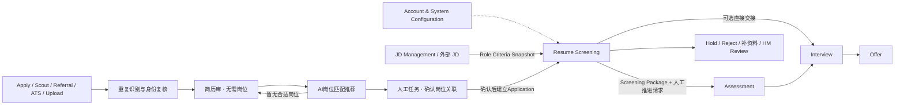
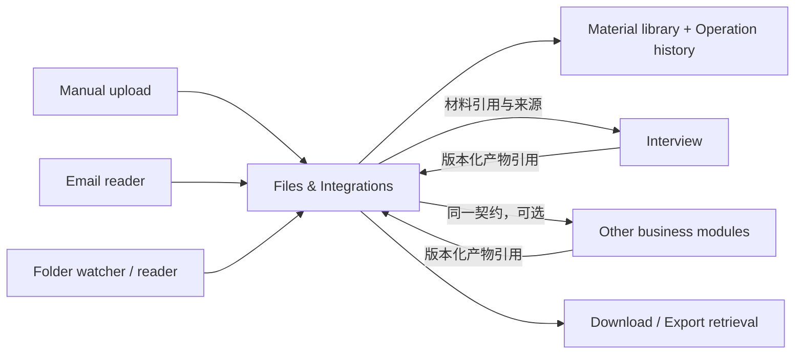

# HireOS Command — Resume Screening Module PRD

| 文档属性 | 内容 |
|---|---|
| 编号 | CMD-SCR-001 |
| 版本 / 日期 | v1.3 / 2026-09-08 |
| 状态 | Draft for Review；整合已确认方向，补充可执行默认规则，非已部署声明 |
| 领域名称 / UI 名称 | Candidate Screening / Resume Screening |
| 配套接口规范 | [Resume Screening Interface Spec v1.0](Resume_Screening_Interface_Spec_v1.0.md) |
| 面向读者 | Product、Design、Engineering、AI、QA、HR、Hiring Manager |

**当前需求基线：v1.3。Command 的所有独立模块均按全功能产品设计与开发，不采用精简首版或按阶段延后已确认功能的范围划分。工程任务可以安排实施顺序，但不能据此删减功能、降低验收要求或把已确认能力列为未来可选项。** 该原则适用于本项目后续所有模块文档和设计讨论。

本版按用户要求，从 [Interview PRD v1.6](HireOS_Command_Interview_PRD_v1.6.md) 直接复制公共模块正文与验收要求，完整收录于 Section 13，保留原文及来源编号。新增 SHARED-11 模型配置与路由的 Screening 使用映射；v1.2 的重复识别、简历库、人工关联、任务管理和既有候选人对比继续有效。Interface Spec v1.0 尚未同步这些新增内容，不得以旧字段或范围限制当前产品流程。

## Section 1 — Product Positioning

Resume Screening 承接多渠道简历入库、岗位发现与匹配，再对经人工确认关联的候选人形成岗位筛选证据。简历可以先于岗位进入系统；没有合适岗位也能保存和管理。核心问题：**Who should advance to the next stage, and why?** 它是 Candidate Screening Decision Engine，不只是 Resume Parser 或一个匹配分数。

Resume 是 Candidate 的证据来源，不是 Candidate 本身。Candidate 表示人；CandidateProfile 表示有版本的资料；CandidateJobRecommendation 表示AI或人工提出的候选人与岗位匹配提案，不是正式关联；Application 表示经人工确认后该人与该岗位的一次招聘关系；PreLinkMatchEvaluation 表示关联前的匹配依据，ScreeningEvaluation 表示正式关联后的岗位筛选评估。一个人在不同岗位的分数、判断和权限分别管理。

目标是减少 HR/HM 阅读和整理资料的时间，同时使推荐、风险、未知项和下一步清楚可追溯。AI 不自动拒绝、自动发测评或自动安排面试。

## Section 2 — Users & Design Principles

| 用户 | 需求 | 可执行动作 |
|---|---|---|
| Recruiter / HR | 批量处理、薪资/地点条件、推进与协作 | 导入、复核、分配、决定、交接 |
| Hiring Manager | 技术深度、相关经验、ownership、0→1 经历 | 审阅证据、补充意见、决定、确认岗位偏好 |
| Recruiting Operations | 处理失败、映射和交付问题 | 重试、修正映射、查看运行与交付状态 |
| Admin / Policy Owner | 权限、配置、偏好治理 | 配置权限、保留策略、批准共享偏好版本 |
| Candidate | 提供和纠正资料、参与下一阶段 | 经受控入口补充信息；无权读取内部排序与评语 |

遵循七项原则：loose coupling；standalone + integrated mode；structured data first；evidence-based AI；human-in-the-loop；versioned data contract；auditability。先建立结构化要求、证据、评价和决定，再生成展示摘要。未知不等于不满足；AI 建议不等于人工决定；来源声明不等于独立验证。

HR 或 HM 均可作为主筛选人，权限由岗位配置决定，不能因角色名称默认一方无权处理。默认普通筛选决定允许一位获授权负责人提交；岗位可要求双人确认。对明确岗位底线的例外推进默认要求 HR 与 HM 共同确认，两个不同人员的有效批准；此为本版拟定默认规则，不将 Interview 最终结论双签机械套用到所有筛选操作。

## Section 3 — Module Context & Boundaries

### 3.1 全局位置



这是可组合业务关系，不是强制运行依赖。M0 是横向配置，不是招聘阶段。Screening 可在只安装本模块及基础账号配置时完成导入、分析、人工决定、报告和导出。

### 3.2 Upstream

| 上游 | 标准输入 | 权威边界 |
|---|---|---|
| JD Management | Job、JDVersion、RoleCriteriaSnapshot、Requirement、Rubric、WorkflowPolicy | 已发布岗位标准归 JD；Screening 只保存快照 |
| 外部 JD / 手动输入 | JD 文本/文件、岗位背景 | Screening 起草本地标准，经人工确认后可用 |
| Apply / Scout / Job Board / Agency / Referral / ATS | Candidate/Profile、Application、Resume、申请回答、来源元数据 | 接入适配器规范化；引擎不包含渠道专用逻辑 |
| Account & System Configuration | 身份权限、AI/评分/保留策略、公司配置 | 配置不代替业务决定；操作时重新验证权限 |
| HR / HM | 人工补充、评分反馈、偏好 | 与原始来源和 AI 输出分开保存 |

### 3.3 Downstream

Assessment 消费能力缺口、测评目标与必要证据；Interview 消费背景、strengths、concerns 和 verification items。目标模块自行建立 Intake 并核验本地条件。筛选通过不意味着测评通过或面试批准。

默认可以 Screening → Assessment → Interview，也可 Screening → Interview，或先 HM Review。没有安装 Assessment 不需要为一个不存在的阶段生成豁免；若已确认工作流明确要求测评，跳过才需要有效豁免。Offer 不由 Screening 直接批准或发放。

### 3.4 Input / Output Summary

| 类别 | 输入门槛或内容 | 输出 |
|---|---|---|
| 简历入库 | 简历/结构化资料、来源与有效权限；无需岗位 | LibraryEntry、DuplicateCheck、Candidate/Profile或待身份确认记录 |
| 岗位推荐 | 可用Profile、可访问且开放的岗位标准；岗位集合可空 | PreLinkMatchEvaluation、CandidateJobRecommendation或no_match/no_open_jobs等明确状态 |
| 人工关联 | 当前有效的候选人/岗位快照、确认人权限、关联处理结果 | LinkDecision；确认时创建或复用Application |
| 岗位项目启动 | JD 文本或结构化岗位定义；候选人可后加 | ScreeningProject、待确认标准 |
| 正式岗位分析 | 人工确认的Application、confirmed RoleCriteria、CandidateProfile（可 partial）、至少一项可用证据来源、有效策略 | ScreeningEvaluation、缺失项、AI 运行状态 |
| 批量分析 | 多个有效 Application，共同评估基线 | 独立结果、失败条目、可比较 cohort 排序 |
| 人工复核 | 结果快照、理由、当前权限 | ScreeningDecision、FeedbackEvent |
| 对外报告 | 完成的 AI 或人工评估，明确复核状态 | 自包含 ScreeningPackage；Hold/Reject 亦可生成 |
| 推进请求 | 有效人工 Advance、目标与适用门槛 | WorkflowTransition、DeliveryReceipt |

新增流程与实体以本版产品要求为准，详细接口须按12.2同步；已存在且非冲突字段沿用配套 Interface Spec。包发布、邮件发送、目标接收和目标执行是四件不同的事。

### 3.5 In Scope / Out of Scope

In scope：简历库、重复识别、岗位匹配提案、人工关联、任务处理、资料接入与规范化、岗位标准确认、eligibility、多维匹配、证据解释、排序、候选人横向对比、人工筛选、反馈采集、版本化报告和交接。

Out of scope：Scout 寻人和冷触达、修改上游已发布 JD、执行笔试、执行面试、Offer 薪酬审批、自动淘汰、跨岗位直接比较分数、以人格/受保护属性推断工作能力。公司规模不是能力或适应性的直接证据。

### 3.6 Standalone Architecture

独立模式使用本地 Project、Job、Candidate、Application 和输入快照；外部 ID 可无。业务核心经 ports/adapters 调用文件、解析、AI、审计、通知和交接能力；可用本地实现，不等待中央服务上线。JD-only 可建岗位项目；Resume-only 可入简历库并检索岗位。无岗位不建虚拟Job或Application；正式岗位筛选需人工确认关联。

关闭 JD/Assessment/Interview 后，已导入材料仍可分析、查看和导出。邮件为默认跨团队交付方式，文件包为替代通道；机器 API/事件为可选集成。邮箱离线不阻断本地业务，交付排队并显示异常。

### 3.7 Integrated Architecture

同一 Screening Engine 使用稳定的版本化契约；禁止直接读取 JD 数据库、写 Assessment/Interview 数据库或依赖其内部表。保留本地 ID，通过 ExternalIdentityMap 关联中央或外部 ID；不强制全局注册。集成模式可复用注册表、事件总线和编排服务，但筛选事实仍归 Screening。

业务状态本地权威；可选 Command 总览是带来源及更新时间的读模型。交接通过事务性 outbox、接收方 inbox 去重和回执可靠处理，不需要跨模块分布式事务。

### 3.8 Shared Services

| 标识 / 公共能力 | 本模块场景 | 边界 |
|---|---|---|
| SHARED-01 账号与权限 | 租户、岗位、负责人、操作授权 | 不拥有筛选决定 |
| SHARED-02/03 主题与字号 | Light/Dark/Deep/System；Small/Medium/Large | 与业务评分偏好分离 |
| SHARED-04 文件与版本 | 上传、预览、下载、材料版本 | 筛选解释与数据映射归本模块 |
| SHARED-05/06 邮件与文件夹读取 | 授权连接、读取、检查点、暂停恢复 | 读取成功不等于导入/分析成功 |
| SHARED-07 任务与历史 | 批次、尝试、失败和重试 | 保留单候选人业务状态 |
| SHARED-08 统计与首页偏好 | 卡片、范围、折叠、刷新 | 筛选指标口径归本模块 |
| SHARED-09 人工任务、确认与通知 | 我的任务、待领取池、任务统计、关联确认、筛选与下一步处理、提醒 | 公共任务框架；来源模块拥有业务完成规则；机器运行任务仍归SHARED-07 |
| SHARED-10 审计与保留 | 输入/结论追溯、访问、删除 | 证据解释与重评影响归本模块 |
| SHARED-11 模型配置与路由 | 模型目录、任务策略、价格/预算、时延、质量评测、数据约束、回退、版本及调用历史；原文见Section 13 | 公共服务管理模型运行，Screening拥有匹配和业务决定 |
| 逻辑公共能力（待统一编号） | Parsing、Evidence registry、Preference engine、Event bus | 可复用组件/服务，不是强制中央运行依赖 |

当前就地定义使用要求，后续整合时抽取公共规范；不声称公共服务已实现，也不因共用组件扩大数据权限。Section 13已原文复制Interview v1.6的完整公共需求，作为本表的详细配套；适用关系及差异见13.1。

## Section 4 — Intake & Canonical Data

支持人工上传 PDF/DOCX、粘贴 JD、结构化 Profile、CSV 批量导入、API，以及获授权邮箱/文件夹读取。招聘平台、推荐、第三方来源统一记录原始渠道与 source_record_id。渠道连接器按企业授权与实际来源配置，支持文件、邮件、文件夹和 API 接入；全功能范围不意味着绕过第三方访问权限或承诺未指定平台的私有接口。

接入顺序：保存来源 → 文件安全检查与重复识别 → 解析和身份归并复核 → 保存简历库/Profile → AI检索岗位并逐岗匹配推荐 → HR/HM处理关联任务 → 人工确认后创建或复用Application → 岗位筛选复核/候选人对比 → 人工提出并确认下一步。上传、AI推荐、正式关联与进入下一轮是不同动作。

保留来源原文和结构化字段，解析纠正产生新 Profile 版本。禁止 AI 补造未写明的薪资、签证、离职原因或公司规模。材料中的指令视为内容，不能改变提示策略、权限或评分规则。文件扫描失败进入隔离，不能送入 AI。

### 4.1 重复简历识别

上传、邮件、文件夹、API及批量导入均执行同一套检测，覆盖同批次内部与已有简历库。同一租户内识别，结果只展示获授权记录；不得通过提示泄露其他租户或受限候选人信息。

| 检测层 | 方法与输出 | 处理规则 |
|---|---|---|
| 完全相同文件 | 文件内容摘要一致，不依赖文件名 | 提示“该文件已存在”，复用文件内容，保留本次上传/渠道记录；不重复创建Candidate/Application/分析任务 |
| 内容相同、格式不同 | 对解析文本规范化后比较，排除版式等差异 | 标疑似内容重复并展示依据；不能因为文本相同自动合并身份或删除新来源 |
| 同人不同版本 | 姓名结合联系方式、履历等多个信号，识别更新时间与内容差异 | 提示可能为更新简历，人工确认后作为同一Candidate的新ResumeVersion；旧版保留 |
| 身份相似但不确定 | 姓名/履历相似或联系方式冲突 | 进入重复复核任务；用户选择同一人、不同人、补资料或暂缓；不按姓名自动合并 |

重复提示显示可见的已有记录、来源、上传时间、版本及差异。人工可选择使用已有资料、保留新版本、确认为不同候选人；需有权限并留审计。完全相同文件自动去重仅复用存储内容，不等于自动确认身份或岗位关联。解析失败无法做文本相似检查时明确显示未完成检查，不宣称“无重复”。

同一个人可以有多份简历和多个经人工确认的岗位关系，不能把多岗位关联当作重复候选人。新简历不覆盖已有评估依据，影响当前推荐/结果时标记待更新。并发重复上传必须原子去重；错误合并支持有审计的纠正/拆分和关联影响复核，不破坏历史证据。

### 4.2 简历库与岗位推荐

简历库独立于岗位保存Candidate、Profile、ResumeVersion、来源、负责人、标签、入库时间、最近匹配时间与授权/保留状态。一个候选人可以关联零个、一个或多个岗位；即使已有岗位关系，也继续属于简历库，不能用互斥的“在库/已关联”状态丢失信息。

上传后自动在用户可访问且开放的岗位集合中检索并匹配；岗位标准必须confirmed。输出岗位列表、各岗位的匹配理由、关键缺口、证据、推荐置信度和输入版本。各岗位使用自身rubric，推荐顺序使用明确版本的岗位推荐规则及理由，不能直接把不同岗位的分数按大小混排；不伪造跨岗位统一录用概率。

匹配状态分开记录：not_started、running、recommendations_ready、no_match、no_open_jobs、insufficient_data、failed。no_match只是当前岗位集合/资料版本下暂无合适岗位，不代表候选人不合格；AI失败不标no_match。无推荐时留库，显示原因，可人工搜索岗位、补资料或设置复查。没有可处理问题时不反复生成无意义待办。

新增/重开岗位、岗位标准更新、候选人资料更新或用户手动操作可触发重新匹配，保留run版本并去重；新匹配产生待确认提案，不自动建立关联。保留期限与可联系状态由配置约束，已删除或受限资料不再自动匹配。

### 4.3 人工岗位关联与下一步分离

CandidateJobRecommendation状态：proposed → confirmed/dismissed/deferred；来源变化可标stale或withdrawn。HR/HM在任务中查看候选人和岗位、AI解释、关键未知项与是否已有正式关系，可确认一个或多个岗位、拒绝本次提案、暂缓或选择其他岗位。拒绝匹配提案不等于拒绝候选人，也不删除简历库资料。

只有有效LinkDecision=confirm才创建或复用正式Application。LinkDecision绑定候选人、岗位、推荐/人工选择来源、输入版本、确认人、时间和原因；重复确认同一有效招聘周期只返回已有Application，重新申请需显式新周期。并发确认采用版本前置条件与唯一约束。确认前重新核验岗位开放状态、资料有效性与权限；过期提案需刷新复核。

候选人主动投递或从指定岗位上传时保留原申请意向和外部申请记录，但在本模块先作为待确认关联输入，不绕过人工确认。对已存在且已有人工作出关联确认的Application只复用已有关系，不重复要求确认；上游提供的确认需可追溯，不接受只有AI结果的“已关联”标记。

确认关联只表示纳入该岗位考虑，不表示Advance或发出邀请。之后生成“筛选/下一步处理”任务，HR或HM可参考匹配、候选人对比给出笔试、直接面试、补资料、暂缓或不推进意见；建议若需其他人批准仍为proposal。只有符合权限和工作流规则的显式决定才能生成交接与通知。可在同一页面连续完成，但后台保留关联与下一步两个独立动作及审计。

### 4.4 数据对象与关联前评估

| 对象 | 必须记录的内容 |
|---|---|
| LibraryEntry | entry_id、workspace、Candidate/Profile/Resume refs或待身份确认来源、负责人、标签、来源、保留状态、入库时间；job/application可无 |
| DuplicateCheck / DuplicateResolution | 来源版本、检测算法版本、hash/相似依据、候选重复refs、检查状态、人工处理结果、操作者/时间；文件重复与身份重复分开 |
| JobDiscoveryRun | Candidate/Profile版本、可访问岗位集合快照、规则/模型版本、运行状态、推荐refs、无推荐原因、生成时间 |
| PreLinkMatchEvaluation | candidate_ref、job_ref、role/profile/policy版本、证据、逐维结果、缺口；无需application_id且不能触发推进 |
| CandidateJobRecommendation | recommendation_id、上述评估ref、建议原因、proposed/confirmed/dismissed/deferred/stale/withdrawn、任务ref；不是Application |
| LinkDecision | 处理结果、候选人/岗位/推荐refs、确认人、时间、理由、expected_version、确认后application_ref；dismiss/defer不创建Application |

关联后若输入、模型和策略完全一致，可创建明确关联的ScreeningEvaluation并引用不可变PreLinkMatchEvaluation以复用已有分析，不改写原记录；否则重新分析。最终推进必须引用Application下有效评估与人工决定。Comparison Set仍只比较已确认Application；待确认推荐在独立推荐池展示，不混入正式pipeline和人数。

## Section 5 — AI Screening Model

### 5.1 Pipeline

关联前：简历入库 → 锁定岗位集合及输入 → 逐岗eligibility/多维匹配 → 推荐岗位 → 人工确认关联。

关联后：确认标准和Application → 锁定输入manifest → 复用有效匹配依据或重评 → strengths/concerns/verification → recommendation → cohort ranking/横向对比 → 人工筛选与下一步处理。两段复用评价引擎，但不要求先创建Application才允许AI匹配。

每个 AI Run 记录模型供应方/版本、prompt 模板/摘要、参数、解析器、策略、rubric、偏好版本、输入摘要、起止时间和错误。可重建当时依据，但不承诺模型重跑逐字一致。AI 失败支持有依据的人工评估，AI 状态显式 unavailable。

### 5.2 Eligibility

| 状态 | 定义 | 行为 |
|---|---|---|
| eligible | 所有适用 hard requirements 有足够证据支持满足 | 继续匹配，仍需人工决定 |
| likely_eligible | 无不满足/未知/冲突，但至少一项只有初步支持 | 标明需确认的依据 |
| needs_verification | 有未知、矛盾或证据不足的硬条件 | 创建 verification item，不自动淘汰 |
| not_eligible | 至少一项硬条件有明确不满足证据 | 展示依据；人工拒绝或按策略审批例外 |

适用条件包括地点、工作授权、必需证书/语言/技能/经验、明确薪资条件。是否 hard 必须来自岗位确认版本，AI 不得自行提升 nice-to-have 为硬门槛。薪资先统一币种、周期、gross/net 后再比较；不具备可比条件时为 unknown。

### 5.3 Multidimensional Match

支持 Skills、Relevant Experience、Seniority、Industry、Company Context、Role Similarity、Scope & Ownership、Achievement、Startup/0→1、Leadership、Location、Compensation、Education、Language。按岗位选择维度与权重，不能全部写死或重复计入同一要求。

每项输出 score、evaluation_status、reason、supporting/counter evidence、confidence。量尺 0–100，0 表示有证据支持的最低表现；unknown/not_evaluated/not_applicable 的分数为 null。

本版默认：对适用且已评价维度按权重归一化计算 overall；coverage 为已评价权重/全部适用权重。coverage < 0.70 时 overall=null，结果标 insufficient_evidence；达到门槛仍必须展示 coverage、confidence 与未验证硬要求。0.70 是待试点校准的产品默认值，保存在策略版本。overall 不是录用概率，不展示百分号。

### 5.4 Strengths / Concerns / Items to Verify

Strength 是有来源的正向 claim；Concern 是正式实体，含类型、严重度、置信度、岗位关联、证据、验证状态和处理记录；VerificationItem 是可分派、可关闭的待核实问题，可来自 concern、未知条件或矛盾。

例：简历写“主导首个产品从概念到上线”可支持 0→1 经历，但仍为 candidate_claim。来自大公司只可记录组织背景；不能直接得出“不适应创业公司”。应提出“请举例说明在资源不足、职责模糊环境中的独立交付”，标明待核实，不能无证据扣适应性分。没写分布式团队经验是 missing_information，不是已证明缺乏能力。

Concern severity 与 confidence 分开。解决 Concern 需解释和结果证据，原 concern 和旧包仍保留。面试重复简历自述不增加独立来源数。

### 5.5 Recommendation & Ranking

建议枚举：strong_advance、advance、review、hold、do_not_advance；每项含理由、关键因素、缺口和建议下一步。策略中的阈值需版本化；缺关键证据默认 review，即使已有维度分数较高。

Ranking 只在同一 workspace/job/role criteria/policy/rubric/model-prompt baseline/effective preference 及同一 scoring algorithm 下比较。不同基线分组，不把旧结果直接混排。个人偏好排序独立命名并留存，不改变团队排序。

默认在各 eligibility bucket 内按可用 overall 降序、coverage 降序排序；相同数值同业务名次，稳定 ID 仅决定显示顺序。无总分列入 Needs Verification，不强行给最低名次。cohort 记录全部成员及结果版本、排序算法、生成时间和排除原因。新增候选人生成新 ranking snapshot，不改历史；手工 pin 仅影响个人查看。

### 5.6 Candidate Comparison — 产品定位与边界

**Ranking → Comparison → Next-step Decision 是三个独立能力。** Ranking 分配审阅注意力；Comparison 呈现候选人之间与岗位相关的差异、取舍和证据缺口；Next-step Decision 决定分别投入何种下一轮评估。对比不表示立即选择录用者，不自动淘汰、推进或发送通知。

适用范围为同一岗位下的多个 Application。简历筛选后、每轮笔试后、每轮面试后及最终综合审阅都能创建或更新对比。候选人可以按不同路径继续：向全部选定候选人发笔试、仅向部分人发下一轮通知、对优秀候选人直接安排面试、补资料、暂缓。默认名次不决定动作；跳过笔试仍遵循已确认工作流的 optional/not_required/有效例外规则。

### 5.7 对比矩阵与一页差异图

采用候选人为列、维度为行的矩阵作为主视图。默认适合并排查看 2–4 人，同时支持更多候选人的横向滚动、固定岗位维度列、筛选及分组；不以四人限制业务名单。用户选择的对比成员固定保存，不随名单新增悄悄改变。

| 维度组 | 内容 | 展示规范 |
|---|---|---|
| 核心差异 | 最重要优势、关键取舍、主要待确认问题 | 优先突出岗位相关差异，共同点可折叠 |
| 能力与资历 | 技术、经验、行业、ownership、领导力、语言能力 | 按同一要求和量尺对齐，展示分数或文字结论及证据 |
| 条件与可行性 | 薪资期望、地点、工作授权、到岗时间 | 展示事实、已知时间、单位与匹配状态；未知不为零 |
| 工作方式 | 独立推进、协作、处理模糊需求、资源有限时交付 | 行为实例及待验证问题，不推断人格，不用笼统文化适配分替代 |
| 证据状态 | 来源阶段、已验证/自述/矛盾/未提供、覆盖率 | 每格可下钻到明确材料版本和定位 |
| 下一步 | 笔试、面试、补资料、暂缓等提案 | 每人独立选择，提交前明确授权与接收对象 |

薪资统一币种、周期、gross/net后才可比较；无法统一时显示不可直接比较及原因。语言区分听说读写和实际验证方式。较低薪资不自动增加能力分；公司规模、简历写法、姓名和照片不作为工作方式推断依据。

支持导出一页可读差异图（PNG/PDF）和完整对比报告。单页必须包含岗位、对比时点、成员、关键差异、证据状态与重要限制；人数过多时要求选择导出子集或输出分页完整报告，不缩成不可读字体或静默漏人。导出按用户当前权限裁剪，不默认包含联系方式及其他无关个人资料。

### 5.8 AI Key Differences

矩阵上方自动生成短摘要：主要差异、对岗位的意义、证据局限、最有价值的下一步验证。每个实质差异关联 requirement、涉及的 Application 及支持/反证；同一事实不得在摘要中被升级为更确定的判断。

允许结论为“暂无明显全面领先者”。对取舍使用条件表达，例如“若更看重已有技术验证，A 的证据更充分；若更看重资源有限环境的交付经历，B 的经历更相关，但仍需验证技术深度”。不得生成未经证实的录用概率，也不得强制指定一个赢家。

### 5.9 同阶段、跨阶段与历轮变化

- **同阶段对比**：同一岗位标准、兼容的测试/评分量尺与策略下比较。不同测评题型、版本或评分标准不能直接混比数值；无有效映射时仅并列证据并标注限制。
- **当前综合对比**：各人可处于不同阶段；展示已完成阶段和证据覆盖。尚未参加笔试/面试属于未评估，不是能力不足。不将更多已完成轮次自动换成更高能力分。
- **历轮变化**：同一 Comparison Set 可持续复用，每次刷新创建新 Snapshot。显示新增证据、已解决concern、未解决缺口及结论变化原因；保留之前对比，不原地覆盖。

综合比较使用一份明确的目标岗位标准；旧阶段要求必须映射到当前版本。无法映射时标不可比。排序沿用5.5的严格cohort规则，综合对比不因此强行生成混合排名。源证据受限、撤回或更新时，对比标stale/restricted，重新生成并复核后才用于新的推进决定。

### 5.10 Comparison 数据与公共能力

**[公共框架 + 各模块业务规则]** Candidate Comparison 是 Command 可复用能力。Screening、Assessment、Interview 各自拥有评估和证据；对比层只组合获授权快照、生成差异，不获得修改源结论的权利。各独立模块均可使用本地对比组件与适配器，不要求中央 Comparison 服务上线。

| 对象 | 必需内容与责任 |
|---|---|
| ComparisonSet | workspace/job、稳定set_id、成员application_refs、创建者、协作者、用途、可见范围；仅同一岗位 |
| ComparisonSnapshot | set版本、成员精确结果版本、目标岗位标准、维度/量尺映射、比较模式、阶段和证据状态、生成时间、输入manifest、模型/prompt版本、访问限制、freshness |
| ComparisonCell | application、requirement/dimension、值/单位、evaluation_status、来源阶段、证据refs、验证状态、可比性与原因 |
| DifferenceSummary | 差异文本、涉及成员、岗位要求、支持/反证、置信度、比较局限和待验证项；AI与人工批注分开 |
| NextStepProposal | application、建议动作、依据snapshot_ref、原因、缺口；仅提案，经显式人工提交生成Decision/WorkflowTransition |
| ComparisonAnnotation | 作者、目标单元格/摘要、正文、时间、引用快照、修订历史；不覆盖AI原文 |

读取、刷新、改成员、批注、导出和提交下一步均审计。快照只冻结输入和当时结论，不冻结永久访问权；已撤权的证据禁止重新导出。接口规范后续同步需补上述字段定义、关系、comparison生成/失效事件及幂等/权限验收，不得以旧接口缺对象为由删去本版功能。

## Section 6 — Human Review & Preference Learning

### 6.1 Decision & Collaboration

可操作：Strong Advance、Advance、Hold、Reject、Request Information、Assign Review、Send Assessment、Move to Interview。后两项属于显式交接请求，不能由 recommendation 自动触发。改分生成 HumanAssessment，不覆盖 AI 分数。Hold/Reject 仍可形成报告；拒绝通知候选人是独立获授权通信动作。

提交决定绑定 evaluation 与输入版本；若资料/岗位/策略已更新则提示 stale，阻止直接推进，要求重评后重新确认或按明确策略批准使用旧依据。并发修改用版本前置条件，冲突显示已有决定，不采用最后写入覆盖。

普通 Advance 由岗位配置的负责人批准；双人审批适用时所有批准必须绑定同一决定版本。Hold 不关闭补资料任务；Reject 后取消未执行推进与提醒。撤销已交接决定向目标发更正通知，不直接取消目标已执行的面试或测评。

### 6.2 Preference Profile

四层：Organization → Team → Role → User。组织治理策略始终优先，Role 已确认标准决定正式计分；Team/Organization 提供默认偏好。User 偏好可在允许范围调整个人查看，不隐式改变硬条件或团队评分。多个层级合成为 effective preference snapshot，记录冲突解决和来源。

允许偏好：技术深度、ownership、0→1、hands-on、行业相关性、领导范围等岗位相关且可证据化因素。禁止学习种族、性别、宗教、年龄、国籍等受保护属性及明显代理；不把名校/大厂、职业间断等当作通用能力替代。不得从姓名、照片推断。

### 6.3 Learning Loop

FeedbackEvent（操作事实）→ PreferenceSignal（有范围、质量和依据的信号）→ proposed PreferenceProfile → 审核/激活新版本 → 新筛选或显式重评。完整提供结构化反馈、信号提炼、偏好提案、审核与版本激活；共享偏好不能绕过人工审核自动生效。

Shortlist/Reject/Override/改分/标记 concern 不正确/标记 strength 重要都可记录，但不是每个点击都能用于学习。推进行为需要理由才能形成高质量信号；个人知识需来源和访问边界。信号需去重、按岗位与时间区分、允许纠正/撤回。组织/团队版本须授权审批，样本不足维持现有版本；阈值由有效策略配置并通过实际样本校准。下游结果只是有选择偏差的反馈，不代表被拒候选人没有能力。

## Section 7 — Batch Screening

完整支持批量导入、运行、进度、失败重试、排序、对比、批量业务决定与批量推进。入库批次可完全没有岗位，逐条检测重复、解析和推荐；正式岗位筛选批次锁定一个岗位评估基线，每个候选人独立任务。机器运行任务与人工待办分别统计。坏文件不阻断其他条目，结果为 partial_success；取消仅停止未完成任务，保留已产出结果。

列表显示 received/parsed/needs_mapping/queued/running/completed/failed/cancelled 数量和明确统计口径。失败重试不重新计费或重复分析成功项（实际供应商重试费用另记成本），不重复创建人或案件。运行中修改岗位版本不改变当前任务；新版本须建新批次。按租户限流，显示预计队列状态，不假造精确完成时间。

批量决定必须先展示精确候选人 ID 清单、当前版本、动作、理由及例外；逐项提交和回执，部分失败可恢复。不能让“选择全部”悄悄包含后续新增候选人。

## Section 8 — UI Hierarchy & Interaction

### 8.1 信息架构

主导航提供 My Tasks / Resume Library / Jobs / Comparisons；公共入口 Files / Connections / Activity / Settings。默认工作入口为“我的任务”，简历库允许不选岗位上传。岗位页分开显示“待确认推荐”和“已关联候选人”，明确两种人数口径。首页展示待关联确认、待筛选、待下一步处理、待补资料和交接异常；机器批次进度单独呈现。团队统计按权限展示，时间范围与最后刷新时间可见。

Workspace 使用左侧候选人列表、右侧详情：岗位与标准版本、候选人数、筛选/排序基线位于顶部；名单保留筛选器与滚动位置。支持状态、维度、来源、负责人、coverage 过滤，来源只用于运营过滤，不默认加权。

### 8.2 Decision → Explanation → Evidence

| 层级 | 展示 |
|---|---|
| Level 1 Decision | 候选人、overall/coverage、eligibility、AI recommendation、人工状态、前三项 strengths/concerns、下一步 |
| Level 2 Explanation | 多维分数、评分标准、缺失信息、待验证项、协作意见、排序说明 |
| Level 3 Evidence | 原文定位、履历时间线、材料版本、支持/反证、生成及修改历史 |

点击分数或 concern 可到来源页码/段落；原文不可用显示 unavailable，不能显示“已验证”。AI 与人类意见使用清晰标签。不要以红绿颜色作为唯一语义；分数不用假精度。stale、pending、empty、error、partial、无权限状态分别设计。

### 8.3 公共体验

沿用 Interview 的 Light/Dark/Deep/System 与 Small/Medium/Large，保留个人显示设置、键盘导航、焦点可见、200% 缩放及读屏标签。文件区提供列表、预览、版本、上传/下载进度、读取与消费两个状态，风格参考既有文件管理体验。内部技术 ID 和 hash 收纳在详情/审计，不放主决策流程。

### 8.4 通知

资料接收、需补充、分析完成待复核、复核逾期、报告完成、交接失败、版本更正均生成通知规则：事件、接收角色、模板、对象 URL、去重键、截止/升级策略。候选人仅收到补资料或获授权流程通知，绝不包含内部评语和排序。URL GET 不产生批准；操作需登录和显式提交。邮件失败本地可见并排队；报告可独立导出。

### 8.5 Comparison Workspace

从岗位列表勾选候选人进入Compare；保留来源列表的过滤条件。顶部为岗位、对比名单、模式、时间/版本和刷新状态，其下是Key Differences，再下是矩阵，右侧或抽屉展开证据与协同批注。提供“只看差异”“显示未知”“按岗位关键维度”“查看历轮变化”及保存的个人视图。

矩阵底部逐人选择下一步，支持批量赋予相同动作后逐人修改；提交前列明精确名单、动作、路由、待满足条件及所需批准。生成对比或导出图表不发送通知。系统必须分别显示提案、人工已决定、待交付、目标接收及执行状态，不能用一个“已推进”掩盖部分失败。

### 8.6 Task Management & My Tasks

**[公共能力｜SHARED-09｜所有独立模块共用]** 所有需要人工完成的动作都能形成简单、可追踪的业务任务，包括简历筛选、岗位搜索结果筛选（job search）、岗位关联确认、下一步处理、补资料、重复复核及各轮评审。提供列表、分配、状态、统计和提醒，不要求用户维护复杂项目计划。岗位搜索结果的业务含义和完成动作仍由来源模块定义，公共任务层不接管搜索业务。

| 任务类型 | 触发 | 完成依据 |
|---|---|---|
| 重复/身份复核 | 检测到无法确定的重复 | 保存DuplicateResolution |
| 岗位推荐/关联确认 | 新有效推荐或人工选岗待确认 | 每个提案有LinkDecision：确认/拒绝；暂缓仍未完成 |
| 简历筛选复核 | 已关联且评估可用 | 保存筛选意见/决定；AI完成不等于人工完成 |
| 下一步处理 | 关联后需人工选择下一步，或筛选仅提交意见 | 保存下一步决定/待审批提案并满足任务要求；发送状态另跟踪 |
| Job search结果筛选 | 来源模块生成待审阅岗位结果 | 来源模块接受用户筛选结果，不自动关联或投递 |
| 补资料/补证、对比评审 | 明确缺口或评审请求 | 来源业务核验所需材料/意见已提交 |
| 异常与交接处理 | 可重试处理耗尽、退信或接收拒绝 | 修复并确认恢复，或有理由终止 |

同一处理能同时满足筛选和下一步任务时，可由业务事务同时完成相应任务，不要求用户重复提交。任务完成是业务动作成功后的结果，不提供绕过必需确认的“直接勾选完成”。关闭浏览器、阅读提醒或AI建议生成不完成任务。

#### 8.6.1 分配与我的任务

每个活动任务有一个主负责人或明确的待领取角色队列，可有协作者；HR或HM均可承担，不默认全压给HR。按岗位配置路由到负责人，缺岗位的入库任务路由到简历库负责人/招聘团队队列。无有效负责人显示“待分配”并通知队列管理者，不能静默丢失。

支持领取、转派、优先级、截止时间、开始处理、等待/暂缓、评论和查看历史。领取与转派需权限及并发控制；多人审批使用不同责任人的子任务，聚合状态不替代审批规则。转派不自动授予候选人资料权限；原负责人失权后不可继续操作。

“我的任务”默认展示本人负责的未结束任务；独立标签展示可领取、我创建/关注、已完成。列包括标题、来源模块/类型、候选人/岗位（可无）、优先级、状态、截止时间、等待原因、最后更新时间和下一步按钮。支持按岗位、模块、类型、负责人、状态和日期筛选，临期/逾期置顶，避免重复通知成为多条任务。

#### 8.6.2 状态与完成条件

状态：open → in_progress → completed；open/in_progress可转waiting，恢复后回到open/in_progress；来源撤回或失效可cancelled。waiting需原因和复查时间或明确恢复事件。逾期是派生标记，不是独立状态。defer不算completed；等待、失败、取消分别显示。

每类任务规定required_action及completion_rule。任务提交时校验当前业务版本、权限与前置条件，业务写入成功后才标completed；业务成功而任务同步失败时依幂等事件对账，不能重做业务。来源版本过期时标needs_refresh并禁用旧动作，更新到有效版本或取消并创建替代任务，保留关联。旧任务不得因同一事件重放重新打开；确有新业务需要时建立新任务/版本。

#### 8.6.3 统计口径

我的任务显示：未完成数（open/in_progress/waiting）、待开始、处理中、等待中、待领取（独立口径）、今日到期、逾期、本周完成。逾期按due_at小于当前时间且未结束判断；等待是否暂停时限由策略明确记录，不能默认隐藏逾期。

团队视图按权限提供负责人工作量、类型分布、未分配数、逾期率、完成数和处理耗时。未完成按task_id去重；子任务和父任务分开展示，不相加虚增。完成数按完成事件窗口计数，取消单列；时长展示创建至完成总时长，净处理时长须明确扣除哪些等待区间。不把任务数当候选人数、录取率或员工表现排名。

#### 8.6.4 提醒与公共数据

任务创建/分配、即将到期、逾期、等待恢复及关键业务变更触发站内提醒，邮件按配置发送。通知包含明确动作、负责人、时限及直达任务URL。频率、时区、工作时间和升级对象可配置；初次分配即时通知，临期/逾期按策略合并摘要，禁止每次后台重试轰炸。完成、取消、转派后撤销旧责任人的未发提醒；暂缓只调整提醒安排，不伪造截止时间或完成。邮箱失败在站内可见。

Task字段：task_id、workspace、source_module、task_type、subject_refs、source_version、required_action、completion_rule、assignee或queue、collaborators、priority、status、due_at、waiting_reason/resume_at、needs_refresh、created/started/completed_at、completion_ref、dedupe_key、supersedes_task_ref、audit_refs。无岗位任务不强制job/application；有业务关系时引用精确对象。提醒去重按task_id+规则版本+提醒时段+收件人；任务创建按来源事件/对象版本+动作+责任范围去重。

来源业务通过版本化task.requested/task.updated/task.completed/task.cancelled事件或等价接口同步；任务层验证生产者与租户，不凭任意事件文本推进招聘流程。独立模块保留本地Task存储与提醒能力；集成后的“我的任务”聚合授权任务，来源模块仍是业务权威。总览离线不阻止模块本地处理，恢复后按版本对账。

## Section 9 — Full Functional Scope

所有下列能力均属于完整产品交付与验收范围，不分精简版与后续扩展版。实施顺序仅是工程依赖安排，不改变范围。

| 功能域 | 完整范围 |
|---|---|
| 资料与接入 | 多来源文件/结构化输入、授权邮箱及文件夹监控、API、材料版本、解析纠正、来源映射、文件/内容/身份重复识别与人工复核、候选人历史、无岗位简历库 |
| 岗位发现与关联 | 入库后AI搜索匹配岗位、无匹配留库、触发重新匹配、人工确认关联、提案与Application分离 |
| 任务与协作 | 跨模块我的任务、角色队列/领取转派、状态/截止/暂缓、任务统计、提醒升级、业务完成校验和审计 |
| 筛选与解释 | 标准确认、eligibility、多维匹配、strengths/concerns/verification、证据定位、统一基线排序、缺失与冲突处理 |
| 候选人对比 | 多人矩阵、关键差异摘要、同阶段及跨阶段综合对比、历轮变化、协同批注、保存快照、一页图表导出、证据下钻、个人视图 |
| 人工决策与协作 | 单人及批量复核、改分、决定、分配、例外审批、逐候选人下一步提案和执行回执 |
| 偏好与学习 | 个人/团队/岗位/组织偏好、反馈采集、信号提炼、审核激活、版本治理、长期结果反馈及选择偏差控制 |
| 匹配与人才复用 | 跨岗位重新匹配、人才再发现、Scout 集成、Skill/Requirement Graph 映射；新岗位重新评估，不直接比较旧岗位分数 |
| 跨模块交付 | Assessment/Interview 文件、邮件、API 和事件交接、自动回执、补证结果回流、更正/撤回通知、异常恢复 |
| 模型配置与路由 | 多供应商目录、任务策略、四维约束、质量评测、价格与预算、受控回退、配置版本、调用历史及告警；详细原文见Section 13 |
| 公共体验与运行 | 主题/字号、高级过滤、统计、文件历史、权限、审计、版本、批次、通知、独立及集成运行 |

上线前校准 rubric、推荐阈值、容量和保留期限，并对完整范围验收。外部系统连接采用适配器和真实授权，未连接时独立流程仍须完整可用。

## Section 10 — Metrics

| 指标 | 精确口径 | 注意事项 |
|---|---|---|
| Time to shortlist | 正式岗位关联至首次人工Advance；另报上传至关联的时长及长期留库时长 | 按岗位cohort，未关联和未决定单列，避免留库混入处理效率 |
| Deduplication quality | 已复核重复提示中确认重复比例，抽样漏检率，误合并纠正数 | 文件重复与身份重复分开；无访问权限数据不外泄 |
| Link confirmation | 有效推荐中人工确认/拒绝/暂缓比例及确认耗时 | 分母为候选人×岗位提案，不能当独立候选人数 |
| Human task operations | 未完成/未分配/逾期/完成数、总处理时长及等待时间 | 采用8.6口径，与AI运行任务分离 |
| Review time / candidate | 前台有效审阅时长/独立审阅 Application 数 | 排除后台和闲置阈值；阈值版本化 |
| Throughput | 每 HR 每周首次完成人工筛选的 Application 数 | 重评不重复计数 |
| Downstream pass rate | 有可观察结果的已交接人中通过人数/有结果人数 | 测评、面试分开，注明观察窗与未完成数 |
| Screening → Offer | cohort 中进入 Offer 的 Application/人工 Advance Application | 不能解释为筛选因果效果 |
| AI acceptance / override | 同方向人工决定数/有 AI 且已决定数；相反方向同分母 | 显式映射 advance 类、hold、reject；review 不计方向，单报比例 |
| Concern validation | confirmed/(confirmed+dismissed) | unresolved 与 accepted_risk 单列 |
| Evidence accuracy | 人工抽样中来源定位且支持主张的 claim/抽样 claim | 跨岗位/来源分层抽样 |
| Comparison usefulness | 人工评审确认可帮助区分候选人的摘要数/已评审摘要数；单列错误差异与无依据结论率 | 按岗位/阶段抽样，不以推进或录用率替代对比质量 |
| Comparison efficiency | 从打开固定对比名单到提交下一步决定的有效时长 | 记录人数、阶段和资料完整度，未提交单列 |
| Ranking quality | 固定 cohort 的 NDCG@K 或 Precision@K，基于独立人工标注 | K、标注准则、未知结果比例固定记录 |
| Reliability / cost | 分析成功率、P95 延迟、每份有效结果成本、交接失败/重复案件率 | 人工路径与 AI 成功分开统计 |

试点先建立基线再设置业务提升目标。全功能硬验收：所有已评分项可追溯、未知不被写成 0、无 AI 自动推进、重复交付不重复建档、租户越权被拒绝。不得只为提高 acceptance rate 隐藏人机分歧。

## Section 11 — Acceptance & Failure Cases

| 编号 | 场景与预期 |
|---|---|
| SCR-01 | 只有 JD 可创建项目；加入可用候选人资料后可独立完成筛选和报告 |
| SCR-02 | 未提供 work authorization → needs_verification，无自动拒绝 |
| SCR-03 | 每个维度/strength/实质 mismatch concern 可定位输入来源；不支持的推断转待验证 |
| SCR-04 | 同人不同岗位形成独立 Application，评分/权限不混用 |
| SCR-05 | AI advance、人工 Hold → 仅保存 Hold，不创建推进请求 |
| SCR-06 | 100 份中一份解析失败 → 其余可完成，失败条目可重试，成功项不重复 |
| SCR-07 | JD 更新 → 旧结果保留并标 stale；新结果经人工确认后可交接 |
| SCR-08 | 无 Assessment 服务 → 可以直接向 Interview/人员交付；明确 required 的阶段需按策略处理 |
| SCR-09 | 同包邮件/文件重复到达 → 目标同一案件；回执丢失可查询/重发 |
| SCR-10 | AI 不可用 → 允许人工证据评估，无伪造模型结果 |
| SCR-11 | 个人偏好变化不改团队排序；共享偏好激活生成新版本 |
| SCR-12 | 邮箱失败不撤销报告；目标离线不回滚人工决定 |
| SCR-13 | 公司背景信息不直接变为 startup adaptability 扣分或拒绝理由 |
| SCR-14 | 键盘、主题、字号、缺失/失败/无权限与原文定位均可用 |
| SCR-15 | 同岗位多人对比呈现核心差异和证据；无明确赢家时不强制推荐第一名 |
| SCR-16 | 一人已笔试、一人未笔试，后者显示未评估，不因资料少直接判低能力 |
| SCR-17 | 一次对比可向全部选定人发笔试，也可分别面试/补资料/暂缓；生成对比本身不通知 |
| SCR-18 | 跳过明确required笔试需有效例外；optional/not_required不虚造测评结果 |
| SCR-19 | 每轮更新生成新快照，旧差异、原证据和变化原因可追溯 |
| SCR-20 | 不同岗位、量尺或标准未完成映射时不混算排名；缺失薪资/语言不写成零 |
| SCR-21 | 一页导出可读且包含比较限制，超量成员采用明确子集或分页，不静默漏项 |
| SCR-22 | 权限撤销或来源更正后禁止使用旧快照发起未经复核的新推进，批注不覆盖原评价 |

| SCR-23 | 相同简历改名重复上传、同批次或并发上传，复用内容且保留来源，不重复创建候选人/关联/任务 |
| SCR-24 | 不同格式同内容与同人新版本显示区别；同名不同人不自动合并，冲突有复核任务 |
| SCR-25 | 只上传简历、没有岗位，可入库；无岗位/无匹配/资料不足/AI失败状态区分 |
| SCR-26 | AI推荐多个岗位，确认前Application数不增加；人工可确认一个或多个并逐项审计 |
| SCR-27 | 人工拒绝岗位提案不删除候选人；暂缓留任务，关联成功不发下一轮通知 |
| SCR-28 | 同岗位重复确认/并发确认只保留一个有效周期关联；岗位关闭或输入过期需重新处理 |
| SCR-29 | 新岗位或新简历触发重新匹配，去重推荐任务且不自动关联；已关联关系不重复确认 |
| SCR-30 | HR/HM可领取和转派任务，未分配进入队列；转派不扩大资料访问权限 |
| SCR-31 | 阅读邮件或AI运行完成不完成人工任务；业务写入成功后任务完成，重复事件不重复执行业务 |
| SCR-32 | 我的任务/团队统计区分等待、逾期、取消、父子及机器任务，计数可追溯 |
| SCR-33 | 完成/取消/转派撤销旧提醒，等待恢复可提醒，邮件异常站内可见 |
| SCR-34 | 独立模块任务与提醒可用；集成聚合按权限及版本对账，不依赖中央任务服务 |

## Section 12 — References & Version Decisions

依据原对话 [Resume Screening Module PRD](chatgpt-conversation://6a9ffa40-a8b8-83ea-b375-5e6bbc00def5) 的已确认业务方向；参考 [Interview PRD v1.5](HireOS_Command_Interview_PRD_v1.5.md)、[Interview Interface Spec v1.0](HireOS_Command_Interview_Interface_Spec_v1.0.md) 与 [Module Boundaries v2.0](HiOS_Command_Module_Boundaries_and_Interface_Spec_v2.0.md)。原对话附图未作为字段级权威，本版以文字确认设计为依据。

冲突处理：保留旧 Interface 的结构化字段、Evidence、版本、审计、幂等原则；独立运行依赖与公共能力归属采用新版参考，不要求共享 Candidate/Application/Workflow 服务。Interview 旧必需前序包条款不能阻断独立模式。本版不会改写既有 Interview 文档，跨模块接入需使用配套 Spec 的映射并做消费者兼容验收。

| 版本 | 变更 |
|---|---|
| v1.0 | 首次双文件交付；固化 Section 3 边界、三层筛选模型、人工决定、偏好治理、批次、UI、初始范围、指标和验收；接口细节独立维护 |
| v1.1 | 2026-09-08：依据用户反馈，确立Command全部独立模块全功能开发原则，取消功能阶段划分；新增5.6–5.10候选人对比、跨轮快照、公共能力与数据对象；新增8.5交互；重写Section 9完整范围；补充对比指标及SCR-15–22验收。 |
| v1.2 | 2026-09-08：新增重复简历识别、无岗位简历库、AI先匹配推荐与人工确认后关联；新增跨模块任务管理/我的任务/统计/提醒；更新Section 3输入边界、Section 4流程与实体、5.1、批次和首页，新增8.6及SCR-23–34。 |
| v1.3 | 2026-09-08：按用户要求原文复制Interview PRD v1.6公共模块及验收到Section 13；新增SHARED-11登记和Screening任务映射；保留源编号与文本，明确源业务例子和本模块适用边界。 |

### 12.1 v1.1 变更影响（历史）

1. v1.1取代v1.0作为当前Screening产品需求基线；v1.0文件保留历史，不再用于裁剪功能范围。
2. Ranking继续保留，新增Comparison解释横向差异，Next-step Decision独立授权。比较不等于录取，不要求所有候选人走相同下一轮。
3. 原列为延后交付的对比、批量决定、偏好学习、跨岗位匹配和完整集成统一纳入全功能范围；审批、权限和证据要求保持有效。
4. Interface Spec v1.0、Interview及Assessment既有文档未在本次改写。接口同步需补对比契约并移除与全功能范围冲突的限制；跨模块共用能力不改变各自事实所有权。

### 12.2 v1.2 变更影响与接口同步要求（继续适用）

v1.2发布时取代v1.1；当前基线已更新为v1.3，旧版保留历史。沿用全功能开发原则以及既有对比能力。本次主要纠正“先创建Application再分析”的顺序：关联前以Candidate×Job提案和PreLinkMatchEvaluation运行，人工确认后才正式link，之后独立处理下一步。

Interface Spec后续同步必须：允许LibraryEntry/JobDiscoveryRun/PreLinkMatchEvaluation/Task在无Application时有效；定义DuplicateCheck、DuplicateResolution、CandidateJobRecommendation、LinkDecision和Task字段、状态、事件；区分重复文件/身份、新版本/重复尝试；规定关联确认唯一性、任务完成与业务事务一致性、通知去重、旧版本影响及权限。原Spec中所有候选人岗位评估必须已有application_id的要求，仅适用于正式关联后的ScreeningEvaluation，不适用于关联前匹配。既有ReviewTask统一映射公共Task，不能另建互不相通的待办体系。

岗位搜索结果筛选、笔试和面试人工任务复用公共框架，各来源模块仍定义自己的完成条件。本次仅更新Screening PRD，不声称其他模块或Interface Spec已完成同步。

### 12.3 v1.3 变更影响

直接复制公共内容，不以摘要替代正文。来源文件未改动。原文保留Interview措辞、章节编号、示例和范围标记，供来源核对；本模块适用说明在13.1独立记录，不无痕改写源文。v1.3为当前PRD；Interface Spec及其他模块尚未同步，公共需求不因此被推迟。

## Section 13 — 公共模块原文（复制自 Interview PRD v1.6）

### 13.1 来源、适用规则与本模块映射

以下各复制块内部文本与来源一致，包含表格、图示、字段及验收，不重新改写。块内的“Section/8.x/12.x”等编号均指**来源Interview文档**，不是本文件同号章节；块外13.x用于定位复制范围。

| 复制范围 | 采用方式 |
|---|---|
| 来源3.8 | 公共编号、归属与抽取规则原文；本模块SHARED-09人工任务扩展仍见8.6 |
| 来源8.2–8.6 | 首页框架、主题、字号、偏好和设计验证原文；面试场次/双签统计是来源示例，本模块任务与候选人计数采用8.6及Section 10 |
| 来源8.7 | Files & Integrations全文，含材料/连接/操作历史、状态与Drive体验参考 |
| 来源8.8 | Model Configuration & Routing全文，含价格、时延、质量、数据约束、预算、回退和运行记录 |
| 来源9公共对象段、10 | 公共读模型、显示偏好、文件及模型实体归属、可靠性与审计；面试采集/Offer规则仅为来源业务例子 |
| 来源12.1–12.4 | 统计、主题、文件与模型的原文验收；公共测试应用到Screening对应对象，不创建虚拟面试对象 |

适用规则：

1. **全功能范围**：源文中的旧范围标签仅保留作原文记录，不成为本模块交付分期。公共能力按完整范围实现，包括自动价格同步（供应商支持时）、定期质量回归、受控灰度对比和告警。自适应模型路由涉及新增策略，仍须明确评测和授权，不因复制默认自行启用。
2. **业务归属**：Interview最终双人确认、JD-only启动、面试数量与Offer流转不自动成为Screening规则。本模块继续支持Resume-only入库、AI先推荐、人工确认才关联、关联后再决定下一步；公共文件层不创建正式Application。
3. **权限与统计**：公共卡片、折叠和刷新机制复用；本模块“我的任务/团队”可见范围及口径按8.6与Section 10。源文“所有雇主用户可见”的面试汇总规则不扩大Screening候选人、任务或明细权限。
4. **输入与输出**：Files负责接收、引用、预览、下载和历史；Screening负责重复身份复核、岗位推荐和关联。源文关于邮件读取的边界不取消本模块已确认的邮件交付与提醒；发送使用获授权输出适配器并独立留状态。
5. **独立运行**：公共是逻辑复用，不强制部署中央服务；本地实现或适配器须满足同等契约。原型模拟仅是演示手段，不代替全功能产品验收。
6. **稳定基线**：模型路由或回退改变实际评估模型时，保留真实ModelRun/Attempt和输出版本；未满足5.5同基线条件不能混排候选人。模型配置不改岗位标准、偏好或人工决定。

Screening模型任务映射：

| task_type | 业务用途 | 专属质量要求 |
|---|---|---|
| resume_parse / profile_normalize | 简历提取与规范化 | 字段准确、来源定位、未知不猜填 |
| duplicate_similarity | 文本/身份疑似重复辅助 | 误合并控制、依据可见；文件摘要去重仍是确定性处理 |
| job_discovery / prelink_match | 入库后的岗位检索与推荐 | 岗位范围授权、逐岗标准、无需Application、不自动link |
| screening_evaluate / evidence_extract | eligibility、多维匹配、证据和concern | rubric一致性、可追溯性、未知处理 |
| candidate_compare | 多候选人关键差异 | 可比条件、证据覆盖、不可强制选赢家 |
| preference_signal_extract | 从反馈提炼偏好 | 特征allowlist、来源/样本、人工审核共享版本 |

普通HR/HM使用已发布任务策略；管理员管理模型连接、预算和配置发布，业务负责人维护任务质量门槛。任务路由的task_type与“我的任务”的人工Task不是同一实体，通过业务对象及运行ref关联。

### 13.2 公共能力登记与整合规则

来源：[Interview PRD v1.6](HireOS_Command_Interview_PRD_v1.6.md)。以下为原文复制。

<!-- BEGIN INTERVIEW V1.6 13.2 -->
### 3.8 跨模块公共能力标识与整合计划

#### 3.8.1 当前与未来的维护方式

**[公共能力｜所有模块共用｜当前就地定义，后续统一抽取]**

适用于 HireOS Command 的 JD Management、Resume Screening、Assessment / Written Test、Interview、Offer 等业务模块。共用表示共用能力、组件和规则框架，不表示每个模块必须启用每个连接器，也不表示所有用户可以读取全部业务数据。

- **当前阶段**：各模块 PRD 先写明自身需要的公共功能及使用场景，保留原型可独立设计的完整信息；不必等待中央公共模块或新公共 PRD 完成。
- **整合阶段**：归并重复定义，建立公共能力规范、统一组件/接口与维护责任；模块 PRD 改为引用公共定义，并保留自身业务配置与差异。
- **本版的归属是逻辑归属**：不要求立即拆成独立部署服务，也不代表已完成平台化改造。独立原型可模拟公共能力。
- 相同公共能力在其他模块出现时沿用以下 SHARED 编号，便于之后对齐；编号是 PRD 追踪标记，不是已经存在的系统 API。

#### 3.8.2 标记约定

| 标记 | 含义 |
|---|---|
| **[公共能力]** | 面向所有模块的基础能力，当前在本 PRD 就地定义，整合时统一抽取 |
| **[公共框架 + Interview 业务规则]** | 基础机制可复用，但数据口径、审批人或业务状态仍由 Interview 定义 |
| **[Interview 专属]** | 面试目标、轮次、证据评价、面试结论及其产物等，不因底层机制共用而迁移全部职责 |

这些标记用于文档和设计交接，不需要作为产品界面标签显示给终端用户。

#### 3.8.3 公共能力登记表

| 公共编号 | 能力 / 归属 | 当前章节 | 整合时统一抽取 | 保留在 Interview 的内容 |
|---|---|---|---|---|
| SHARED-01 | 账号、Workspace、权限与授权配置 / 公共能力 | 3.1、9、10 | 身份与租户校验、角色/权限基础、连接授权 | 面试官/HR/HM 的具体业务操作权限 |
| SHARED-02 | 主题、配色 / 公共能力 | 8.3、8.5 | Appearance、Light/Dark/Deep/System、强调色、偏好保存 | 面试组件如何适配主题；第三方会议区域边界 |
| SHARED-03 | 字号与可访问性 / 公共能力 | 8.4、8.5 | Small/Medium/Large、键盘/缩放支持及通用组件适配 | Live Interview、Scorecard 等专属布局验证 |
| SHARED-04 | 文件上传、下载、预览与材料版本 / 公共能力 | 8.7.1–8.7.2、8.7.5、8.7.10 | Drive 参考体验、文件列表、传输/预览、材料引用与版本 | JD/简历/面试附件的业务含义、评估包内容生成 |
| SHARED-05 | 邮件监控与读取 / 公共能力 | 8.7.3 | 授权邮箱连接、手动/自动读取、规则引擎、正文/附件获取、检查点 | 哪些邮件格式对应面试材料、目标项目映射 |
| SHARED-06 | 文件系统监控与读取 / 公共能力 | 8.7.4 | 文件夹连接、扫描/持续监控、暂停恢复、变化发现 | 面试资料归组及对当前项目的影响 |
| SHARED-07 | 操作历史、任务状态与重试 / 公共能力 | 8.7.6–8.7.8、9–10 | 通用操作/批次/尝试时间线、错误反馈、去重、恢复、权限控制 | “读取成功”后 Interview 消费结果与业务复核 |
| SHARED-08 | 统计呈现与首页偏好 / 公共框架 + Interview 业务规则 | 8.2、8.5 | 卡片、T1/T2/T3 折叠机制、加载/失败状态、范围标识及偏好保存 | 面试/岗位/确认计数、去重口径及全局汇总可见策略 |
| SHARED-09 | 确认/审批与任务通知 / 公共框架 + Interview 业务规则 | 5、7、8.1、9 | 可复用的确认任务、状态呈现、通知/跟进机制 | HR + HM 最终确认及例外规则；Offer 的 HC 预算批准仍由 Offer 定义 |
| SHARED-10 | 审计、来源追溯与保留策略执行 / 公共框架 + Interview 业务规则 | 9–10 | 审计记录机制、访问/保留策略执行、通用输入版本追溯 | 证据解释、能力映射、评分理由与面试特有记录 |

| SHARED-11 | 模型配置与路由 / 公共能力 | 8.8、9、12.4 | 模型目录、连接、四维约束、任务路由、预算、评测记录、回退及调用历史 | Interview 的任务定义、Rubric、质量标准、证据解释与人工最终结论 |

文件模块的 Files / Connections / Activity 是公共能力的一个统一界面组合，不属于 Interview 独占。公共组件可由各模块提供入口，材料和操作记录通过 module/subject 引用关联具体业务。

#### 3.8.4 集成时不应混淆的边界

1. **共用界面设置不等于共享业务数据**：同一账号的主题和字号可统一沿用，材料/历史仍受 Workspace、角色、用途限制。
2. **公共上传不等于统一业务判定**：基础校验/内容提取可共用；“有 JD 即可启动 Interview”仍是 Interview 规则。
3. **统计框架不等于统计口径**：不能把面试场次、Offer 数量和 Screening 数量直接混为同一指标；首页全局数字可见不扩大文件/日志权限。
4. **审批框架不等于相同审批人**：面试最终结论和例外由 HR/HM 共同确认；Offer 预算负责人规则保持独立。
5. **公共输出通道不拥有业务产物**：下载和文件版本可共用，Hiring Evaluation Package 的内容和结论仍归 Interview。
6. 公共规则存在冲突时先登记差异，整合时统一决策并更新版本，不在另一个模块中无痕改变已确认业务要求。

#### 3.8.5 各模块可复用的备注格式

> **[公共能力｜SHARED-xx｜所有模块共用]** 当前在本模块 PRD 中定义需求和使用场景，便于独立设计与实现；未来整合时统一抽取到公共能力规范。本模块仅保留调用入口、业务配置和特有规则。此备注不代表公共服务已实现，也不扩大业务数据权限。

<!-- END INTERVIEW V1.6 13.2 -->

### 13.3 首页统计、主题、字号、偏好与设计验证

来源：[Interview PRD v1.6](HireOS_Command_Interview_PRD_v1.6.md)。以下为原文复制。

<!-- BEGIN INTERVIEW V1.6 13.3 -->
### 8.2 Homepage Statistics — 个人、全局与展示优先级

**[公共框架 + Interview 业务规则｜SHARED-08]** 卡片、折叠、加载与偏好机制供所有模块复用；本节的面试指标、计数口径和可见范围属于 Interview，不自动套用到其他模块。

#### 8.2.1 目标与范围

首页首先回答“我接下来要处理什么”，其次回答“团队当前招聘与面试规模如何”。用户可以从计数进入相关工作列表，不需要为看一个简单总数进入独立分析后台。

- **My Work**：当前登录用户的待办与参与场次，随身份变化。
- **Workspace Overview**：当前 Workspace 的全部项目/岗位汇总，所有有效雇主端用户可见，不能只给 HR/管理员看。这里的全局不跨 Workspace，也不包括候选人公共访问端。
- **T1 / T2 / T3 是展示优先级**，不是 P0/P1/P2 研发阶段。本版三层的基础统计均纳入 P0；T2/T3 不是延期功能。
- 英文界面可用 My Work、Workspace Overview、More statistics，T1/T2/T3 主要用于设计规格，不必成为用户需要理解的术语。

#### 8.2.2 推荐指标与精确口径

以下为本版默认分层，可根据真实使用反馈调整；数据口径变更需版本化记录。

| ID / 层级 | 英文展示名 | 范围 / 单位 | 默认计数口径 |
|---|---|---|---|
| HOME-M01 / T1 | My remaining interviews | 个人 / 场次 | 当前用户为有效面试官或 Panel 成员的 planned、scheduled、in_progress 场次，按 session_id 去重；排除 completed、cancelled、no_show。无日期的已规划场次也计入；过期未关闭场次仍保留并标 Overdue |
| HOME-M02 / T1 | Awaiting my schedule confirmation | 个人 / 场次 | 有效预约/改期请求中，当前用户需要答复且仍 pending 的唯一场次；只是等待候选人或他人答复不计入“我的” |
| HOME-M03 / T1 | Scorecards to submit | 个人 / 份 | 已结束场次（completed，或 interrupted 且明确要求反馈）中分配给当前用户、尚未提交且未豁免/取消的必需人工反馈任务；按 feedback_task_id 去重，不统计 AI 草稿版本数 |
| HOME-M04 / T1 | Decisions awaiting my confirmation | 个人 / 项目 | 当前项目最新结论或例外请求仍有效、需要当前用户作为 HR/HM 确认且尚未确认的唯一项目数；同项目有多个待确认事项只计一个项目，详情显示事项；只等另一方时不计入我的待确认 |
| HOME-G01 / T1 | Total interview projects | 全局 / 项目 | 当前 Workspace 中未删除、未归档的唯一 project_id，包括 draft、active、on_hold、completed、closed；其中只有 JD、尚未关联候选人的项目也计入 |
| HOME-G02 / T1 | Roles actively recruiting | 全局 / 岗位 | recruiting_status=open 的唯一 role_id；paused/closed/unknown 不计入；不按面试项目数或 HC 数计数 |
| HOME-G03 / T1 | Roles in interview | 全局 / 岗位 | 至少有一个 active/on_hold 的未归档项目已开始执行面试、且面试最终结论尚未双方确认的唯一 role_id；包含跨轮等待与 Hold，不要求查询时恰好有人正在视频通话 |
| HOME-M05 / T2 | My interviews today | 个人 / 场次 | 按用户有效时区，今天有 scheduled/in_progress 场次且当前用户为有效参与面试官；为 remaining 的子集 |
| HOME-M06 / T2 | My interviews in the next 7 days | 个人 / 场次 | 从用户本地今天 00:00 至第 7 天 00:00，不含终点；同范围内用户参与的 scheduled/in_progress 场次 |
| HOME-G04 / T2 | Active interview projects | 全局 / 项目 | project_status=active 的未删除/归档项目；与 Total 为包含关系，不能相加 |
| HOME-G05 / T2 | Projects awaiting joint confirmation | 全局 / 项目 | 最新最终结论/例外已送审，HR 或 HM 至少一方尚未确认的唯一项目；同项目多请求去重 |
| HOME-G06 / T2 | Interviews awaiting scheduling | 全局 / 场次 | 已规划但尚无有效预约的 planned 场次；未创建的未来轮次不凭空计数 |
| HOME-G07 / T2 | Roles with unknown recruiting status | 全局 / 岗位 | 已登记但招聘状态没有可靠来源的唯一 role_id；提醒角色统计覆盖不足 |
| HOME-G08 / T3 | Interviews completed — last 30 days | 全局 / 场次 | completed_at 落在 Workspace 时区含今天的最近 30 个自然日内的场次；排除 cancelled/no_show |
| HOME-G09 / T3 | Evaluation packages completed — last 30 days | 全局 / 项目 | 当前有效、双方确认后的包在最近 30 个自然日完成的唯一项目数；修订/重发不重复累计，同一项目只取当前有效包 |
| HOME-G10 / T3 | Projects on hold | 全局 / 项目 | project_status=on_hold 的未归档项目 |

概念与去重补充：

1. **项目 ≠ 岗位 ≠ 场次 ≠ 反馈任务**。一个岗位可有多个候选人项目，一个项目有多轮/多场面试，每场可有多位反馈人；每张卡必须显示明确单位。
2. 多项目共享同一岗位时，岗位按稳定 role_id 去重。独立导入 JD 时允许选择已有岗位或创建新岗位记录；同名 JD 不自动认定是同一岗位，JD 修订不自动新建岗位。
3. 招聘状态有 Job 来源时继承；独立项目没有来源时由用户标记 open/paused/closed，未标记即 unknown。这是统计完整度信息，**不成为 JD-only 启动门槛**。
4. 岗位招聘状态与面试活动是独立维度；一个岗位可以同时进入 G02、G03，卡片不得暗示两数相加等于总岗位数。
5. M01–M04 是不同工作队列，可能有相关重叠，不将卡片数字直接相加称为“全部待办”。M04 只统计当前用户未完成的确认动作，已确认的一方仍可在项目详情看见等待另一方的状态。
6. 已归档项目及其关联场次/任务默认从首页运营计数排除；恢复后重新计入。软删除同样排除。重复导入、改期版本、重复事件不产生额外计数。

#### 8.2.3 首页排序与折叠

```text
Header: Interview | Create interview | Appearance
My Work                    T1：个人待办，默认展开
Workspace Overview         T1：三个全局核心汇总，默认展开
More statistics            T2：默认折叠
Trends & additional stats  T3：默认折叠
Interview projects         列表/筛选/项目操作
```

- T1 优先于 T2/T3，个人紧急工作优先于全局背景；首屏应能看见关键行动及项目列表入口。
- 不把 7 个 T1 指标强塞成一排。个人卡片可换行，全局用更紧凑的独立摘要行；数量较多时收纳为明确标记的分组。
- T1 默认完整展开，也允许压缩为保留数字的摘要行，不能全部藏到无提示区域。T2/T3 用 Show more / Show less，显示额外指标数量。
- 折叠状态按用户、Workspace、Module 保存；展开 T2/T3 不改变原指标顺序或口径。
- 小屏/大字号采用换行与纵向排列，不依赖横向滚动才能看到关键计数。
- 指标说明通过可访问的详情/提示显示时间范围、计数单位和更新时间；不能只有鼠标悬停才能获取。

#### 8.2.4 点击、筛选与全局可见性

- 个人指标点击进入与口径一致的过滤列表，保留范围标签和返回首页入口。
- 全局汇总向全部 Workspace 雇主用户开放。进入明细时继续遵循记录权限；汇总权限不授予候选人/评分/录音读取权限。
- 有部分明细权限时标明 `Showing records you can access`，不能把较少的列表行数冒充全局全部明细。无明细权限时仍显示全局卡片数字及说明，提供明确的访问限制反馈，不把数字改成 0。
- Workspace Overview 明确使用 Workspace scope，不受个人项目列表的临时筛选静默影响。若未来增加全局筛选，必须显示当前筛选条件。
- 新建项目、排期答复、评分提交、双方确认、归档及岗位状态变更成功后刷新对应计数；去重与状态计算以有效记录为准。

#### 8.2.5 加载、更新与异常

- 首次加载使用占位状态；真实 0 显示 0 及清楚的空状态，不混同未加载。
- 刷新保留布局稳定，显示 `Updated ...`；默认进入/重新聚焦首页时刷新，可手动刷新。实时推送并非原型前置要求。
- 单项读取失败显示 `Unavailable` 与 Retry，不将失败渲染成 0；其余成功指标可正常工作。
- 缓存数据可显示，但明确标 `Last updated ...` / stale。与明细对比时使用相同快照时间和过滤口径解释短暂差异。
- 个人身份、Workspace 切换后重新取数，不能短暂展示上一用户/Workspace 的计数。

### 8.3 Appearance — 主题与配色

**[公共能力｜SHARED-02｜所有模块共用]** 主题、强调色和切换组件是跨模块公共设置；现阶段在本 PRD 定义，整合时统一抽取，同一用户跨模块沿用个人设置。

#### 8.3.1 功能与默认值

首页工具栏或头像菜单提供常驻 `Appearance` 入口，同时可从个人设置进入。切换立即作用于整个 Interview 模块，而非只改首页背景；不丢失当前页面、筛选或未提交内容。

| 选项 | 作用 |
|---|---|
| Light | 浅色背景、白色内容区；**首次使用默认**，延续用户确认的 Google Workspace 风格 |
| Dark | 中性暗灰背景，适合夜间；文字、边框、菜单、弹层同步适配 |
| Deep | 更深的蓝灰/深海军蓝背景，作为与 Dark 不同的深色可选主题 |
| System | 跟随操作系统的浅/暗偏好；系统切换时随之更新 |

另提供有限的 `Accent color`：Blue（默认）、Teal、Violet，作为可选强调配色。背景主题与强调色分开，避免“深色模式”和品牌色混成不清楚的一个开关。具体色值由统一设计组件确定，用户选择语义保持稳定。

- 不按钟点强制日夜切换；用户选择 Light/Dark/Deep 时优先于系统设置，只有 System 跟随系统。
- 主题改变按钮、表格、卡片、弹层、评分图、表单、提示、加载/错误状态；不只对页面执行颜色反转。
- Success / Warning / Error 的语义稳定，不被强调色覆盖；状态同时用文字/图标表达。
- Dark / Deep 中证据高亮、选择态、输入焦点和禁用态可辨认。
- 嵌入第三方会议界面可能无法同步主题；在设计说明中注明外部组件边界，不宣称控制全部供应商界面。
- 导出评估包默认使用适合阅读/打印的浅色文档样式，不因个人暗色偏好改变评估内容或其他用户看到的产物。

### 8.4 Text Size — 字号设置与可访问性

**[公共能力｜SHARED-03｜所有模块共用]** 字号调节和基础可访问性不是 Interview 专属；各模块先记录适配要求，整合后共用设置、组件及偏好。

Appearance 内提供 `Text size`，Small / Medium / Large 三档，默认 Medium；旁边用真实预览文本即时展示，不要求用户理解像素。

建议正文基准为 Small 14px、Medium 16px、Large 18px；标题、导航、按钮、表格、标签、提示按同一比例层级调整，不只放大正文。最终数值可在设计验证后微调，不能让“小字号”成为笔记本默认以容纳过量信息。

- 字号改变立即生效，保留当前工作与输入。
- 容器高度、按钮和表单间距随内容适应；长英文标签换行或合理重排，不裁切文字。
- Large 下 T1 统计仍完整可读，数字与说明没有遮挡；卡片换行，项目列表可使用较少列及详情展开。
- 主题、字号、折叠是三个独立设置；换主题不重置字号，改字号不重置展开偏好。
- 保留浏览器缩放；在 200% 缩放下仍能访问主要动作、关闭弹层及读取关键说明，不禁用缩放。
- 键盘可以打开 Appearance、选择主题/字号、展开统计并进入列表；焦点可见，设置状态具有可读标签，不能只展示无文字色块。
- 第三方会议画面内部字体及固定格式导出文档不保证跟随应用字号；HireOS 自有导航、控制与信息区必须跟随。

### 8.5 偏好持久化与全局模块关系

**[公共能力｜SHARED-02/03/08]** 主题/字号为通用用户偏好；首页折叠等局部偏好保留 user + workspace + module 命名空间，防止模块之间相互覆盖。当前可本地模拟，未来统一管理。

主题、强调色、字号归属 **Account & System Configuration 的个人偏好**。Interview 首页提供快捷操作，不把这些选择变成所有用户共用的管理员配置。

- 同一登录用户刷新、离开返回、重新登录后恢复选择；生产设计支持账号级跨设备同步。
- 无个人设置时使用 Light + Blue + Medium；System 是用户显式可选项。
- 修改失败保留可用界面并提示保存状态，可重试，不能默默声称已经同步。
- 原型可用本地持久化模拟，交付时说明未连接账号同步；不同演示角色的个人设置应隔离。
- 折叠偏好按用户 + Workspace + Module 保存，防止不同 Workspace 的首页布局互相意外覆盖。
- 提供 `Reset to defaults`，恢复默认主题、字号、配色与首页折叠；不清空业务数据、筛选以外的工作内容或面试草稿。

### 8.6 高保真原型补充范围

在此前完整可点击流程中新增：

1. 首页显示一组相互一致的个人/全局统计，卡片可进入匹配的演示列表。
2. HR 与 Hiring Manager 角色切换时：My Work 各自不同，Workspace Overview 在同一快照下相同。
3. 同一项目一方已确认时，只在另一方的个人待确认中计数；全局仍计一个待双方确认项目。
4. T2/T3 展开/折叠并在返回首页后保留；T1 可压缩但核心数字不消失。
5. Light / Dark / Deep / System、强调色、Small / Medium / Large 均可操作，跨页保留。
6. 至少验证 Light + Medium、Dark + Large、Deep + Large 的首页、评审和决定页；设置与界面互不遮挡。
7. 演示计数 0、加载、单项失败与重试，不能只有理想静态状态。
8. 模拟新增项目/提交评分/双方确认时，同步更新相关演示计数；原型数据不必连接真实服务。


<!-- END INTERVIEW V1.6 13.3 -->

### 13.4 Files & Integrations 完整正文

来源：[Interview PRD v1.6](HireOS_Command_Interview_PRD_v1.6.md)。以下为原文复制。

<!-- BEGIN INTERVIEW V1.6 13.4 -->
### 8.7 独立功能模块 — Files & Integrations

**[公共能力｜SHARED-04/05/06/07｜所有模块共用]** 以下文件、邮件、文件系统和操作历史需求当前完整写在 Interview PRD，后续各模块整合时统一抽取。Interview 使用该公共模块，不独占其功能；无须现在另建公共 PRD 才能继续原型。

#### 8.7.1 定位与解耦边界

新增小型、独立、可复用的 **Files & Integrations（文件与数据接入）** 模块，负责文件上传、下载、邮件读取、指定文件夹监控/读取及统一操作历史。Interview 首先使用它，但它不依赖 Interview、前序 Screening/Assessment 或后序 Offer 已经存在，可被其他模块复用。

模块回答“材料从哪里来、是否成功读取、交给谁、产物如何下载”，Interview 回答“这些材料如何形成岗位要求、面试与评价”。不能将一次文件传输成功直接当作业务导入成功。



| 本模块负责 | 由其他模块负责 |
|---|---|
| 来源连接、范围与规则、读取任务、文件接收/存储引用、类型校验、基础内容提取 | Interview 对 JD、简历、测评的业务识别、字段映射、归组、评分与决定 |
| 材料 ID、版本、来源、操作状态、失败原因和历史 | 业务项目/候选人关联及“是否可以启动面试”的规则 |
| 接收业务产物、提供获授权下载、记录传输 | Interview 生成评估包内容；Offer 批准预算与条款 |
| 调用全局身份、连接凭据与访问策略 | Account & System Configuration 管理账号、授权及凭据策略 |

材料可以先进入独立材料库，不要求已有 project_id/application_id。业务模块通过引用关联，避免复制一套上传/下载和邮件代码。文件模块无法识别材料属于哪一项目时保留 `Unassigned`，不擅自创建候选人或推进流程。Interview 收到 JD 后即可启动，其他材料缺失不改变 JD-only 规则。

#### 8.7.2 首版能力与输入输出

| 方式 | 用户操作 / 输入 | 模块输出与反馈 |
|---|---|---|
| Manual upload | 点击选择或拖入单个/多个文件；可不选业务项目 | 每个文件独立材料引用、来源、进度、完成/失败结果；一批中个别失败不回滚全部 |
| Email read | 选择已授权邮箱/文件夹，设置匹配条件；Read now 或启用自动读取 | 将匹配正文和附件分别记录为可追溯材料；保留 message_id、附件标识、读取状态与批次 |
| Folder watch | 选择已授权文件夹，配置范围和监控规则；Start / Pause / Read now | 发现新增/更新文件并读取；每次扫描批次、文件版本、成功/跳过/失败均可查 |
| Download | 在材料/产物列表选择单项或多项下载 | 权限验证后提供文件或打包结果；每次请求和可观测传输状态有记录 |
| Export retrieval | 业务模块提供评估包等版本化产物 | 可预览/下载的产物引用；生成、可用和下载状态分别显示 |

首版至少支持 JD/简历常见 PDF、DOCX、TXT，以及已有 Markdown 产物；具体大小/数量限制由部署配置提供，操作前在页面明确显示。邮件正文保存为受控内容，附件按同样类型规则处理；不支持、损坏或加密无法提取的文件给出明确原因，不伪造解析结果。其他格式可扩展，无需改动下游业务流程。

**首版输出为文件/产物下载及向业务模块提供材料引用。** 邮件读取不意味着自动发送邮件；监控文件夹不意味着自动写回、移动或删除源文件。未来如增加邮件投递或写回文件夹，作为独立输出适配器扩展，仍沿用操作历史契约。

#### 8.7.3 邮件连接与读取规则

**[公共能力｜SHARED-05]** 包括邮件监控/自动读取，适用于所有模块；连接和读取机制统一抽取，邮件格式到面试项目的映射由 Interview 保留。

设置内容：连接名称、授权账号、邮箱/标签/文件夹范围、发件人/主题/时间条件、正文/附件选择、读取方式、可选默认接收模块。规则有版本，任务记录实际使用的版本。

- 配置时提供匹配预览和 `Read now`，同时支持启用后台自动读取；自动读取频率/通知机制由连接器配置，页面展示运行状态与上次/下次读取时间（适用时）。
- 首次连接需明确起始范围：建议默认只读启用后的新邮件，用户可选择历史时间区间补读；不能未经说明扫描整个邮箱历史。
- 同一邮件的正文、多个附件各有子记录。一封邮件无匹配附件或无匹配内容时记录 `Skipped` 及原因，不显示为失败。
- 邮件已被读取不等于业务项目已导入；默认不修改源邮箱已读状态、不移动/删除原邮件。
- 连接授权到期或撤回显示 `Authorization required`，暂停依赖任务，恢复授权后从可靠检查点继续；不假装后台仍正常运行。

#### 8.7.4 文件夹监控与读取规则

**[公共能力｜SHARED-06]** 文件系统监控、扫描及恢复由各模块共用；当前先就地定义，后续统一抽取，目标业务归组按模块配置。

设置内容：连接名称、根文件夹、是否包含子文件夹、允许类型/文件名条件、首次读取范围、自动监控开关、可选默认接收模块。

- 支持初次扫描与持续监控：用户可选择扫描现有文件，或只处理启用后的新增/更新；显示实际选择，避免意外重复导入历史资料。
- 监控可以用事件或定时扫描实现，界面只承诺已连接范围内的服务能力；显示 `Watching / Paused / Disconnected / Authorization required / Error`。
- 文件仍在写入时等待稳定后再读取；原文件更新形成新 MaterialVersion，并通知已关联业务模块复核，不无痕覆盖旧评估依据。
- 记录扫描游标/检查点及失败项。重连后补扫范围内可能遗漏的变化，并去重；手动重试失败项无需重做全部成功项。
- 文件重命名/移动/删除时记录可观测变化，尽量用稳定源 ID 识别同一文件；无可靠 ID 时使用明确的回退去重策略。源删除不自动删除已导入材料或历史，只标记源不可用；保存/删除仍按既定策略处理。
- 普通浏览器页面不能默认被视为拥有后台监控任意本地目录的能力。生产接入需经授权的云文件连接器或本地辅助服务等方案；原型可模拟，并标明未连接真实监控。

#### 8.7.5 下载与产物状态

**[公共能力｜SHARED-04]** 通用下载/预览及传输状态供所有模块使用；本节出现的评估包生成逻辑仍属于 Interview。

- 原始材料与业务产物均可提供受权限控制的下载入口；多个文件可打包，但必须能查看批次和每项结果。
- `Export generation` 与 `Download` 分开：生成失败不是下载失败；产物已生成也不表示用户下载过。
- 下载前检查当前用户、Workspace、产物版本及访问权限；临时链接到期显示可重新申请，重复下载形成新的操作记录。
- 浏览器端不能可靠确认用户已保存到本地磁盘。历史使用 `Requested / Preparing / Ready / Transfer started / Transfer served / Failed / Cancelled / Expired` 等可观测状态；无法确认传输完成则保持“结果未确认”，不得显示虚假的“已保存到设备”。
- 服务端 `Transfer served` 仅表示已提供全部响应数据，不证明客户端已永久保存。页面可显示 `File sent` 并在详情解释。
- 已下载但后续权限撤回的文件无法由本模块自动从用户设备收回；后续下载与在线访问按当前权限控制。

#### 8.7.6 统一状态模型

连接、扫描任务、单个材料、业务导入和下载各自有状态，不能用一个“完成”标签替代全部阶段。

| 对象 | 状态 / 转换 | 语义 |
|---|---|---|
| Connection | Not connected → Connected；Paused / Disconnected / Authorization required / Error | 邮箱/文件来源连接状态 |
| Read / Scan run | Queued → Running → Succeeded / Partially succeeded / Failed / Cancelled | 一次手动或自动读取批次；无匹配项可为 Succeeded 且 matched=0 |
| Intake item | Discovered → Queued → Reading/Uploading → Validating → Extracting → Available | 材料被持久化并可供消费；失败、取消、跳过为分支；不需提取的产物可跳过 Extracting |
| Business import | Unassigned / Pending → Accepted / Needs review / Rejected / Failed | 下游确认；没有目标模块时保持 Unassigned，不影响材料 Available |
| Export artifact | Requested → Generating → Ready / Failed / Cancelled | 业务模块生成产物，接入模块展示回执 |
| Download attempt | Requested → Preparing → Ready → Transfer started → Transfer served | 失败/取消/过期可在相应阶段发生；不可观测完成用 outcome_unknown 标记 |

批次含成功、失败、跳过计数；只要有失败且有成功即 `Partially succeeded`。全部仅重复/不匹配被跳过且无错误时可成功，但注明 `No new materials`。用户暂停监控不取消此前已成功接收的材料；取消运行后保留已成功项及未完成项状态。

#### 8.7.7 Activity History — 全部操作历史

**[公共能力｜SHARED-07]** 统一操作历史适用于各模块的上传、下载、监控、读取与重试。历史按来源和业务关联过滤；“共用”不等于全员可读全部记录。

**所有上传、下载、邮件读取、文件夹扫描/读取都必须留历史，包含失败、取消、跳过、空扫描和重试。** 读取这里指从来源获取材料/内容，不是只记录成功创建 Interview Project 的行为。材料预览/在线读取也记录 actor、material_ref、时间和结果，方便追溯访问。

| 字段组 | 必须记录的内容 |
|---|---|
| 标识与上下文 | operation_id、run_id/batch_id、workspace_id、operation_type、source_type、source_connection_ref；可选 target_module/project_ref |
| 发起者 | actor_id、actor_type（user/service）、trigger（manual/scheduled/watch/retry），自动任务还记录连接/规则负责人 |
| 来源与材料 | 原文件名、类型、大小（可得时）、源稳定标识/版本、受控来源路径或邮件标识、material_id/version、内容摘要；不在历史列表直接暴露邮件正文 |
| 时间 | requested_at、started_at、finished_at（结束时）、last_updated_at；存 UTC，按用户时区展示 |
| 阶段与结果 | 当前阶段、当前状态、批次发现/匹配/成功/跳过/失败数、错误代码及可理解说明、下一步建议 |
| 去重与重试 | idempotency_key、duplicate_of（重复时）、attempt_id/attempt_number、retry_of、使用的规则版本与检查点 |
| 业务消费 | 接收模块、delivery_ref、consumer_status、回执/关联对象；允许尚未关联 |
| 下载信息 | 请求的产物版本、下载尝试、可观测传输结果、链接到期/失败原因；不把临时下载令牌保存到普通历史展示字段 |

历史查看行为：

- 提供时间、上传/下载/邮件/文件夹/预览、来源连接、状态、发起人、目标项目过滤及文件名/操作 ID 搜索。
- 默认显示最近活动，可分页查看历史；批次可展开子项，子项可打开按时间排序的阶段与重试时间线。
- 时间线事件追加保留，不用最终状态覆盖原失败。列表当前状态可为投影，但详情能看到每次尝试。
- 支持 `Retry failed items`、单项重试、重新授权、查看来源、关联项目；只对适用状态提供操作。
- 对成功材料重新投递仅重试下游，不重新下载源文件；对已成功项不因批次重试重复建项目。
- **操作历史不采用首页全局汇总的“所有人可见”规则。** 普通用户可查看获授权来源/材料/项目历史；拥有管理权限的人员可查看 Workspace 范围历史。无权材料不通过文件名、邮件主题或路径泄露。
- 断开连接不删除既有历史；材料删除后保留策略允许的最小操作记录并标记材料不可用。历史保留期与敏感信息处理由全局策略管理，不能因删除材料仍在历史中无限制保留正文或可下载副本。

#### 8.7.8 解耦契约与可靠性

本节是逻辑产品契约，不规定服务拆分或最终 API 路径。独立模块可先作为同一应用中的可复用组件实现，不必为“小模块”强制增加独立部署成本。

- 统一输出 `MaterialEnvelope`：material_id、version、workspace_id、source_type、source_ref、artifact_ref、content_type、checksum、read_status、extraction_status、operation_ref；target_module/project_ref 可选。
- 统一接收业务消费回执：material_ref、consumer_module、consumer_status、business_object_ref（成功时）、reason（需复核/失败时）。
- 业务产物通过 `ExportArtifactRef` 注册：artifact_id/version、producer_module、业务来源引用、文件格式、生成状态和访问范围；模块负责下载通道和历史，不改写评估包内容。
- 相同来源对象版本重复发现应记录为跳过/已有材料引用；不同来源出现同内容时保留各自来源历史，可复用存储，但不能自动认定属于同一候选人/岗位项目。
- 重试建立新 attempt，保留原 operation 关联和稳定业务去重键；错误分为可重试与需用户处理，不能无限重试权限/格式错误。
- 采用可恢复任务与检查点，模块暂停/下游不可用时保留已接收材料。读取成功、下游导入失败时只重试交付，避免前后模块耦合。
- 文件内容是待处理数据，不得作为更改系统权限、连接规则或自动发送/删除操作的指令。

#### 8.7.9 界面与高保真原型

Interview 导航增加 `Files & Integrations` 入口，作为独立工作区，包含三个标签：

1. **Files**：材料/产物列表、来源、版本、读取状态、业务关联、上传、预览、下载。
2. **Connections**：Email / Folder 连接、规则、监控状态、Read now、Pause / Resume、重新授权。
3. **Activity**：统一上传/下载/读取历史、筛选、批次详情、状态时间线与重试。

创建项目页的三个导入按钮调用本模块；项目详情显示关联材料并链接 Activity；评估包下载也复用同一通道。首页可增加一个小型失败/需授权提示，点击进入 Activity，不将文件运行日志堆成 T1 统计卡片。

沿用英文、Google Workspace 风格、笔记本优先、主题与字号设置。原型至少演示：上传一批成功/失败项；邮件读取正文和附件；文件夹发现新文件与更新版本；重复跳过；读取成功但待关联；下游失败只重试交付；下载请求和历史；暂停监控与重新授权。外部邮箱、监控、下载传输可模拟，不能假称真实连接已完成。


#### 8.7.10 Google Drive 设计参考（用户已确认）

**Files & Integrations 的文件上传、下载和材料浏览体验以 Google Drive 为主要参考。** 整体 Interview 仍沿用 Google Workspace 风格；文件模块在其中使用熟悉、一致的文件操作方式。

以下是本产品的设计落地要求，不是对 Google Drive 当前全部功能的承诺或复制：

| 参考方向 | HireOS 设计要求 |
|---|---|
| 文件浏览 | 清楚的文件列表与位置导航，突出文件名、类型、来源、更新时间；同时保留读取状态与业务关联 |
| 上传入口 | 明显的 Upload 按钮和拖放区域，支持多文件，拖入时提示接收区域与限制 |
| 上传反馈 | 独立进度区域呈现逐项进度、成功、失败、取消与重试；用户继续浏览时仍能找到正在运行的任务 |
| 选择与操作 | 单选/多选及清晰的上下文操作；下载、预览、详情可达，不把关键功能只藏在右键菜单 |
| 文件预览 | 在预览层查看材料，可关闭返回原列表位置与选择状态；不强迫用户下载才能查看支持预览的文件 |
| 下载体验 | 单文件与多文件下载入口清楚；需要打包时展示 Preparing，失败可重试；完成语义仍遵循 Section 8.7.5 |
| 详情与活动 | 通过详情面板查看来源、版本、业务关联和操作时间线；完整 Activity 标签保留统一历史查询 |
| 搜索与筛选 | 文件名搜索与类型、来源、状态筛选搭配使用，结果与当前范围明确 |
| 外观与可访问性 | 延续舒适间距、可辨识文件图标及英文操作文案；支持现有浅/暗/深色主题与小/中/大字号 |

范围约束：

- Google Drive 是**体验参考**，不代表必须使用 Google Drive 存储，也不代表已经选定 Google 邮箱或文件夹连接器。
- 保持小型独立模块范围，不因参考 Drive 而自动扩展在线文档编辑、完整网盘同步、公开分享或复杂文件权限产品。
- Files / Connections / Activity 三个标签保持职责清楚：熟悉的文件管理用于 Files；邮箱读取和文件监控属于 Connections；全部上传/下载/读取与失败重试属于 Activity。
- 上传进度面板是即时反馈，Activity 是持久历史。关闭进度面板不取消任务、不删除记录；取消必须有明确操作。
- 文件移动、删除或命名等操作若未来加入，必须明确是模块内材料操作还是对源系统操作；本版仍不自动改写源邮件/文件夹。

原型补充：以同一批样例文件演示拖放上传→进度→部分失败重试→列表预览→多选下载→历史详情的完整操作。设计验收关注熟悉、流畅、清楚的文件体验，同时保留本产品特有的“读取状态”和“业务消费状态”。

<!-- END INTERVIEW V1.6 13.4 -->

### 13.5 Model Configuration & Routing 完整正文

来源：[Interview PRD v1.6](HireOS_Command_Interview_PRD_v1.6.md)。以下为原文复制。

<!-- BEGIN INTERVIEW V1.6 13.5 -->
### 8.8 公共服务模块 — Model Configuration & Routing

**[公共能力｜SHARED-11｜所有模块共用｜当前就地定义，后续统一抽取]**

该模块供 JD Management、Resume Screening、Assessment / Written Test、Interview、Offer 等所有需要 AI 的模块调用。当前在 Interview PRD 中保留完整需求和面试使用场景；整合时抽取为统一模型配置与调用服务。本版定义产品能力，不表示已连接供应商、已完成合规审查或已实现自动模型优化。

#### 8.8.1 目标与边界

允许按任务选用不同供应商/模型，综合考虑 **价格、时延、准确性与合规**，在可接受的约束内选择模型，避免所有任务固定使用同一模型。

| 公共服务负责 | 业务模块保留 |
|---|---|
| 模型目录、连接与凭据引用、能力/价格记录、健康状态 | 本模块任务目的、数据内容及业务意义 |
| 按任务配置模型、路由、预算、时限、允许的数据处理范围 | 面试评分 Rubric、要求与证据标准、任务质量验收定义 |
| 评测结果登记、候选模型对比、配置发布/回滚 | 业务专家对质量的复核与基准样本确认 |
| 调用追踪、用量成本、延迟、错误、受控回退 | HR/HM 最终结论、例外确认与 Offer 预算审批 |

“默认模型”是允许覆盖的基线，不是所有任务必须使用的唯一模型。供应商可以有多个模型，一个模型可服务多个模块；模型适配器、任务策略和业务输入分离，不要求各模块自行维护一套供应商密钥和重试代码。

#### 8.8.2 模型目录与能力配置

| 配置组 | 必要字段与行为 |
|---|---|
| 标识与连接 | provider、model_id、model_version/deployment_ref、endpoint_ref、credential_ref、环境（测试/生产）、负责人；凭据只引用受控存储，不明文展示或写入日志 |
| 能力 | 文本生成、结构化输出、工具调用、视觉、音频/转写等支持情况；输入输出限制、可用语言、上下文容量；按实际连接验证，不仅依赖名字猜测 |
| 可用性 | Enabled/Disabled、连接测试结果、健康状态、限流条件、供应商下线/版本不可用信息 |
| 价格 | 计费单位、币种、输入/输出/缓存/音频等适用费率、来源及生效时间；未知价格明确标 Unknown，不按免费处理 |
| 时延 | 按任务/输入规模/区域/版本登记测量窗口、样本数、P50/P95 完成时间；流式任务另记首响应时间，超时/失败单列 |
| 质量 | 任务对应评测结果、评测集版本、语言、样本数、评审人、时间及质量门槛；未经评测显示 Not evaluated |
| 数据处理 | 部署/处理区域、允许数据等级、数据保留/训练使用条件、适用用途、限制及复核资料引用；未知项标 Pending review |

不在 PRD 固定供应商实时价格或声称某模型准确率最高。具体模型和价格在接入时依据有效资料登记，配置记录附来源和更新时间。供应商同名模型可能变化，优先固定可用版本；只能使用滚动别名时记录该限制和供应商可返回的实际版本。

#### 8.8.3 按模块与任务设置策略

配置层级：**平台约束 → Workspace 约束与默认策略 → 模块默认策略 → 任务策略**。下层可以选择允许的模型并收紧门槛，不能放宽上层地域、数据使用、权限或预算硬限制。首版不要求普通面试官每次调用手动选模型。

一个 Task Policy 至少包含：module_id、task_type、policy_version、主要模型/允许候选集合、数据分类、输出格式、输入/输出上限、质量门槛、超时时限、单次成本限额、预算归属、重试次数、允许回退顺序及无可用模型时的行为。

| Interview 示例任务 | 主要关注 | 路由设计要求 |
|---|---|---|
| JD 理解、能力与 Rubric 草稿 | 岗位含义、结构化准确性 | 通过该任务质量门槛后，按价格/时限选型 |
| Interview Plan / Question Generation | 岗位相关性、可用性、成本 | 可用不同于评估任务的模型，人工可编辑确认 |
| Transcription | 语言识别、词错、说话人/时间定位、音频处理条件 | 使用具备音频能力且获准处理相关数据的模型/服务；与会议嵌入能力分开 |
| Evidence Extraction / Mapping | 原文定位、引用准确、遗漏与无依据陈述 | 需要通过来源追溯和结构化校验；不因模型更便宜降低质量门槛 |
| Scorecard / Cross-round Debrief | 证据支持、Rubric 一致性、分歧保留 | 独立评测；模型生成建议仍需人工复核 |
| Live Suggestions（P1） | 首响应时间、相关性、费用 | 优先低时延但仍满足质量和数据约束；公共路由不使实时面试功能自动升级为 P0 |

其他模块沿用同一任务策略机制，并提供各自任务类型与评测标准。业务 Prompt 模板可版本化引用，但其领域内容仍由对应模块负责。

#### 8.8.4 四维选择规则

模型选择不是四个分数随意平均。默认按以下顺序：

1. **先检查硬约束**：当前授权、数据类别、处理地域/用途、模型能力与版本可用性。不通过则不进入候选列表。
2. **再检查质量门槛**：模型在适用任务、语言和输入范围上的有效评测是否达标；未评测不能伪装达标。必要时先进入评测/试运行而非直接承接真实敏感数据。
3. **再检查成本与时限**：请求估算成本、剩余预算、时限/容量要求。成本或时延资料缺失时明确提示，按配置阻止、排队或使用已验证的替代方案，不静默放行。
4. **最后按已发布偏好选择**：Balanced、Cost priority、Latency priority、Quality priority；只在已满足约束的集合中排序。候选质量不可比较时不得显示一个虚假的“最佳模型”。

首版采用明确可审计的配置规则和优先顺序，不依赖自学习路由。结果记录实际使用模型与选择/回退原因。

价格优先不能绕过合规；速度优先不能取消最低质量要求；质量优先也不能无限突破费用和超时限制。没有符合条件的模型时返回 `No eligible model`，提供原因与适用的等待/人工处理路径。

#### 8.8.5 成本、用量与预算

- 支持 Workspace、模块、任务的用量统计与预算归属，保留单次运行估算成本及供应商可得的实际用量/结算成本，标明估算与实际差异。
- 预算支持通知阈值、硬限额和账期/币种；AI 使用预算与招聘 HC 预算是不同预算，不能互相替代授权。
- 请求前检查估算及在途预占额度，并发任务不能每个都按同一份可用余额放行；结束后释放/结算，缺供应商用量的记录标 Pending reconciliation。
- 重试和回退成本计入同一逻辑任务总额；不要只统计最终成功模型的费用。
- 输入大小、输出长度、尝试次数和可中断时限用于约束最大支出。不能保证精确预估时显示范围；硬预算策略应保守判断，不承诺供应商计费绝无误差。
- 达到硬限额默认暂停受影响的新 AI 调用；提示授权管理员调整预算或选择符合要求的较低成本模型。普通用户不能从错误弹窗越权加预算。
- 费用看板支持按模块、任务、模型、日期查看；普通用户仅看获授权范围，管理员可查看 Workspace 汇总。

#### 8.8.6 准确性与质量评测

准确性是任务相关的：转写可评估词错和定位；证据提取关注引用准确率、遗漏和无依据陈述；评分草稿关注与专家 Rubric 的一致性和可解释性。不能用一个通用供应商排行榜分数替代所有招聘任务质量。

- 使用获授权、可追溯、必要时去标识化的样本集；按任务、语言与典型资料质量分组，保留评测集/Prompt/模型版本。
- 对比页同时显示质量指标、样本数、成本、P50/P95、失败率和测量时间；不同条件不可直接宣称更优。
- 新模型、模型实质更新或 Prompt 变化需要相关评测及负责人复核，再发布到对应任务。灰度/生产采用何种范围由已批准发布策略控制。
- 质量退化可触发告警、停用或回滚到已批准版本；不能自动改写已完成面试评分或已确认结论。
- 重新生成产生新 Draft 与运行记录，经人工复核后才替换业务使用版本；AI 质量标记不代替 HR/HM 确认。

#### 8.8.7 合规配置与数据边界

本节定义产品控制机制，不提供某一司法辖区的法律结论，也不把供应商勾选项当作完成合规审查。

- 按 Workspace/用途登记可用供应商、部署区域、允许数据类别、保留与训练使用条件，以及复核人、依据、有效期。
- 候选人资料、面试音视频、转写、内部评分分别分类；调用前检查实际发送字段、附件以及目标模型，不仅检查 task_type 名称。
- 待复核、过期或不满足条件的目标对相应请求不可用；技术重试/回退不能向未授权供应商或地域发送数据。
- 原始内容按任务最小必要范围传入；调试和调用历史默认存引用/摘要与必要元数据，不默认复制全部简历和转写。
- 凭据仅由有权限人员管理；界面脱敏，日志不记录密钥。撤销连接权限应阻止后续调用，并处理可取消的在途请求。
- 数据已发往外部后不能承诺撤回已发生的传输；删除/保留/撤回按实际供应商能力与全局策略执行并留记录。

#### 8.8.8 超时、回退与配置版本

| 情况 | 处理要求 |
|---|---|
| 限流、临时错误 | 在次数、总预算和截止时间内重试；保留每次尝试 |
| 超时或主模型不可用 | 仅回退至同任务已评测且当前合规的候选；再次检查预算和权限；无候选则停止/排队 |
| 输出格式无效或引用校验失败 | 标为校验失败，可在受控次数内修复/重新生成；不能因请求 HTTP 成功就标业务成功 |
| 质量不足 | 交由人工复核或已批准替代模型；不静默降低质量标准 |
| 模型配置变更 | Draft → Validating → Approved → Active；历史版 Superseded，可禁用或回滚到已批准版本 |
| 运行中策略更新 | 普通更新不无痕改变运行的已锁定配置；后续尝试重新检查硬约束；紧急停用/授权撤回优先阻止新请求 |

避免同一任务并行返回多个结果后重复入库。未知供应商执行结果时保留 outcome_unknown；重试前检查可得运行状态并防止重复业务写入，不承诺跨供应商绝不重复计费。

每次运行固定输入版本、Prompt/任务策略版本；回退记录实际模型、部署、区域、发生阶段和原因。服务故障不将已完成面试改为未完成，用户仍可采用已有手工记录/评审路径。

#### 8.8.9 权限、页面与操作历史

入口建议位于全局 `Settings → AI Models`，Interview 提供链接并展示本模块正在使用的策略；它是所有模块共享设置的临时入口，不是仅供 Interview 的配置副本。

| 页面 / 标签 | 内容与操作 |
|---|---|
| Model catalog | 添加连接引用、模型/版本/能力、启停、测试、价格与复核状态 |
| Task policies | Workspace/模块/任务继承、主模型、候选顺序、质量/时限/成本硬约束 |
| Compare & evaluate | 在可比条件下对比质量、成本、延迟；查看评测证据与批准结果 |
| Usage & cost | 预算、估算/实际费用、用量、失败/回退统计、异常提示 |
| Activity & versions | 测试、配置修改、发布/回滚、调用尝试、选择原因和错误历史 |

默认由有权限的 Workspace 模型管理员维护连接/预算和发布配置；业务负责人提供任务质量标准并参与评测。可配置发布审核角色，**不把面试结论的 HR/HM 双签规则自动套用为所有模型设置的审批规则**。普通面试官可查看获授权的当前模型、运行状态和失败说明，无需也不能任意修改全局路由或敏感设置。

记录内容：operation_id、workspace/module/task、actor、发生时间、配置变更前后版本、复核/发布记录；调用记录增加 run_id/attempt_id、输入引用、实际模型版本、区域、Prompt/policy 版本、tokens/音频等用量、估算/实际成本、耗时、状态、错误、回退及人工复核引用。复用 SHARED-07/10，不另建不可关联的日志孤岛。

#### 8.8.10 原型范围与分期

首版 P0：模型目录、多供应商/多模型配置、任务策略、四维约束、手动维护价格与评测资料、预算、受控回退、版本发布及历史的完整可点击演示。真实供应商连接、测量和调用可模拟，**全部演示价格、时延、质量值明确标为 Sample data**。

原型至少演示：添加模型→登记条件→选择 Interview 任务→对比可用候选→配置主模型/回退→发布→查看一次运行与成本；另演示预算不足、区域不允许、未经评测不可选、主模型超时安全回退和回滚。

P1 可扩展：自动价格同步、定期质量回归、灰度对比与告警集成。基于数据的自适应路由需后续专门评审，不因本模块存在就默认开启。


<!-- END INTERVIEW V1.6 13.5 -->

### 13.6 公共数据对象与所有权

来源：[Interview PRD v1.6](HireOS_Command_Interview_PRD_v1.6.md)。以下为原文复制。

<!-- BEGIN INTERVIEW V1.6 13.6 -->
新增逻辑数据与责任：

| 对象 | 关键数据 | 所有者 / 规则 |
|---|---|---|
| HomepageStatsSnapshot | workspace_id、user_id（个人项）、metric_id、value、unit、scope、time_window、timezone、as_of、availability、filter_ref | Interview 聚合读模型，可从项目/场次/任务/岗位状态重建；不人工维护重复总数 |
| DisplayPreference | user_id、theme_mode、accent_palette、text_size、updated_at | Account & System Configuration 的用户偏好；首页提供快捷入口 |
| HomepagePreference | user_id、workspace_id、module_id、expanded_sections | 用户级首页偏好，不影响其他用户；T1 核心摘要不可全部隐藏 |
| RoleIdentity | workspace_id、role_id、source_job_id（可选）、recruiting_status、status_source | 独立岗位稳定 ID；接入 Job 后建立映射，不按岗位标题字符串自动合并 |

统计不能通过查询普通用户可访问的项目明细后直接求和得到“全局”数；需要允许所有 Workspace 雇主用户读取的汇总能力。该能力只开放定义好的聚合，不自动开放详情。旧 Interface Spec 后续需补充以上读模型、双确认及独立项目引用契约。

Files & Integrations 拥有 SourceConnection/RuleVersion、Material/MaterialVersion、ReadRun、Operation/Attempt/Timeline 和下载尝试等逻辑记录；其来源连接引用全局授权，不在日志暴露凭据。Interview 拥有材料业务关联、内容解释和评估产物；文件模块保存产物引用并提供下载。Section 8.7.7–8.7.8 是本版新增操作历史与接入契约的产品定义。

模型公共服务拥有 ModelDeployment、PriceSchedule、TaskPolicyVersion、ModelEvaluation、BudgetLedger、ModelRun/Attempt 等逻辑对象；引用全局 credential/permission，而非复制密钥。Interview 通过 task_type + policy_ref 发起任务并接收可追溯输出，仍拥有评估内容与最终确认。ModelRun/Attempt 与既有 AgentRun、AIArtifactTrace 建关联，不重复定义一份冲突的业务结论。

<!-- END INTERVIEW V1.6 13.6 -->

### 13.7 可靠性、隐私与追溯规则

来源：[Interview PRD v1.6](HireOS_Command_Interview_PRD_v1.6.md)。以下为原文复制。

<!-- BEGIN INTERVIEW V1.6 13.7 -->
## Section 10 — Reliability, Privacy & AI Quality

**[公共框架 + Interview 业务规则｜SHARED-01/07/10]** 身份校验、审计、重试、保留策略及通用追溯机制未来统一抽取；岗位相关证据与评分质量规则仍由 Interview 定义。

- 读写和证据链接访问均校验 Workspace、角色与处理用途；禁止仅依靠前端隐藏。
- 录制权限按参与者与用途检查；权限撤回后停止后续受影响采集与访问，通知下游限制使用。
- 默认向 Offer 交付必要的评估与受控证据引用，不复制全部录音、转写或内部笔记。
- AI 产物记录输入版本、模型/提示模板版本、生成时间与人工修正；无法定位来源的陈述不得作为已验证事实。
- 上游文本作为待分析资料，不得改变系统权限、Rubric 或流程规则。
- 事件重复不产生重复场次、包或 Offer；异步失败可重试，异常任务有负责人。
- 候选人缺席与网络失败属于流程事实，不直接计入能力低分。
- 本节定义产品控制要求；具体保留期限、地域策略与集成服务指标由全局配置及上线评审确定。

<!-- END INTERVIEW V1.6 13.7 -->

### 13.8 公共能力完整验收

来源：[Interview PRD v1.6](HireOS_Command_Interview_PRD_v1.6.md)。以下为原文复制。

<!-- BEGIN INTERVIEW V1.6 13.8 -->
### 12.1 Homepage & Appearance 验收

| 编号 | 场景 | 预期结果 |
|---|---|---|
| HOME-AC01 | 同岗位多个项目、多轮、多面试官 | 项目/岗位/场次/反馈按各自主键正确去重；取消、归档排除 |
| HOME-AC02 | HR 已确认，HM 未确认 | HR 的 M04 不计该项目，HM 计 1；G05 仍计 1，角色切换全局一致 |
| HOME-AC03 | 同项目存在多个确认请求 | M04/G05 按项目各计 1，详情可看到所有待确认事项 |
| HOME-AC04 | 普通用户只有部分记录权限 | 能看到同 Workspace 全局核心数字；明细只显示有权访问部分并解释范围 |
| HOME-AC05 | JD-only 项目、岗位状态 unknown | 项目计入总数；unknown 岗位单列，不假定 open，不阻止启动 |
| HOME-AC06 | 统计首次加载、真实零、失败、缓存 | 四种状态视觉和语义不同；单项失败不影响其他指标 |
| HOME-AC07 | 展开 T2/T3 后刷新或返回 | 保留个人展开选择；T1 优先，核心摘要仍可见 |
| HOME-AC08 | 1366 × 768，Large，暗色 | 首页和决定页无文字裁切、操作遮挡；卡片换行，列表入口可达 |
| HOME-AC09 | 依次切换主题和字号并跨页 | 即时生效、设置独立、表单内容保留；刷新/重登恢复 |
| HOME-AC10 | System 与显式主题 | System 跟随系统；Light/Dark/Deep 不被系统变化覆盖 |
| HOME-AC11 | 各强调色与主题组合 | 状态文字/图标、证据高亮、焦点、表单和弹层可辨认 |
| HOME-AC12 | 键盘和 200% 浏览器缩放 | 能展开统计、调整设置、进入列表和完成主要操作 |
| HOME-AC13 | 状态变更及重复同步 | 新建、评分、确认等更新相应数字；重复事件不重复计数 |
| HOME-AC14 | 重置设置 | 恢复 Light/Blue/Medium、默认折叠；面试数据和草稿保留 |

### 12.2 Files & Integrations 验收

| 编号 | 场景 | 预期结果 |
|---|---|---|
| FILE-AC01 | 无项目时上传材料 | 材料可独立存储为 Unassigned，后续关联不重复上传；只含 JD 可启动 Interview |
| FILE-AC02 | 批量上传含成功、格式错误、取消 | 各项结果及批次部分成功清楚；全部尝试有历史，成功项不回滚 |
| FILE-AC03 | 邮件含正文及多个附件 | 来源邮件和子材料可追溯；无匹配项也记录读取批次与零结果 |
| FILE-AC04 | 文件夹首次扫描、持续新增、更新文件 | 遵循已选范围；新版本不覆盖旧依据；历史显示扫描和文件处理 |
| FILE-AC05 | 重复通知、重连补扫、批次重试 | 已成功材料不重复创建；重复保留跳过记录；失败项独立重试 |
| FILE-AC06 | 读取成功但 Interview 消费失败 | 文件 Available、业务 Failed 分开显示；仅重试交付，原读取历史保持 |
| FILE-AC07 | 监控暂停/授权失效/恢复 | 状态真实，暂停后不宣称继续读取；恢复从检查点补齐并去重 |
| FILE-AC08 | 评估包生成失败与下载失败 | 状态和责任区分；可用产物不因下载失败被标为生成失败 |
| FILE-AC09 | 下载开始、链接过期、无法确认本地保存 | 记录可观测状态；不虚构“已保存”，重新下载形成新尝试 |
| FILE-AC10 | 历史筛选、批次展开及重试时间线 | 上传、下载、读取、预览及各次失败/重试均可定位，原历史不覆盖 |
| FILE-AC11 | 普通用户打开无权来源历史 | 不泄露文件名/主题/路径/内容；全局首页统计权限不扩大日志权限 |
| FILE-AC12 | 断开来源、删除材料 | 既有历史按策略保留且标材料不可用；不自动删除或修改源邮箱/源文件 |
| FILE-AC13 | 模拟接入与模块复用 | 可在无真实前后模块时完成材料/历史流程；外部连接模拟明确标示 |
| FILE-AC14 | Drive 参考的完整文件操作 | 上传入口/拖放、逐项进度、选择、预览、下载与详情一致可用，关闭预览回到原列表上下文 |
| FILE-AC15 | 进度面板与历史分离 | 关闭面板不取消任务或删除历史；失败重试可从进度和 Activity 进入，状态一致 |

### 12.3 公共能力标记与设计交接检查

- 主题/字号、上传/下载、邮件监控读取、文件夹监控读取和操作历史均有公共编号与就地备注，可对应 Section 3.8 登记表。
- 原型可在 Interview 中独立演示公共入口；设计说明标记未来复用，不需要将内部 SHARED 编号显示给终端用户。
- 统计、审批、证据产物的业务规则与公共机制区分清楚；共享功能不突破原有访问范围或双人确认规则。
- 未来统一设置时，同一用户主题/字号跨模块一致，局部首页折叠不会覆盖其他模块；整合验收在相应公共规范建立后执行。

### 12.4 Model Configuration & Routing 验收

| 编号 | 场景 | 预期结果 |
|---|---|---|
| MODEL-AC01 | 不同模块/任务选择不同模型 | 配置继承可见，实际调用记录任务与模型版本；不要求修改业务流程 |
| MODEL-AC02 | 便宜/快的模型不满足区域或数据用途 | 不进入可用候选，不能通过偏好或回退绕过 |
| MODEL-AC03 | 任务模型未经评测或质量不达标 | 清楚标示，不作为已达标生产候选；提供评测/人工路径 |
| MODEL-AC04 | 价格或用量未知 | 不显示免费或实际费用为零；标 Unknown/Pending reconciliation 并执行策略 |
| MODEL-AC05 | 并发请求、重试与回退 | 在途预占可见，所有尝试计入逻辑任务预算，不重复写业务结果 |
| MODEL-AC06 | 主模型超时 | 只到获准且达标的回退模型；记录原因、额外费用；无合格模型时明确停止/等待 |
| MODEL-AC07 | 输出格式/证据校验失败 | 调用与业务成功分离，失败历史可查，不把错误草稿当已验证证据 |
| MODEL-AC08 | 发布/回滚与版本变化 | 输入、Prompt、策略和实际模型可追溯；不无痕覆盖历史评分或双方确认 |
| MODEL-AC09 | 普通用户或授权撤回 | 无权改预算/凭据/全局策略；撤回后禁止依赖的新请求 |
| MODEL-AC10 | 样例数据与隐私日志 | 演示价格/质量标 Sample data；历史不显示密钥或无必要的候选人原文 |

<!-- END INTERVIEW V1.6 13.8 -->

